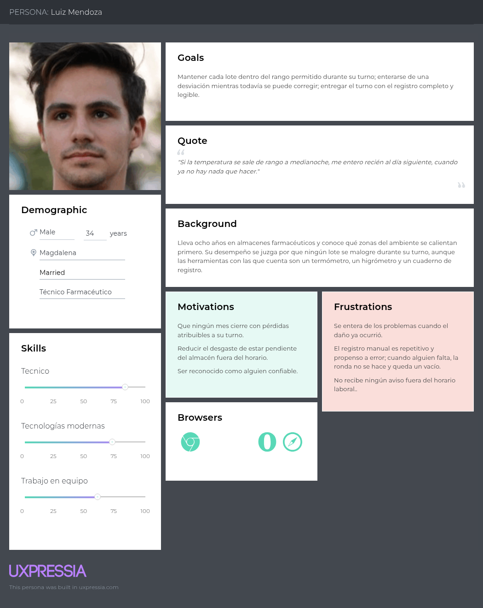
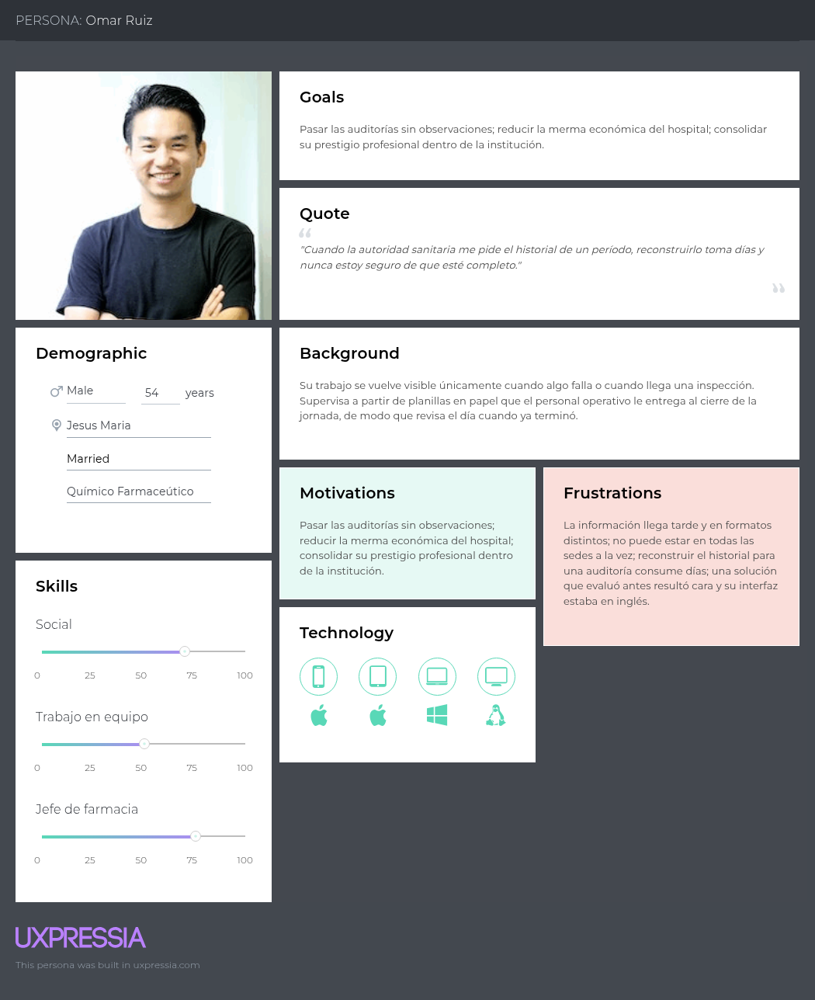
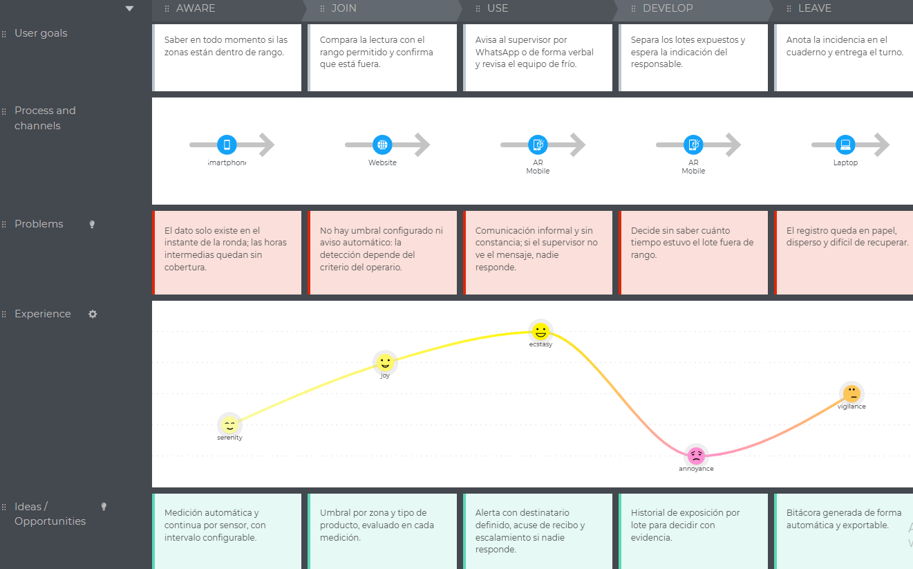
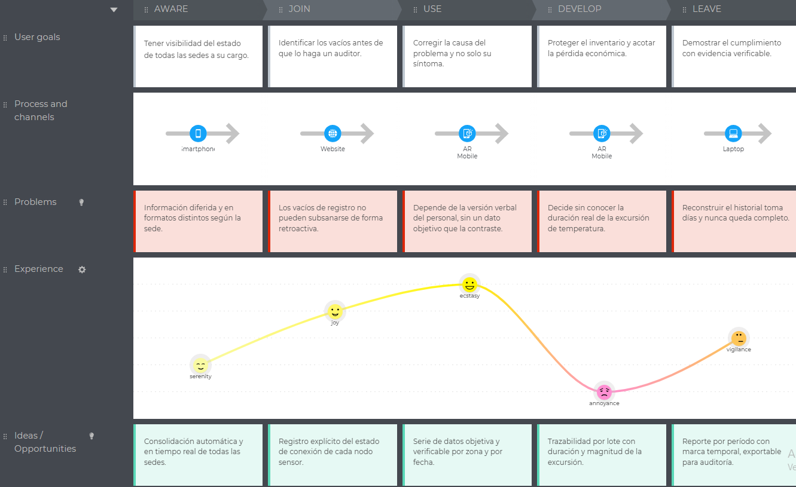
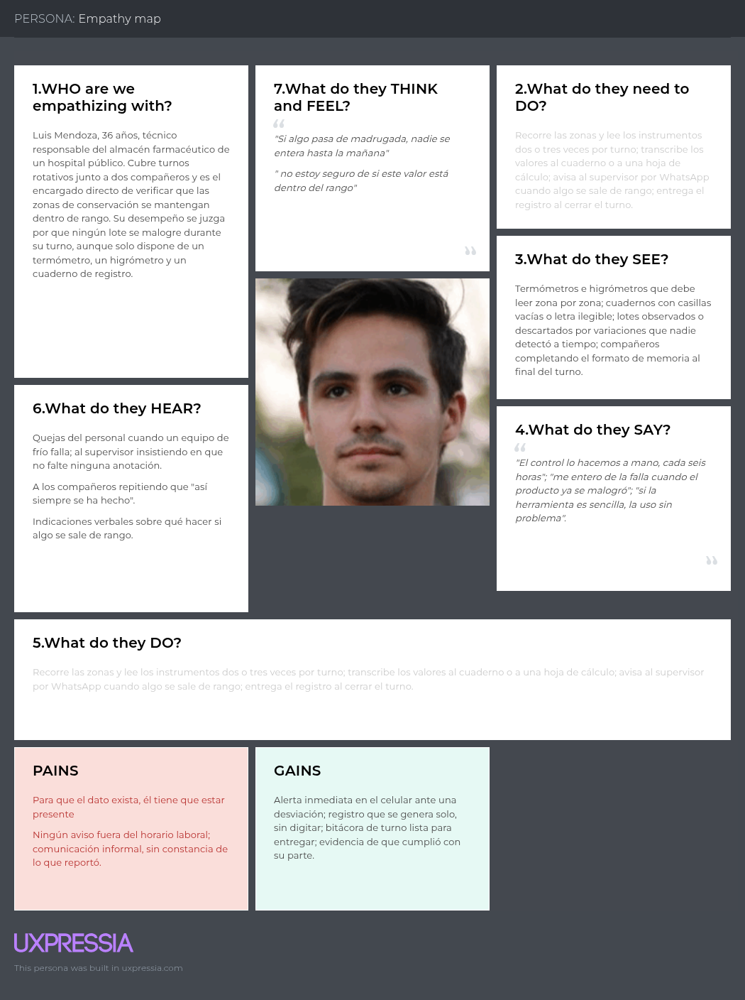
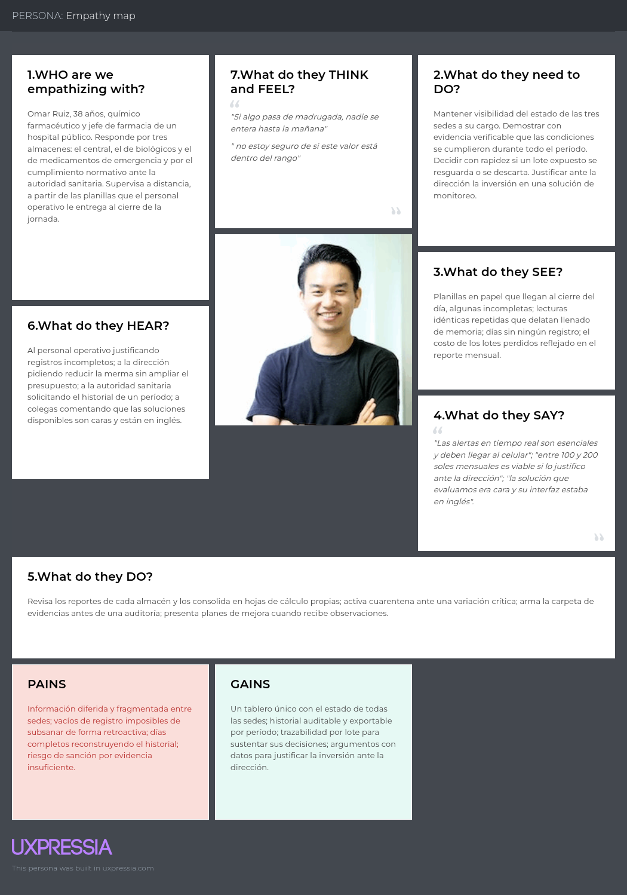

# Capítulo II: Requirements Elicitation & Analysis

> **Nota metodológica (1ASI0732):** este capítulo documenta la elicitación y el análisis de requisitos como insumos del diseño experimental. Las entrevistas, personas y mapas As-is alimentan hipótesis verificables; los ítems marcados con `(completar)` requieren reforzamiento de evidencia de campo o actualización de métricas en sprints posteriores.

## 2.1. Competidores

Para delimitar el espacio competitivo de KairoLabs se identificaron tres competidores directos que ofrecen soluciones de monitoreo ambiental para el sector salud y farmacéutico, seleccionados por su presencia en el mercado o por su accesibilidad para instituciones peruanas:

**Sensitech (TempTale).** Empresa estadounidense parte de Carrier Global Corporation y referente mundial en monitoreo de cadena de frío farmacéutica, con más de 30 años de trayectoria, sensores TempTale y la plataforma SensiWatch

**Monnit (iMonnit).** Fabricante estadounidense de sensores IoT inalámbricos de bajo costo para múltiples industrias, con plataforma en la nube iMonnit y aplicación móvil. Representa la alternativa profesional accesible, de amplio catálogo de sensores.

**MOCREO.** Marca de origen chino con presencia global, orientada a sensores de temperatura y humedad de bajo costo bajo un modelo de pago único. Representa la opción más económica para farmacias y clínicas pequeñas.

### 2.1.1. Análisis competitivo

<table>
  <tr>
    <th colspan="6">Competitive Analysis Landscape</th>
  </tr>
  <tr>
    <td colspan="1">¿Por qué llevar a cabo el análisis?</td>
    <td colspan="5">El análisis competitivo es muy útil para identificar los puntos fuertes y débiles que tenemos frente a otras empresas con productos similares, y para definir cómo deberíamos proceder con el desarrollo del producto a fin de superarnos frente a la competencia.</td>
  </tr>
  <tr>
    <td colspan="2"></td>
    <td><b>KairoLabs</b></td>
    <td><b>Sensitech (TempTale)</b></td>
    <td><b>Monnit (iMonnit)</b></td>
    <td><b>MOCREO</b></td>
  </tr>
  <tr>
    <td colspan="2">Logo</td>
    <td></td>
    <td></td>
    <td></td>
    <td></td>
  </tr>
  <tr>
    <td rowspan="2">Perfil</td>
    <td>Overview</td>
    <td>Plataforma web peruana con sensores IoT para monitorear temperatura, humedad y luz en almacenes farmacéuticos de hospitales, clínicas y farmacias, con alertas en tiempo real e historial de datos, alineada a normativas sanitarias locales.</td>
    <td>Empresa estadounidense líder global en monitoreo de cadena de frío farmacéutica, con sensores TempTale y plataforma SensiWatch. Parte de Carrier Global Corporation. Más de 30 años en el mercado.</td>
    <td>Empresa estadounidense fundada en 2010, especializada en sensores IoT inalámbricos de bajo costo para monitoreo remoto en múltiples industrias incluyendo salud. Plataforma en la nube iMonnit disponible vía web y app móvil.</td>
    <td>Empresa de origen chino con presencia global, orientada a sensores inalámbricos de temperatura y humedad para hospitales, clínicas y farmacias pequeñas. Solución accesible con pago único sin costos recurrentes.</td>
  </tr>
  <tr>
    <td>Ventaja competitiva ¿Qué valor ofrece a los clientes?</td>
    <td>Solución diseñada específicamente para el contexto peruano: normativas sanitarias locales, infraestructura limitada, hospitales públicos y entidades como el MINSA. Primera opción adaptada al mercado de salud latinoamericano.</td>
    <td>Validación regulatoria global (FDA 21 CFR Parte 11, GAMP5), precisión certificada NIST, y cobertura de cadena de frío extrema (hasta -200 °C). Confianza y respaldo de las principales farmacéuticas del mundo.</td>
    <td>Sensores desde $49 con monitoreo básico gratuito, batería de hasta 10 años, configuración en 15 minutos y más de 80 tipos de sensores. Relación costo-beneficio superior en el segmento de pequeñas y medianas instituciones.</td>
    <td>Sistema completo desde $50 con inversión única sin costos recurrentes, alertas vía app, email y buzzer, con monitoreo 24/7. Ideal para farmacias y clínicas con presupuesto muy reducido.</td>
  </tr>
  <tr>
    <td rowspan="2">Perfil de Marketing</td>
    <td>Mercado Objetivo</td>
    <td>Hospitales, clínicas, farmacias, almacenes farmacéuticos y entidades del Estado peruano (MINSA, redes de salud), especialmente en zonas donde no existe infraestructura tecnológica de monitoreo.</td>
    <td>Grandes laboratorios farmacéuticos, distribuidoras globales y hospitales de alto nivel en mercados desarrollados (EE.UU., Europa, Asia). Enfocado en cadenas de frío internacionales de alto valor.</td>
    <td>Hospitales medianos, clínicas, laboratorios de investigación, instalaciones de salud y empresas industriales en EE.UU. y 90+ países. Orientado a instituciones que buscan bajo costo con funcionalidad robusta.</td>
    <td>Farmacias pequeñas, clínicas y hospitales con presupuesto reducido en mercado global. Especialmente en zonas donde el costo de los sistemas tradicionales es prohibitivo.</td>
  </tr>
  <tr>
    <td>Estrategias de Marketing</td>
    <td>Enfoque directo en instituciones de salud peruanas, alianzas con el sector público, propuesta de valor orientada al cumplimiento de normativas sanitarias locales y reducción de pérdidas económicas por deterioro.</td>
    <td>Posicionamiento premium, certificaciones regulatorias como diferencial, casos de éxito con farmacéuticas globales (Pfizer, Direct Relief), ventas B2B a través de distribuidores especializados.</td>
    <td>Marketing digital con énfasis en bajo costo y facilidad de uso, prueba gratuita de 45 días, distribuidores internacionales, y reconocimiento por premios tecnológicos (IoT Breakthrough Award 2024 y 2025).</td>
    <td>E-commerce directo al consumidor (D2C), precio competitivo como principal argumento, venta a través de plataformas como Amazon y su sitio web propio.</td>
  </tr>
  <tr>
    <td rowspan="3">Perfil de Producto</td>
    <td>Productos y Servicios</td>
    <td>Plataforma web con dashboard en tiempo real, sensores IoT para temperatura, humedad y luz, sistema de alertas automáticas, historial de datos y reportes para auditorías.</td>
    <td>Sensores TempTale (temperatura, humedad, luz, ubicación GPS), plataforma SensiWatch, servicios de logística de cadena de frío, monitoreo 24/7, reportes de cumplimiento regulatorio y analítica avanzada.</td>
    <td>Más de 80 tipos de sensores inalámbricos (temperatura, humedad, agua, luz, movimiento), gateways, plataforma iMonnit en la nube y app móvil, con planes básicos gratuitos y premium (iMonnit Premiere).</td>
    <td>Sensores inalámbricos de temperatura y humedad, hub de monitoreo local con pantalla LCD, plataforma web y app móvil con historial de datos y alertas en tiempo real.</td>
  </tr>
  <tr>
    <td>Precios y Costos</td>
    <td>Modelo SaaS con suscripción mensual según número de sedes: Plan Básico (una sede, visualización en tiempo real y alertas básicas), Plan Profesional (varias áreas o sucursales, historial, reportes y alertas avanzadas), Plan Premium (múltiples sedes centralizadas, automatización, análisis de tendencias y soporte prioritario).</td>
    <td>Precio elevado, orientado a contratos corporativos. No disponible públicamente; se gestiona mediante cotización directa con distribuidores autorizados.</td>
    <td>Sensores desde $49. Monitoreo básico gratuito. Plan Premiere con funcionalidades avanzadas a bajo costo anual.</td>
    <td>Sistema completo desde $50 como inversión única sin costos de suscripción recurrentes.</td>
  </tr>
  <tr>
    <td>Canales de distribución (Web y/o Móvil)</td>
    <td>Plataforma web accesible desde navegador, con potencial de app móvil para alertas y supervisión remota.</td>
    <td>Plataforma web SensiWatch, app móvil, distribuidores internacionales y equipos de venta directa B2B.</td>
    <td>Plataforma web iMonnit, app móvil para iOS y Android, distribuidores en más de 90 países.</td>
    <td>Sitio web propio, app móvil, y canales de e-commerce como Amazon para distribución directa.</td>
  </tr>
  <tr>
    <td rowspan="4">Análisis SWOT</td>
    <td>Fortalezas</td>
    <td>Adaptación al mercado y normativas sanitarias peruanas, enfoque exclusivo en salud farmacéutica, conocimiento del problema local, costo accesible para el sector público.</td>
    <td>Liderazgo global con 30+ años de experiencia, validación regulatoria rigurosa (FDA, GAMP5), precisión certificada NIST, cobertura de temperaturas extremas y respaldo de Carrier Global.</td>
    <td>Bajo costo de entrada, amplio catálogo de sensores, configuración rápida (15 minutos), batería de larga duración (10+ años) y plataforma gratuita para uso básico.</td>
    <td>Precio de entrada muy bajo ($50), sin costos recurrentes, fácil instalación, cobertura de temperatura amplia y presencia en e-commerce global.</td>
  </tr>
  <tr>
    <td>Debilidades</td>
    <td>Startup sin trayectoria comprobada, base de clientes aún por construir, recursos limitados para escalar rápidamente y sin certificaciones regulatorias internacionales.</td>
    <td>Precio prohibitivo para hospitales públicos latinoamericanos, orientado exclusivamente a grandes corporaciones, sin adaptación a normativas locales del Perú.</td>
    <td>No está especializado en el sector farmacéutico ni adaptado a normativas latinoamericanas; soporte técnico limitado fuera de EE.UU.</td>
    <td>Funcionalidades limitadas para entornos regulados, sin cumplimiento de normativas farmacéuticas reconocidas, soporte postventa escaso y sin presencia local en Perú.</td>
  </tr>
  <tr>
    <td>Oportunidades</td>
    <td>Creciente demanda de digitalización en salud pública peruana, brechas normativas sin solución tecnológica local, potencial de expansión a otros países de la región con problemáticas similares.</td>
    <td>Expansión en mercados emergentes latinoamericanos con regulaciones farmacéuticas en modernización, y crecimiento del mercado de vacunas y biológicos que requieren control estricto.</td>
    <td>Crecimiento del sector salud en mercados emergentes que buscan soluciones IoT asequibles, sin necesidad de grandes inversiones iniciales.</td>
    <td>Mercado de farmacias y clínicas pequeñas en Latinoamérica con alta necesidad de monitoreo y bajo presupuesto disponible.</td>
  </tr>
  <tr>
    <td>Amenazas</td>
    <td>Posible entrada de competidores internacionales con mayor respaldo financiero, baja cultura de adopción tecnológica en el sector salud público peruano y dependencia de conectividad a internet.</td>
    <td>Competencia de soluciones más accesibles que cubren necesidades básicas a menor costo, y creciente regulación de privacidad de datos en nuevos mercados.</td>
    <td>Competidores especializados en salud con mayor certificación regulatoria y soluciones más robustas para el sector farmacéutico.</td>
    <td>Desconfianza en productos de origen chino en sectores regulados, limitaciones de soporte técnico local y ausencia de certificaciones farmacéuticas reconocidas.</td>
  </tr>
</table>

### 2.1.2. Estrategias y tácticas frente a competidores

A partir del análisis competitivo realizado, KairoLabs define las siguientes
estrategias y tácticas para posicionarse frente a sus competidores:

**Frente a Sensitech (TempTale)**

Sensitech es el competidor más consolidado del mercado con más de 30 años de
experiencia y certificaciones regulatorias globales como FDA y GAMP5. Sin embargo,
su precio prohibitivo y su orientación exclusiva a grandes corporaciones lo hacen
inaccesible para hospitales públicos y clínicas medianas en el Perú. KairoLabs
aprovechará esta brecha ofreciendo planes de suscripción accesibles adaptados al
presupuesto del sector salud peruano, con soporte en español y alineación a
normativas sanitarias locales, aspectos que Sensitech no cubre para el mercado
latinoamericano.

**Frente a Monnit (iMonnit)**

Monnit ofrece una solución de bajo costo con amplio catálogo de sensores, pero
carece de especialización en el sector farmacéutico y no está adaptado a las
normativas latinoamericanas. Además, su soporte técnico es limitado fuera de
EE.UU. KairoLabs se diferenciará mediante un enfoque exclusivo en salud
farmacéutica, con funcionalidades específicas como gestión de medicamentos según
sus condiciones de conservación, reportes orientados al cumplimiento de normativas
sanitarias peruanas y soporte técnico local, aspectos que Monnit no puede garantizar
para el contexto peruano.

**Frente a MOCREO**

MOCREO compite en precio con una inversión única desde $50 sin costos recurrentes,
atractivo para organizaciones con presupuesto muy reducido. Sin embargo, sus
funcionalidades son limitadas para entornos regulados y carece de certificaciones
farmacéuticas reconocidas. KairoLabs responderá destacando el valor agregado
de su modelo SaaS: actualizaciones continuas, soporte técnico local, historial de datos
en la nube y cumplimiento normativo, beneficios que una solución de pago único no
puede garantizar a largo plazo. Adicionalmente, el Plan Básico de KairoLabs
ofrece un punto de entrada económico competitivo para farmacias y clínicas pequeñas
que actualmente consideran MOCREO como única opción accesible.

**Estrategia general**

KairoLabs se posicionará como la única solución de monitoreo ambiental
farmacéutico diseñada específicamente para el mercado peruano, combinando
accesibilidad económica mediante sus tres planes de suscripción, adaptación a
normativas sanitarias peruanas y tecnología IoT orientada al sector salud.
Las principales tácticas a implementar son alianzas directas con instituciones del
sector salud público como el MINSA y redes hospitalarias, una propuesta de valor
centrada en la reducción de pérdidas económicas por deterioro de medicamentos,
y un modelo de onboarding simple que reduzca la resistencia a la adopción
tecnológica en organizaciones con poca cultura digital, aprovechando la baja
cultura tecnológica identificada como amenaza para convertirla en una oportunidad
de diferenciación mediante capacitación y soporte continuo.

---

## 2.2. Entrevistas

### 2.2.1. Diseño de entrevistas

Con el objetivo de recolectar información relevante para la construcción de los
arquetipos de cada segmento objetivo, se diseñaron las siguientes preguntas
orientadas a identificar características demográficas, objetivas y subjetivas de
los entrevistados.

**Segmento 1: Personal operativo de almacenes farmacéuticos**

1. ¿Cuál es su ocupación actual y en qué tipo de institución trabaja?
2. ¿Cuánto tiempo lleva trabajando en el área de almacenamiento farmacéutico?

Preguntas principales:

1. ¿Cómo realiza actualmente el control de temperatura, humedad y luz en el almacén?
2. ¿Con qué frecuencia registra las condiciones ambientales del almacén?
3. ¿Ha tenido casos de medicamentos deteriorados por condiciones inadecuadas de almacenamiento? ¿Qué pasó?
4. ¿Cómo se entera actualmente cuando algo sale mal con las condiciones del almacén?
5. Si tuviera una herramienta que le alertara automáticamente, ¿cómo cambiaría su trabajo?
6. ¿Qué tan dispuesto estaría su institución a pagar por una solución de monitoreo digital?

**Segmento 2: Entidades de salud y gestores farmacéuticos**

1. ¿Cuál es su cargo y en qué tipo de institución trabaja?
2. ¿Cuántas sedes o almacenes supervisa actualmente?

Preguntas principales:

1. ¿Cómo supervisa actualmente las condiciones de almacenamiento en las sedes a su cargo?
2. ¿Qué tan difícil es tener visibilidad del estado de múltiples almacenes al mismo tiempo?
3. ¿Ha enfrentado problemas de incumplimiento normativo relacionados al almacenamiento? ¿Cómo los manejó?
4. ¿Qué tan importante es para usted tener acceso a datos históricos de las condiciones de almacenamiento?
5. ¿Qué tan abierta está su institución a adoptar nuevas tecnologías?
6. ¿Qué funcionalidad consideraría indispensable en una plataforma de monitoreo?

### 2.2.2. Registro de entrevistas

#### Segmento 01

* Nombre : Dolores Alvarez Cabeza
* Edad : 62
* Distrito : San Martín de Porres
* Ocupación : Personal de salud asistencial

Dolores Álvarez Cabeza, de 62 años y residente en San Martín de Porres, se desempeña como personal de salud asistencial y utiliza una computadora de escritorio con Google Chrome para registrar la temperatura de los medicamentos en hojas de Excel. Señala que existen distintos tipos de medicamentos con requerimientos específicos de conservación, especialmente en lo relacionado a la temperatura; por ejemplo, en el caso de medicamentos destinados a recién nacidos, es fundamental mantener condiciones cercanas a los 24 °C para garantizar su eficacia y seguridad. Actualmente, el monitoreo se realiza de forma manual cada 6 horas, lo que implica un proceso repetitivo y propenso a errores humanos. Además, menciona que durante su experiencia en el Hospital San José, al ser una institución pública, en ocasiones no contaban con los recursos necesarios para asegurar un monitoreo adecuado de las condiciones de almacenamiento.

* Nombre : Jorge Perez
* Edad : 34
* Distrito : San Juan de Lurigancho
* Ocupación : Tecnico de almacén en clínica privada

* Nombre : Adriana Martínez
* Edad : 20
* Distrito : San Juan de Miraflores
* Ocupación : Area logística de una farmacia 

Adriana Martínez, de 20 años, trabaja en el área logística de una farmacia, donde se encarga de la gestión y control de productos, enfocándose en asegurar que los medicamentos se mantengan en buen estado. Actualmente, realiza el control de temperatura, humedad y luz en el almacén revisando visualmente los termómetros e hidrómetros instalados y registrando los datos manualmente varias veces al día. Ha tenido casos de productos deteriorados debido a fallas en el aire acondicionado y alta humedad, y se entera de los problemas solo durante las revisiones anuales, lo que dificulta una reacción inmediata. Aunque se siente cómoda con la tecnología, actualmente utiliza equipos estándar y formatos de papel, y considera que una solución de monitoreo digital con alertas automáticas mejoraría significativamente su trabajo, permitiéndole actuar rápidamente ante emergencias sin depender de revisiones manuales. Adriana cree que su institución estaría dispuesta a implementar una herramienta digital que optimice los procesos y evite pérdidas de medicamentos, lo que generaría ahorros a largo plazo.

---

#### Segmento 02

* Nombre : Dayana Quispe
* Edad : 25
* Distrito : La Molina
* Ocupación : practicas farmaceuticas

Dayana Quispe, de 25 años y residente en La Molina, realiza prácticas farmacéuticas y utiliza una computadora de escritorio del hospital con Google Chrome en sus actividades. Durante sus prácticas, comenta que el monitoreo de temperatura y humedad se realiza de forma manual, registrando los datos en un cuaderno con apoyo de termómetros e hidrómetros, generalmente dos o tres veces al día dependiendo del turno asignado. Señala que este proceso puede ser riesgoso, ya que no permite un seguimiento continuo; por ejemplo, menciona que en una ocasión falló inesperadamente el módulo donde se almacenaban vacunas, lo que ocasionó la pérdida de algunas de ellas. Además, explica que, si la temperatura se registra correctamente en un momento dado pero el sistema se avería horas después, no se detectarían cambios a tiempo, ya que se asumiría que las condiciones siguen siendo adecuadas.

* Nombre : Omar Ruiz
* Edad : 30
* Distrito : Surco
* Ocupación : Qúimico farmacéutica y jefe de farmacia en hospital público

El entrevistado, Omar, supervisa varios almacenes en un hospital público, incluyendo el central, el de biológicos y el de medicamentos de emergencia. El proceso de supervisión actual se basa en registros manuales de temperatura y humedad, los cuales son entregados en papel al final del día para su revisión, lo que lo hace lento y poco confiable. Ha enfrentado problemas de incumplimiento normativo, como cuando se encontraron registros de temperatura incompletos, lo que obligó a presentar un plan de mejora ante la autoridad sanitaria. Considera fundamental tener acceso a datos históricos para demostrar el cumplimiento de las normativas y evitar sanciones. Aunque evaluó una solución tecnológica hace dos años, el costo y la interfaz en inglés fueron obstáculos para su implementación. A pesar de la apertura institucional hacia nuevas tecnologías, los procesos administrativos y la desconfianza de algunos jefes hacia lo digital son barreras importantes. Omar destaca que las alertas en tiempo real son esenciales y que un presupuesto de entre 100 y 200 soles mensuales sería viable si se justifica adecuadamente ante la dirección.

* Nombre : Lucero Betis Morarizano
* Edad : 22
* Distrito : San Juan de Miraflores
* Ocupación : Infusora en el área farmacéutica de la clínica agroamericana 

Lucero Betis Morarizano, de 22 años, trabaja como infusora en el área farmacéutica de la clínica agroamericana, donde supervisa las áreas de dispensación directa. Su trabajo incluye rondas de inspección programadas y la revisión de reportes diarios de temperatura y humedad, los cuales son registrados por el personal operativo. A pesar de la dificultad de tener visibilidad centralizada de los almacenes, maneja los problemas de incumplimiento normativo, como variaciones térmicas, activando protocolos de cuarentena y notificando al área de calidad. Lucero considera esencial tener acceso a datos históricos para auditorías y detectar fallas en equipos de refrigeración. Ha evaluado algunos sensores, pero prefiere soluciones en la nube para monitorear desde cualquier lugar. Aunque su institución está abierta a adoptar nuevas tecnologías, el principal obstáculo es la integración con los sistemas de gestión existentes y la cobertura de red.
---

Enlace de las entrevistas : 

### 2.2.3. Análisis de entrevistas
### Segmento 01: Personal operativo de almacenes farmacéuticos

---

### Segmento 02: Gestores y responsables de farmacia en instituciones de salud

## 2.3. Needfinding

### 2.3.1. User Personas
Esta sección representa los principales perfiles de usuario que fueron creados en base a los segmentos objetivos. El propósito principal de la creación de estos perfiles es el de reflejar de manera precisa las motivaciones, frustraciones y las necesidades reales de nuestros usuarios finales.

Para ello seleccionamos los siguientes perfiles:

User Persona 1

User Persona 2

---

### 2.3.2. User Task Matrix

### Matriz de Tareas: Luis Mendoza (El Guardián Operativo)
*Enfoque: Monitoreo directo y acciones preventivas en el almacén.*

| Actividad / Tarea | Importancia | Frecuencia | Descripción del Usuario |
| :--- | :---: | :---: | :--- |
| **Consultar temperatura actual** | 5 | Diaria | Revisar que los equipos estén en el rango adecuado (ej. 2°C a 8°C). |
| **Registrar incidencia ambiental** | 5 | Eventual | Notificar inmediatamente cuando ocurre una desviación de temperatura. |
| **Recibir alertas push** | 5 | Eventual | Notificación sonora en el celular ante fallos fuera de horario laboral. |
| **Cargar datos de inventario** | 3 | Semanal | Vincular qué lotes de medicamentos están en qué refrigerador. |
| **Generar bitácora diaria** | 4 | Diaria | Exportar el resumen de lecturas para la entrega de turno. |
| **Realizar checklist de limpieza** | 2 | Semanal | Registrar el mantenimiento básico de los equipos de frío. |

---

### Matriz de Tareas: Omar Ruiz (El Gestor de Cumplimiento)
*Enfoque: Supervisión, cumplimiento normativo y toma de decisiones estratégicas.*

| Actividad / Tarea | Importancia | Frecuencia | Descripción del Usuario |
| :--- | :---: | :---: | :--- |
| **Visualizar Dashboard central** | 5 | Diaria | Ver el estado de salud de todos los almacenes desde una sola vista. |
| **Generar reporte histórico** | 5 | Mensual | Descargar PDFs con gráficos de temperatura para entes reguladores. |
| **Configurar umbrales de alerta** | 4 | Eventual | Definir los rangos permitidos de temperatura para cada tipo de fármaco. |
| **Gestionar usuarios y accesos** | 3 | Mensual | Dar de alta o baja a los técnicos que tienen acceso al sistema. |
| **Analizar patrones de falla** | 4 | Mensual | Identificar qué equipos fallan con más frecuencia para planear mantenimiento. |
| **Validar firmas digitales** | 5 | Diaria | Revisar y aprobar los registros de incidencias reportados por los técnicos. |

### 2.3.3. User Journey Mapping

User Persona 1

User Persona 2

### 2.3.4. Empathy Mapping

Empathy map 1

Empathy map 2

### 2.3.5. As-is Scenario Maps

— Luis Mendoza, técnico de almacén farmacéutico**

| **FASES** | **Inicio de turno** | **Ronda de medición** | **Detección de la desviación** | **Respuesta y acción correctiva** | **Registro y cierre del turno** |
| :--- | :--- | :--- | :--- | :--- | :--- |
| DOING | Recibo el turno del compañero y reviso el cuaderno por si anotó algo fuera de lo normal. Verifico que los equipos de frío estén encendidos y sin alarma. | Recorro las zonas con la planilla y leo el termómetro y el higrómetro de cada punto. Anoto los valores a mano, uno por uno. Si el día está cargado, dejo la anotación para el final. | Veo una lectura que me parece alta y la comparo de memoria con el rango que debería tener. Abro el equipo para confirmar. Reviso qué lotes sensibles hay en esa zona. | Aviso al jefe de farmacia por WhatsApp con una foto del termómetro. Llamo al técnico si el equipo no enfría. Separo los lotes de la zona afectada mientras espero indicación. | Completo la planilla del turno, a veces reconstruyendo las horas que no alcancé a anotar. Dejo la hoja en el file y le comento de palabra al del siguiente turno. |
| THINKING | *"¿Habrá pasado algo de madrugada que nadie vio?"* *"Espero que el compañero haya anotado todo."* | *"Dos lecturas al día no dicen qué pasó entre una y otra."* *"Si hoy no alcanzo a hacer la ronda, ese dato se pierde."* | *"¿Esto está fuera de rango o es normal a esta hora?"* *"¿Desde cuándo está así? No tengo cómo saberlo."* | *"Ojalá vea el mensaje a tiempo."* *"Si el lote ya se malogró, no hay vuelta atrás."* | *"Si mañana preguntan por este día, ¿esto alcanza como respaldo?"* *"Estoy anotando de memoria y no debería ser así."* |
| FEELING | Expectativa mezclada con inquietud. Alerta por lo que no pudo ver. | Rutina y cansancio. Resignación ante un control que sabe incompleto. | Duda e inseguridad. Sensación de llegar siempre tarde. | Impotencia y urgencia. Depende de que otro responda. | Fatiga y escepticismo sobre el valor del registro. Temor a que le observen la planilla. |

 — Omar Ruiz, químico farmacéutico y jefe de farmacia**

| **FASES** | **Recepción de reportes** | **Consolidación del período** | **Detección de vacíos y hallazgos** | **Decisión y acción correctiva** | **Sustentación ante la auditoría** |
| :--- | :--- | :--- | :--- | :--- | :--- |
| DOING | Al cierre del día recibo las planillas en papel de las tres sedes. Reviso por encima si vienen completas y legibles. Insisto por WhatsApp por las que faltan. | Transcribo las lecturas a mi hoja de cálculo, sede por sede. Las ordeno por fecha y armo los gráficos de tendencia del mes. | Marco los días sin ningún registro y los turnos sin cobertura. Detecto valores idénticos repetidos que delatan llenado de memoria. Consulto al personal qué ocurrió esos días. | Activo cuarentena sobre los lotes de la zona comprometida. Pido la revisión del equipo de frío y registro la incidencia. Decido si el lote se libera o se da de baja. | Armo la carpeta de evidencias del período solicitado. Respondo preguntas sobre fechas puntuales. Redacto el plan de mejora cuando hay observación. |
| THINKING | *"Otra vez reviso el día cuando ya terminó."* *"¿Y los turnos de noche cómo los cubro?"* | *"Estoy digitando datos que ni siquiera puedo verificar."* *"Dos días completos en algo que debería ser automático."* | *"Estas lecturas son demasiado parejas para ser reales."* *"Los vacíos ya no los puedo llenar sin faltar a la verdad."* | *"Tengo que decidir sin saber cuánto tiempo estuvo fuera de rango."* *"Si me equivoco, pierdo el lote o expongo al paciente."* | *"Si no lo puedo demostrar con un registro, para el auditor no ocurrió."* *"Ojalá no pidan el detalle de las noches ni de los fines de semana."* |
| FEELING | Frustración por recibir la información tarde. Dependencia de terceros que no comparten su urgencia. | Desgaste y desmotivación. Conciencia de invertir días en algo sin valor agregado. | Desconfianza sobre lo que le entregan. Alarma por la exposición que representan los vacíos. | Presión y urgencia. Peso de responder por la pérdida económica. | Exposición ante la autoridad. Alivio o temor según lo que el auditor decida revisar. |

## 2.4. Ubiquitous Language
El siguiente glosario define los términos del dominio que deben emplearse de forma consistente por el equipo de desarrollo, los expertos del negocio y el propio código fuente.

| **Término (Term)** | **Definición** |
| :--- | :--- |
| Healthcare Entity (Entidad de salud) | Organización cliente que contrata el servicio y bajo la cual se agrupan todas sus sedes, usuarios y dispositivos. |
| Site (Sede) | Local físico de la entidad de salud dentro del cual se despliega el monitoreo. Una misma entidad puede administrar varias sedes bajo una sola cuenta. |
| Storage Point (Punto de almacenamiento) | Ubicación concreta sometida a supervisión dentro de una sede: un refrigerador, una cámara de frío, un ambiente de almacén o un contenedor de transporte. Es la unidad sobre la que se contrata el servicio. |
| Monitoring Zone (Zona de monitoreo) | Área de una sede que se comporta de forma ambiental homogénea y a la que se aplica un mismo juego de umbrales, por ejemplo una cámara de frío o un pasillo de estantería. |
| Sensor Node (Nodo sensor) | Dispositivo IoT instalado en un punto de almacenamiento que captura de forma periódica las variables ambientales de ese punto y las transmite a la plataforma. |
| Environmental Variable (Variable ambiental) | Magnitud física del entorno cuya evolución afecta la conservación del producto. En el alcance actual: temperatura, humedad relativa y exposición a la luz. |
| Reading (Lectura) | Dato crudo que un nodo sensor entrega en un instante puntual, todavía sin validar ni corregir por calibración. |
| Measurement (Medición) | Lectura que, una vez validada y corregida, queda asociada a un punto de almacenamiento y a una marca temporal, e ingresa al historial de la entidad. |
| Sampling Interval (Intervalo de muestreo) | Frecuencia configurada con la que un nodo reporta sus lecturas. A menor intervalo, mayor detalle del historial y menor demora en advertir una desviación. |
| Calibration (Calibración) | Contraste periódico de un nodo sensor contra un patrón de referencia, del que resulta el ajuste que se aplicará a sus lecturas posteriores. |
| Coverage Gap (Vacío de cobertura) | Tramo de tiempo de un período sin ninguna medición válida, ya sea por desconexión del nodo o por ausencia de registro. Es el hallazgo que una auditoría no admite subsanar de forma retroactiva. |
| Threshold (Umbral) | Límite superior o inferior fijado para una variable ambiental dentro de una zona; al ser cruzado, el sistema genera una alerta. |
| Safe Range (Rango seguro) | Franja de valores delimitada por los umbrales, dentro de la cual el producto se considera correctamente conservado. En cadena de frío farmacéutica suele situarse entre 2 °C y 8 °C. |
| Deviation (Desviación) | Medición que se ubica fuera del rango seguro definido para su zona. |
| Excursion (Excursión) | Intervalo continuo que va desde que una variable abandona el rango seguro hasta que regresa a él. La auditoría evalúa la excursión completa, con su duración y magnitud, y no cada medición por separado. |
| Cold Chain (Cadena de frío) | Proceso ininterrumpido de conservación a temperatura controlada que debe sostenerse desde la recepción del producto hasta su dispensación al paciente. |
| Incident (Incidencia) | Registro que la plataforma crea automáticamente cuando una medición rompe un umbral, y que agrupa la excursión completa junto con las acciones tomadas sobre ella. |
| Alert (Alerta) | Notificación emitida a los responsables designados tras la detección de una incidencia, entregada por aplicación móvil, correo electrónico o mensaje al celular. |
| Acknowledgement (Reconocimiento) | Acción mediante la cual un responsable confirma haber recibido una alerta, dejando constancia del momento en que la atendió. |
| Escalation (Escalado) | Mecanismo que eleva una alerta a un responsable de mayor jerarquía cuando no ha sido reconocida dentro del plazo definido. |
| Action Plan (Plan de acción) | Protocolo de respuesta que se ejecuta para corregir una desviación y resguardar el inventario expuesto. |
| Quarantine (Cuarentena) | Estado en el que se coloca un lote expuesto a una excursión, que lo retira de la dispensación hasta determinar si conserva su eficacia terapéutica. |
| Batch (Lote) | Conjunto de medicamentos con las mismas características de fabricación, que se monitorea, se resguarda y se da de baja como una sola unidad. |
| Thermosensitive Product (Producto termosensible) | Producto cuya eficacia terapéutica se degrada al quedar expuesto fuera de su rango de conservación permitido. |
| Traceability (Trazabilidad) | Capacidad de reconstruir las condiciones ambientales a las que estuvo expuesto un lote durante todo el tiempo que permaneció almacenado. |
| Auditable Evidence (Evidencia auditable) | Registro histórico íntegro y verificable, con marca temporal por medición, que sustenta el cumplimiento normativo ante una fiscalización sanitaria. |
| DIGEMID | Dirección General de Medicamentos, Insumos y Drogas; autoridad peruana que fiscaliza el cumplimiento de las Buenas Prácticas de Almacenamiento. |
| Good Storage Practices (Buenas prácticas de almacenamiento, BPA) | Conjunto de disposiciones que regulan las condiciones de conservación de productos farmacéuticos y cuyo cumplimiento la plataforma debe permitir evidenciar. |
| Custodian (Custodio) | Usuario responsable directo de la supervisión de uno o varios puntos de almacenamiento; corresponde al perfil operativo del Segmento 1. |
| Compliance Manager (Gestor de cumplimiento) | Usuario que supervisa varias sedes y responde por la evidencia de cumplimiento ante la autoridad sanitaria; corresponde al perfil de gestión del Segmento 2. |
| Subscription Plan (Plan de suscripción) | Modalidad de contratación del servicio, escalonada según el número de sedes y de puntos de almacenamiento monitoreados. |

