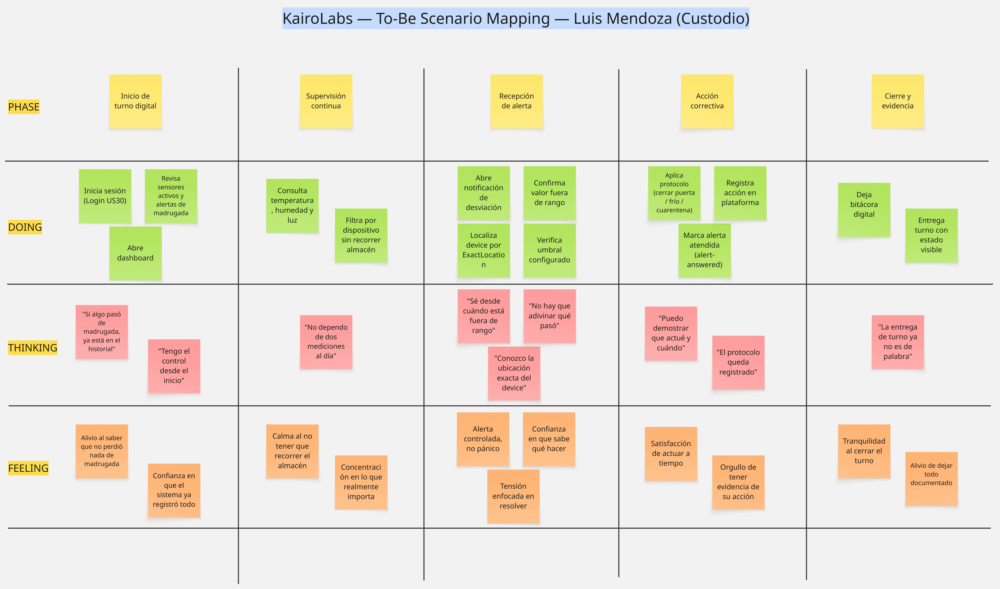
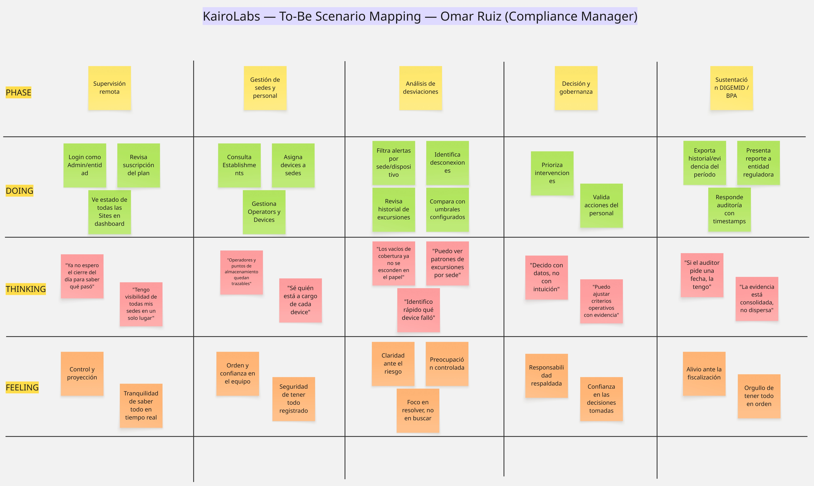
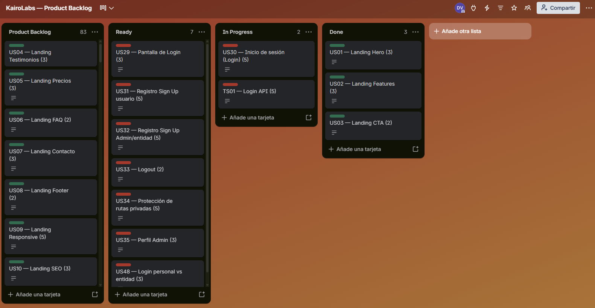

# Capítulo III: Requirements Specification

Este capítulo especifica los requisitos de **KairoLabs** a partir del needfinding del Capítulo II: User Personas, As-Is Scenario Maps y Ubiquitous Language. Incluye el escenario futuro (To-Be), las User Stories, el Product Backlog y el Impact Mapping.

---

## 3.1. To-Be Scenario Mapping

### Introducción

Mientras el **As-Is** (Capítulo II) muestra cómo trabaja cada segmento hoy —planillas, rondas manuales y consolidación tardía—, el **To-Be** muestra cómo trabajarían con **KairoLabs**: monitoreo continuo, alertas y evidencia digital.

Se elaboró un To-Be Scenario Map por segmento, con las filas **Phases**, **Doing**, **Thinking** y **Feeling**, contrastado frente al As-Is correspondiente.

### Resumen del proceso

Partiendo de los As-Is y de las entrevistas, el equipo rediseñó el flujo diario de cada persona en Lucidchart/Miro e incorporó las capturas a continuación.

### 3.1.1. Segmento 1 — Luis Mendoza (personal operativo)

Con KairoLabs, Luis inicia turno en el dashboard, supervisa lecturas sin planilla, atiende alertas desde la plataforma y cierra el turno con evidencia digital.



### 3.1.2. Segmento 2 — Omar Ruiz (gestor farmacéutico)

Con KairoLabs, Omar supervisa varias sedes en una sola vista, gestiona establecimientos y personal, analiza desviaciones con datos consolidados y sustenta auditorías con historial exportable.



---

## 3.2. User Stories

### Introducción

A partir de los To-Be Scenario Maps y del alcance de la plataforma KairoLabs, el equipo redactó un **Product Backlog unificado** con:

- **User Stories (US01–US78)**: Landing Page + Web Application (incluye **Login** en US29–US30 y el resto del flujo IAM).
- **Technical Stories (TS01–TS12)**: capacidades de API / infraestructura por bounded context.
- **Spike Stories (SP01–SP5)**: investigación técnica acotada.

Todas usan criterios **Gherkin** (Given – When – Then) con Happy Path y Unhappy Path.

**Conteo:** 78 User Stories + 12 Technical Stories + 5 Spike Stories = **95** ítems especificados.

### Epics del producto

| Epic ID | Título | Descripción |
| :--- | :--- | :--- |
| EP01 | Descubrimiento Landing Page | Como visitante, deseo entender KairoLabs al entrar al sitio, para evaluar si me interesa. |
| EP02 | Propuesta de valor Landing | Como visitante, deseo ver el problema-solución con claridad, para validar la necesidad. |
| EP03 | Credibilidad y conversión Landing | Como visitante, deseo confiar y contactar, para avanzar a una demo o contratación. |
| EP04 | Usabilidad Landing | Como visitante, deseo usar el sitio sin fricción, para no abandonar. |
| EP05 | Identidad y acceso (Login/IAM) | Como usuario, deseo registrarme e iniciar sesión, para acceder a mi contexto operativo. |
| EP06 | Gestión de establecimientos | Como gestor, deseo administrar sedes, para centralizar el monitoreo multi-site. |
| EP07 | Gestión de operadores | Como gestor, deseo administrar personal operativo, para cubrir turnos. |
| EP08 | Monitoreo de dispositivos IoT | Como custodio/gestor, deseo gestionar dispositivos y lecturas, para asegurar conservación. |
| EP09 | Dashboard y análisis | Como usuario, deseo ver estado y tendencias, para decidir con datos. |
| EP10 | Alertas y respuesta | Como personal de salud, deseo detectar y atender desviaciones, para actuar a tiempo. |
| EP11 | Cadena de frío en transporte | Como personal logístico, deseo monitorear transportes, para no romper cold chain. |
| EP12 | Suscripciones y planes | Como entidad de salud, deseo gestionar mi plan SaaS, para dimensionar el servicio. |
| EP13 | Plataforma técnica (APIs) | Como desarrollador, deseo APIs confiables documentadas, para integrar la Web App. |
| EP14 | Spikes de investigación | Como equipo, deseo reducir incertidumbre técnica, para decidir con evidencia. |

### Cuadro general unificado (Epics + US + TS + SP)

| **ID** | **Título** | **Descripción** | **Criterios de aceptación (Gherkin)** | **Epic** |
|---|---|---|---|---|
| **EP01** | Descubrimiento Landing Page | Como visitante, deseo entender KairoLabs al entrar al sitio, para evaluar si me interesa. | — | — |
| **US01** | Navegación clara | Como visitante, deseo navegar entre secciones sin recargar, para encontrar información rápido. | **Happy Path:** Given estoy en la landing de KairoLabs When hago clic en un ítem del menú Then la vista se desplaza a la sección y el ítem queda activo.<br>**Unhappy Path:** Given estoy en móvil When el menú hamburguesa no responde Then no puedo acceder a las secciones. | EP01 |
| **US02** | Mensaje hero claro | Como visitante, deseo entender en segundos qué hace el producto, para evaluar relevancia. | **Happy Path:** Given ingreso a la landing When veo el hero Then comprendo que KairoLabs monitorea temperatura, humedad y luz en almacenes farmacéuticos vía IoT.<br>**Unhappy Path:** Given pantalla pequeña When el texto del hero se corta Then el mensaje pierde claridad. | EP01 |
| **US03** | Acceso a sección tecnología | Como visitante, deseo ver cómo funciona el sistema, para conocer la propuesta técnica. | **Happy Path:** Given estoy en la landing When abro Tecnología Then veo sensores IoT, variables y flujo de datos con apoyo visual.<br>**Unhappy Path:** Given error de carga When abro la sección Then veo mensaje amigable y alternativa de contacto. | EP01 |
| **US04** | Acceso a sectores objetivo | Como visitante, deseo ver a quién va dirigido el producto, para saber si aplica a mi contexto. | **Happy Path:** Given navego la landing When abro Sectores Then veo hospitales, clínicas, farmacias, almacenes y entidades del Estado con breve descripción.<br>**Unhappy Path:** Given la sección viene vacía When busco mi sector Then no puedo decidir si aplica. | EP01 |
| **US05** | Visualización de beneficios | Como visitante, deseo ver beneficios concretos, para evaluar utilidad neta. | **Happy Path:** Given llego a Beneficios When reviso el contenido Then veo al menos 3 beneficios (monitoreo en tiempo real, alertas, reducción de pérdidas).<br>**Unhappy Path:** Given la sección no carga When busco valor Then abandono sin entender el diferencial. | EP01 |
| **US06** | Información del equipo | Como visitante, deseo conocer al equipo, para generar confianza. | **Happy Path:** Given abro Nosotros/Equipo When reviso perfiles Then veo nombre, rol y foto (o avatar) de cada integrante.<br>**Unhappy Path:** Given fallan las imágenes When cargo la sección Then se muestran avatares de reemplazo y los nombres siguen visibles. | EP01 |
| **US07** | Explicación de funcionalidades | Como visitante, deseo conocer funcionalidades del sistema, para entender el alcance. | **Happy Path:** Given abro Funcionalidades When leo Then identifico dashboard, sensores, alertas, historial y reportes.<br>**Unhappy Path:** Given textos genéricos When evalúo Then no puedo medir el alcance real. | EP01 |
| **US08** | Identificación de uso práctico | Como visitante, deseo ver casos de uso en mi entorno, para imaginar la adopción. | **Happy Path:** Given reviso casos de uso When leo Then entiendo aplicación en hospital, farmacia o almacén.<br>**Unhappy Path:** Given no hay ejemplos When imagino el flujo Then lo percibo demasiado abstracto. | EP01 |
| **US09** | Contenido para almacenes | Como visitante operativo, deseo contenido para mi rol de almacén, para ver valor diario. | **Happy Path:** Given soy técnico de almacén When leo el bloque operativo Then veo alertas, monitoreo de refrigeradores y fin del cuaderno manual.<br>**Unhappy Path:** Given solo hay mensajes genéricos When busco mi rol Then descarto el producto. | EP01 |
| **US10** | Contenido para entidades/gestores | Como visitante gestor, deseo información de supervisión multi-sede y cumplimiento, para evaluar implementación. | **Happy Path:** Given soy jefe de farmacia When leo el bloque gestor Then veo multi-sede, normativas y reportes de auditoría.<br>**Unhappy Path:** Given falta cumplimiento/escalabilidad When presento a dirección Then no tengo argumentos. | EP01 |
| **EP02** | Propuesta de valor Landing | Como visitante, deseo ver el problema-solución con claridad, para validar la necesidad. | — | — |
| **US11** | Identificación del problema | Como visitante, deseo identificar qué problema resuelve KairoLabs, para validar necesidad. | **Happy Path:** Given leo la problemática When termino Then reconozco almacenamiento inadecuado y falta de monitoreo continuo en establecimientos peruanos.<br>**Unhappy Path:** Given el problema es genérico When lo busco Then no lo relaciono con mi trabajo. | EP02 |
| **US12** | Relación problema-solución | Como visitante, deseo ver cómo la solución ataca el problema, para confiar. | **Happy Path:** Given leo solución When comparo con el problema Then entiendo IoT + web reemplazando registros manuales y detección tardía.<br>**Unhappy Path:** Given la solución no referencia el problema When evalúo Then percibo desconexión. | EP02 |
| **US13** | Lenguaje comprensible | Como visitante no técnico, deseo textos claros, para entender sin jargon. | **Happy Path:** Given soy técnico de farmacia When leo Then comprendo sin conocer MQTT/microservicios.<br>**Unhappy Path:** Given hay tecnicismos densos When leo Then abandono. | EP02 |
| **US14** | Información de monitoreo (variables) | Como visitante, deseo saber qué variables se monitorean, para evaluar utilidad. | **Happy Path:** Given reviso alcance When leo Then identifico temperatura, humedad y luz y su importancia.<br>**Unhappy Path:** Given no se listan variables When comparo Then descarto por falta de detalle. | EP02 |
| **US15** | Ventajas vs método tradicional | Como visitante, deseo comparar contra planillas/rondas, para justificar el cambio. | **Happy Path:** Given veo comparativa When analizo Then identifico continuo vs cada 6h, alertas vs WhatsApp, digital vs cuaderno.<br>**Unhappy Path:** Given no hay comparativa When justifico inversión Then no cuantifico beneficio. | EP02 |
| **US16** | Información de planes y precios | Como cliente potencial, deseo ver planes SaaS, para evaluar contratación. | **Happy Path:** Given abro Planes When comparo Then veo Básico/Profesional/Premium con límites y precios o rangos claros.<br>**Unhappy Path:** Given no hay precios ni límites When decido Then abandono por opacidad. | EP02 |
| **EP03** | Credibilidad y conversión Landing | Como visitante, deseo confiar y contactar, para avanzar a una demo o contratación. | — | — |
| **US17** | Presentación profesional | Como visitante, deseo un diseño profesional, para confiar en una solución de salud. | **Happy Path:** Given cargo la landing When evalúo Then percibo tipografía, color e imágenes coherentes con sector salud.<br>**Unhappy Path:** Given hay inconsistencias visuales When evalúo Then desconfío. | EP03 |
| **US18** | Información estructurada | Como visitante, deseo jerarquía clara de títulos y párrafos, para leer sin esfuerzo. | **Happy Path:** Given navego una sección When leo Then distingo título/subtítulo/cuerpo.<br>**Unhappy Path:** Given todo tiene el mismo peso visual When leo Then abandono. | EP03 |
| **US19** | Coherencia visual de marca | Como visitante, deseo identidad visual consistente, para percibir rigurosidad. | **Happy Path:** Given recorro todas las secciones When observo Then colores y componentes de KairoLabs se mantienen.<br>**Unhappy Path:** Given una sección usa otra paleta When navego Then percibo producto inacabado. | EP03 |
| **US20** | Información de la empresa (misión) | Como visitante, deseo conocer misión/visión, para generar confianza. | **Happy Path:** Given abro Nosotros When leo Then veo misión de conservación farmacéutica con IoT y visión regional.<br>**Unhappy Path:** Given 404 o vacío When abro Then pierdo confianza. | EP03 |
| **US21** | Botón de contacto visible | Como visitante, deseo encontrar contacto fácil, para comunicarme. | **Happy Path:** Given estoy en cualquier sección When busco CTA Then lo localizo sin scroll excesivo y lleva a contacto.<br>**Unhappy Path:** Given el CTA no contrasta When busco Then no contacto. | EP03 |
| **US22** | Formulario de contacto | Como cliente potencial, deseo enviar una consulta, para solicitar información. | **Happy Path:** Given completo nombre, correo, institución y mensaje When envío Then veo confirmación de éxito.<br>**Unhappy Path:** Given el servidor falla When envío Then veo error claro y medio alternativo. | EP03 |
| **EP04** | Usabilidad Landing | Como visitante, deseo usar el sitio sin fricción, para no abandonar. | — | — |
| **US23** | Respuesta visual a interacción | Como visitante, deseo feedback hover/click, para saber qué es clicable. | **Happy Path:** Given paso el cursor sobre un botón When interactúo Then cambia apariencia y al click hay respuesta inmediata.<br>**Unhappy Path:** Given no hay feedback When interactúo Then no distingo elementos clicables. | EP04 |
| **US24** | Claridad del siguiente paso (CTA) | Como visitante, deseo saber qué hacer al terminar de leer, para continuar. | **Happy Path:** Given termino el recorrido When busco acción Then veo CTA claro (Contactar / Ver planes / Solicitar demo).<br>**Unhappy Path:** Given hay muchos CTA iguales When decido Then me confundo y abandono. | EP04 |
| **US25** | Lectura clara (legibilidad) | Como visitante, deseo texto legible, para entender sin forzar la vista. | **Happy Path:** Given leo cualquier sección When miro tipografía Then tamaño ≥16px, buen contraste y interlineado.<br>**Unhappy Path:** Given bajo contraste o texto <12px When leo en móvil Then abandono. | EP04 |
| **US26** | Adaptación responsive | Como visitante, deseo que funcione en móvil y desktop, para acceder desde cualquier lugar. | **Happy Path:** Given abro en smartphone/tablet/PC When navego Then no hay solapes y botones son usables.<br>**Unhappy Path:** Given el layout se rompe en móvil When intento Then abandono. | EP04 |
| **US27** | Carga eficiente | Como visitante, deseo carga rápida, para no perder tiempo. | **Happy Path:** Given conexión estándar When abro la landing Then above-the-fold visible en <3s.<br>**Unhappy Path:** Given tarda >8s When espero Then abandono. | EP04 |
| **US28** | Exploración intuitiva | Como visitante, deseo explorar sin tutorial, para entender solo. | **Happy Path:** Given entro por primera vez When exploro Then identifico secciones y flujo problema→solución→beneficios→contacto.<br>**Unhappy Path:** Given la arquitectura es confusa When navego Then me desoriento. | EP04 |
| **EP05** | Identidad y acceso (Login/IAM) | Como usuario, deseo registrarme e iniciar sesión, para acceder a mi contexto operativo. | — | — |
| **US29** | Pantalla de Login | Como usuario, deseo ver una pantalla de inicio de sesión clara, para autenticarme. | **Happy Path:** Given abro /login When cargo Then veo campos email y password, enlace a registro y CTA Iniciar sesión.<br>**Unhappy Path:** Given la vista login falla When cargo Then veo error y opción de reintentar. | EP05 |
| **US30** | Inicio de sesión (Login) | Como usuario registrado, deseo iniciar sesión con email y password, para entrar a la Web App. | **Happy Path:** Given credenciales válidas When envío el formulario de login Then la app llama POST /api/v1/users/sign-in, recibe JWT + UserResource y redirige al dashboard.<br>**Unhappy Path:** Given password incorrecto When envío Then recibo 401, mensaje de credenciales inválidas y permanezco en login. | EP05 |
| **US31** | Registro Sign Up operador/usuario | Como nuevo usuario, deseo registrarme, para obtener acceso. | **Happy Path:** Given completo Sign Up válido When envío Then POST /api/v1/users crea la cuenta y puedo ir a login.<br>**Unhappy Path:** Given email duplicado When envío Then 400 y no se crea cuenta. | EP05 |
| **US32** | Registro Sign Up entidad Admin | Como gestor, deseo registrarme como Admin con entityName, para crear cuenta institucional. | **Happy Path:** Given rol Admin + entityName When Sign Up Then se registra la entidad de salud asociada.<br>**Unhappy Path:** Given falta entityName en Admin When envío Then validación impide el alta. | EP05 |
| **US33** | Cerrar sesión (Logout) | Como usuario autenticado, deseo cerrar sesión, para proteger el acceso en equipos compartidos. | **Happy Path:** Given tengo sesión activa When elijo Logout Then se elimina el token y vuelvo a /login.<br>**Unhappy Path:** Given el token queda en storage When “cierro sesión” Then otra persona podría reutilizar la sesión. | EP05 |
| **US34** | Protección de rutas privadas | Como usuario, deseo que sin login no se acceda al dashboard, para seguridad. | **Happy Path:** Given no hay token When entro a /dashboard Then soy redirigido a /login.<br>**Unhappy Path:** Given una ruta privada no valida token When navego Then se exponen datos. | EP05 |
| **US35** | Perfil Admin de entidad | Como Admin, deseo crear/ver mi perfil Admin (entityName, code, schedule), para operar como Compliance Manager. | **Happy Path:** Given user Admin válido When POST /api/v1/admins Then queda AdminResource vinculado.<br>**Unhappy Path:** Given userId inexistente When creo Then la API rechaza. | EP05 |
| **US36** | Editar perfil de usuario en UI | Como usuario, deseo editar datos básicos de mi perfil, para mantener información actualizada. | **Happy Path:** Given estoy autenticado When guardo cambios de perfil Then veo confirmación y datos actualizados.<br>**Unhappy Path:** Given validación falla When guardo Then veo errores por campo. | EP05 |
| **EP06** | Gestión de establecimientos | Como gestor, deseo administrar sedes, para centralizar el monitoreo multi-site. | — | — |
| **US37** | Listar establecimientos | Como gestor, deseo ver mis sedes, para tener control global. | **Happy Path:** Given sesión Admin When GET /api/v1/establishments Then veo listado con nombre, tipo y ubicación.<br>**Unhappy Path:** Given error de red When listo Then veo estado de error recuperable. | EP06 |
| **US38** | Crear establecimiento | Como gestor, deseo registrar una sede (nombre, tipo, address, geo, contacto), para ampliar cobertura. | **Happy Path:** Given datos válidos When creo Then POST /api/v1/establishments persiste y aparece en lista.<br>**Unhappy Path:** Given datos incompletos When guardo Then validación 400 y no se crea. | EP06 |
| **US39** | Ver detalle de establecimiento | Como gestor, deseo ver ficha de una sede, para revisar operadores y dispositivos asociados. | **Happy Path:** Given elijo una sede When abro detalle Then veo datos de contacto, mapa/coords y accesos a operadores/dispositivos.<br>**Unhappy Path:** Given id inexistente When abro Then 404 amigable. | EP06 |
| **US40** | Eliminar establecimiento | Como gestor, deseo dar de baja una sede, para mantener inventario limpio. | **Happy Path:** Given sede existente When elimino Then DELETE /api/v1/establishments/{id} responde 204 y desaparece.<br>**Unhappy Path:** Given id inexistente When elimino Then 404. | EP06 |
| **US41** | Buscar/filtrar sedes | Como gestor, deseo filtrar sedes por nombre o ciudad, para encontrar rápido. | **Happy Path:** Given muchas sedes When filtro por texto Then la lista se reduce correctamente.<br>**Unhappy Path:** Given filtro sin matches When busco Then veo empty state. | EP06 |
| **US42** | Mapa / ubicación de sede | Como gestor, deseo ver ubicación de la sede, para contextualizar operaciones. | **Happy Path:** Given sede con lat/long When abro mapa Then veo el punto correcto.<br>**Unhappy Path:** Given coords inválidas When renderizo Then no rompo la página. | EP06 |
| **US65** | Visualización multi-sede | Como Compliance Manager, deseo ver varias Sites a la vez, para control global. | **Happy Path:** Given ≥2 establishments When abro dashboard gestor Then veo estado por sede.<br>**Unhappy Path:** Given falta una sede por permisos When miro Then supervisión incompleta. | EP06 |
| **EP07** | Gestión de operadores | Como gestor, deseo administrar personal operativo, para cubrir turnos. | — | — |
| **US43** | Listar operadores por sede | Como gestor, deseo ver operadores de una sede, para supervisar cobertura de turnos. | **Happy Path:** Given sede con operators When GET /api/v1/establishments/{id}/operators Then veo solo los de esa sede.<br>**Unhappy Path:** Given sede sin operators When listo Then empty state. | EP07 |
| **US44** | Crear operador en sede | Como gestor, deseo asignar un operador (schedule + usersId) a una sede, para cubrir turnos. | **Happy Path:** Given sede y user válidos When POST nested operators Then se crea OperatorResource.<br>**Unhappy Path:** Given establishment inexistente When creo Then 404 EstablishmentNotFound. | EP07 |
| **US45** | Actualizar horario de operador | Como gestor, deseo cambiar el schedule, para reflejar turnos reales. | **Happy Path:** Given operator existente When PUT schedule Then se persiste.<br>**Unhappy Path:** Given operatorId inválido When actualizo Then 404. | EP07 |
| **US46** | Eliminar operador | Como gestor, deseo dar de baja un operador, para mantener el equipo actualizado. | **Happy Path:** Given operator de la sede When DELETE Then 204.<br>**Unhappy Path:** Given operator de otra sede When intento nested Then 404. | EP07 |
| **US47** | Ver información de operador | Como gestor, deseo ver detalle (horario, alertas atendidas), para evaluar desempeño. | **Happy Path:** Given selecciono operator When abro ficha Then veo schedule y métricas de alertas.<br>**Unhappy Path:** Given datos incompletos When abro Then no rompe UI. | EP07 |
| **US48** | Login diferenciado personal vs entidad | Como usuario, deseo elegir o llegar al login según mi rol (personal/entidad), para no confundirme. | **Happy Path:** Given voy a login de entidad o de personal When autentico Then entro al home correspondiente.<br>**Unhappy Path:** Given uso el login equivocado When intento Then veo guía para el flujo correcto. | EP07 |
| **EP08** | Monitoreo de dispositivos IoT | Como custodio/gestor, deseo gestionar dispositivos y lecturas, para asegurar conservación. | — | — |
| **US49** | Registrar dispositivo en sede | Como gestor, deseo crear Device (ubicación, tipo medicación, sensores), para monitorear un Storage Point. | **Happy Path:** Given establishment válido When POST .../devices Then se crea el device.<br>**Unhappy Path:** Given TypeOfMedication inválido When creo Then 400. | EP08 |
| **US50** | Listar dispositivos por sede | Como personal de salud, deseo listar devices de mi sede, para ver cobertura. | **Happy Path:** Given devices registrados When GET nested devices Then veo ubicación y lecturas.<br>**Unhappy Path:** Given sede sin devices When listo Then empty state. | EP08 |
| **US51** | Ver detalle de dispositivo | Como custodio, deseo ver ficha del device, para conocer estado y última reading. | **Happy Path:** Given elijo un device When abro detalle Then veo ExactLocation, tipo, doorStatus y variables.<br>**Unhappy Path:** Given deviceId inválido When abro Then 404. | EP08 |
| **US52** | Actualizar sensor-data de dispositivo | Como sistema/dispositivo, deseo publicar lecturas, para monitoreo en tiempo real. | **Happy Path:** Given device existente When PUT .../sensor-data con Temperature/Humidity/LightIntensity y DoorStatus Then se actualiza DeviceResource.<br>**Unhappy Path:** Given DoorStatus inválido When envío Then 400 DeviceUpdateFailed. | EP08 |
| **US53** | Monitoreo de temperatura en UI | Como personal de salud, deseo ver temperatura actual °C, para garantizar conservación. | **Happy Path:** Given hay reading reciente When veo panel Then aparece temperatura + timestamp.<br>**Unhappy Path:** Given reading vieja (>5 min) When veo panel Then se indica desactualización. | EP08 |
| **US54** | Monitoreo de humedad en UI | Como personal de salud, deseo ver humedad, para controlar ambiente. | **Happy Path:** Given device con Humidity When consulto Then veo valor % y contexto.<br>**Unhappy Path:** Given sensor humedad deshabilitado When consulto Then se indica N/A. | EP08 |
| **US55** | Monitoreo de luz en UI | Como personal de salud, deseo ver intensidad lumínica, para proteger fotosensibles. | **Happy Path:** Given device con LightIntensity When consulto Then veo lux/nivel y si está fuera de rango.<br>**Unhappy Path:** Given sin señal de luz When consulto Then se indica falta de dato. | EP08 |
| **US56** | Eliminar dispositivo | Como gestor, deseo retirar un device, para reflejar baja de hardware. | **Happy Path:** Given device de la sede When DELETE Then 204 y desaparece.<br>**Unhappy Path:** Given device de otra sede When nested delete Then 404. | EP08 |
| **US62** | Estado activo/inactivo de sensores | Como personal, deseo ver si el device está activo, para asegurar funcionamiento. | **Happy Path:** Given listo devices When miro Then distingo activos vs inactivos visualmente.<br>**Unhappy Path:** Given device desconectado sigue “activo” When miro Then decido mal. | EP08 |
| **US63** | Registro automático de datos | Como usuario, deseo que las lecturas se guarden sin planilla, para evitar error humano. | **Happy Path:** Given llega sensor-data When procesa Then se persiste con timestamp sin intervención.<br>**Unhappy Path:** Given hay corte de red sin buffer When ocurre Then se generan coverage gaps. | EP08 |
| **US64** | Filtro por tipo de medicamento | Como personal, deseo filtrar por TypeOfMedication, para control preciso. | **Happy Path:** Given devices de varios tipos When filtro “Vacunas” Then veo solo esos.<br>**Unhappy Path:** Given el filtro mezcla tipos When aplico Then decido con data incorrecta. | EP08 |
| **EP09** | Dashboard y análisis | Como usuario, deseo ver estado y tendencias, para decidir con datos. | — | — |
| **US57** | Dashboard estado general | Como usuario autenticado, deseo un resumen global, para decidir sin navegar todo. | **Happy Path:** Given sesión activa When abro Home Then veo cantidad de devices, últimas lecturas y alertas por sede.<br>**Unhappy Path:** Given sync falla When abro Then aviso de datos posiblemente desactualizados. | EP09 |
| **US58** | Identificación por ubicación | Como custodio, deseo ver ExactLocation, para localizar el problema en el almacén. | **Happy Path:** Given selecciono device When veo Then ubicación inequívoca tipo “Almacén – Refrigerador 3”.<br>**Unhappy Path:** Given ubicaciones duplicadas When llega alerta Then pierdo tiempo ubicando. | EP09 |
| **US59** | Visualización de gráficos/tendencias | Como personal de salud, deseo ver tendencias, para analizar estabilidad. | **Happy Path:** Given elijo device y período When abro gráficos Then veo serie de temp/humedad/luz.<br>**Unhappy Path:** Given hay datos pero el query falla When abro Then no debo ver “sin datos” falso. | EP09 |
| **US60** | Historial de registros | Como gestor, deseo historial filtrable, para auditorías. | **Happy Path:** Given elijo rango y device When consulto historial Then veo registros timestamped exportables.<br>**Unhappy Path:** Given rango con data When filtro Then no debe devolver vacío por bug. | EP09 |
| **US61** | Acceso remoto seguro | Como usuario, deseo usar la Web App desde fuera del local, para monitorear sin estar presente. | **Happy Path:** Given estoy fuera When login válido Then veo dashboard en tiempo real.<br>**Unhappy Path:** Given sesión expira sin aviso When trabajo Then pierdo contexto; debe avisarse. | EP09 |
| **EP10** | Alertas y respuesta | Como personal de salud, deseo detectar y atender desviaciones, para actuar a tiempo. | — | — |
| **US66** | Detección de desviación fuera de rango | Como personal, deseo ver fuera de Safe Range resaltado, para actuar rápido. | **Happy Path:** Given reading fuera de umbral When abro panel Then device en alerta con valor y contexto.<br>**Unhappy Path:** Given UI no refresca When hay desviación Then no actúo. | EP10 |
| **US67** | Marcar alerta atendida | Como operador, deseo registrar que atendí la alerta, para trazabilidad. | **Happy Path:** Given soy operator de la sede When PUT .../operators/{id}/alert-answered Then se registra atención.<br>**Unhappy Path:** Given operator inexistente When marco Then 404. | EP10 |
| **US68** | Priorización de alertas | Como gestor, deseo ver críticas primero, para atender urgencias. | **Happy Path:** Given alertas mixtas When abro lista Then crítico > warning > info.<br>**Unhappy Path:** Given todas iguales When priorizo Then pierdo tiempo. | EP10 |
| **US69** | Notificación de desconexión | Como técnico, deseo saber si un sensor deja de reportar, para evitar huecos. | **Happy Path:** Given no hay reading >N min When el sistema detecta Then se marca desconectado y se avisa.<br>**Unhappy Path:** Given sigue “activo” When está caído Then hay coverage gap silencioso. | EP10 |
| **US70** | Registro de incidente operativo | Como personal, deseo registrar un incidente (puerta abierta, falla equipo), para evidencia. | **Happy Path:** Given completo formulario When guardo Then queda ligado a device/sede con timestamp.<br>**Unhappy Path:** Given falla guardado When envío Then no pierdo el texto ingresado. | EP10 |
| **EP11** | Cadena de frío en transporte | Como personal logístico, deseo monitorear transportes, para no romper cold chain. | — | — |
| **US71** | Registrar transporte | Como personal logístico, deseo crear Transport en una sede, para seguir cold chain. | **Happy Path:** Given establishment válido When POST .../transports Then se crea.<br>**Unhappy Path:** Given TypeOfMedication inválido When creo Then 400. | EP11 |
| **US72** | Listar transportes por sede | Como gestor, deseo listar transportes, para ver flota monitoreada. | **Happy Path:** Given hay transports When GET nested Then veo solo los de esa sede.<br>**Unhappy Path:** Given lista vacía When consulto Then empty state. | EP11 |
| **US73** | Actualizar sensor-data de transporte | Como sistema, deseo publicar lecturas en tránsito, para detectar ruptura de frío. | **Happy Path:** Given transport existente When PUT .../sensor-data Then actualiza variables y DoorStatus.<br>**Unhappy Path:** Given transportId inexistente When actualizo Then 404. | EP11 |
| **US74** | Eliminar transporte | Como gestor, deseo dar de baja un transporte, para mantener flota al día. | **Happy Path:** Given transport de la sede When DELETE Then 204.<br>**Unhappy Path:** Given de otra sede When nested Then 404. | EP11 |
| **EP12** | Suscripciones y planes | Como entidad de salud, deseo gestionar mi plan SaaS, para dimensionar el servicio. | — | — |
| **US75** | Ver planes en app | Como Admin, deseo ver planes disponibles, para elegir cobertura. | **Happy Path:** Given abro Planes When comparo Then veo diferencias Básico/Profesional/Premium.<br>**Unhappy Path:** Given sin detalle When elijo Then elijo mal. | EP12 |
| **US76** | Crear suscripción | Como Admin, deseo crear Subscription (plan, fechas), para activar servicio. | **Happy Path:** Given AdminId + Plan válido When POST /api/v1/subscriptions Then queda registrada.<br>**Unhappy Path:** Given Plan inválido When creo Then 400. | EP12 |
| **US77** | Consultar suscripciones | Como Admin, deseo listar suscripciones, para ver estado del servicio. | **Happy Path:** Given existen subscriptions When GET /api/v1/subscriptions Then veo plan y fechas.<br>**Unhappy Path:** Given error API When listo Then mensaje claro. | EP12 |
| **US78** | Cancelar suscripción | Como Admin, deseo cancelar/eliminar suscripción, para cerrar el servicio. | **Happy Path:** Given subscription existente When DELETE Then 204.<br>**Unhappy Path:** Given id inexistente When elimino Then 404. | EP12 |
| **EP13** | Plataforma técnica (APIs) | Como desarrollador, deseo APIs confiables documentadas, para integrar la Web App. | — | — |
| **TS01** | API Login sign-in JWT | Como desarrollador, deseo POST /api/v1/users/sign-in, para autenticar la Web App con JWT. | **Happy Path:** Given credenciales válidas When sign-in Then 200 AuthResource (user+token).<br>**Unhappy Path:** Given inválidas When sign-in Then 401 Problem Details. | EP13 |
| **TS02** | API Sign Up users | Como desarrollador, deseo POST /api/v1/users, para registrar usuarios y entidades. | **Happy Path:** Given payload válido When Sign Up Then 201 UserResource.<br>**Unhappy Path:** Given error de dominio When Sign Up Then 400. | EP13 |
| **TS03** | API listar/eliminar users | Como desarrollador, deseo GET/DELETE /api/v1/users, para administración de cuentas. | **Happy Path:** Given users en BD When GET Then lista UserResource.<br>**Unhappy Path:** Given id inexistente When DELETE Then 404. | EP13 |
| **TS04** | API Admins | Como desarrollador, deseo POST/GET /api/v1/admins, para vincular entidades. | **Happy Path:** Given user válido When creo Admin Then AdminResource.<br>**Unhappy Path:** Given payload inválido When creo Then 400. | EP13 |
| **TS05** | API Establishments | Como desarrollador, deseo GET/POST/DELETE /api/v1/establishments, para Sites. | **Happy Path:** Given comando válido When POST Then EstablishmentResource.<br>**Unhappy Path:** Given CreationFailed When POST Then 400. | EP13 |
| **TS06** | API Operators nested + alert-answered | Como desarrollador, deseo CRUD operators por establishment y alert-answered, para operación. | **Happy Path:** Given nested routes When CRUD/alert-answered Then 200/204/4xx correctos.<br>**Unhappy Path:** Given operator ajeno a sede When nested Then 404. | EP13 |
| **TS07** | API Devices + sensor-data | Como desarrollador, deseo devices nested y PUT sensor-data, para monitoreo. | **Happy Path:** Given device When PUT reading Then persiste SensorReading.<br>**Unhappy Path:** Given device otra sede When nested Then 404. | EP13 |
| **TS08** | API Transports + sensor-data | Como desarrollador, deseo transports nested y sensor-data, para logística. | **Happy Path:** Given transport When PUT sensor-data Then resource actualizado.<br>**Unhappy Path:** Given id inexistente When PUT Then 404. | EP13 |
| **TS09** | API Subscriptions | Como desarrollador, deseo GET/POST/DELETE /api/v1/subscriptions, para SaaS. | **Happy Path:** Given Plan parseable When ciclo completo Then OK.<br>**Unhappy Path:** Given Plan inválido When POST Then 400. | EP13 |
| **TS10** | Swagger/OpenAPI publish | Como desarrollador front, deseo Swagger en deploy, para integrar sin ambigüedad. | **Happy Path:** Given backend Render When /swagger Then veo tags Users, Admins, Establishments, Operators, Devices, Transports, Subscriptions.<br>**Unhappy Path:** Given swagger caído When integro Then bloqueo. | EP13 |
| **TS11** | CORS y configuración front-back | Como desarrollador, deseo CORS correcto hacia el front, para llamadas browser. | **Happy Path:** Given origin del front When llama API Then no hay bloqueo CORS.<br>**Unhappy Path:** Given mal config When llama Then error de red opaco. | EP13 |
| **TS12** | Problem Details consistentes | Como desarrollador, deseo errores Problem Details uniformes, para UX de error predecible. | **Happy Path:** Given fallo de dominio When responde Then body de error consistente.<br>**Unhappy Path:** Given 500 sin detalle When ocurre Then el front no puede informar. | EP13 |
| **EP14** | Spikes de investigación | Como equipo, deseo reducir incertidumbre técnica, para decidir con evidencia. | — | — |
| **SP01** | Spike SensorReading MVP | Como equipo, deseo decidir variables MVP (temp/humidity/light vs extendidas), para no sobrecargar UI. | **Happy Path:** Given ≤1 día When revisamos DeviceResource + entrevistas Then documentamos MVP vs futuro.<br>**Unhappy Path:** Done when: nota de decisión en informe. | EP14 |
| **SP02** | Spike estrategia de alertas/umbrales | Como equipo, deseo decidir si umbrales viven en backend o client, para implementar US66-US67. | **Happy Path:** Given ≤1 día When comparamos opciones Then elegimos enfoque y gaps.<br>**Unhappy Path:** Done when: ADR corto. | EP14 |
| **SP03** | Spike manejo JWT en frontend | Como equipo, deseo validar storage/expiración del token de login, para sesiones seguras. | **Happy Path:** Given ≤0.5 día When probamos login→dashboard→401 Then definimos logout y refresh policy.<br>**Unhappy Path:** Done when: checklist aplicada. | EP14 |
| **SP04** | Spike exportación auditoría | Como equipo, deseo investigar CSV/PDF de historial, para US60. | **Happy Path:** Given ≤1 día When evaluamos libs Then proponemos formato mínimo.<br>**Unhappy Path:** Done when: spike notes. | EP14 |
| **SP05** | Spike mapa multi-sede | Como equipo, deseo evaluar librería de mapas para US42/US65, para UX de Omar. | **Happy Path:** Given ≤0.5 día When comparamos opciones Then elegimos.<br>**Unhappy Path:** Done when: decisión documentada. | EP14 |

---

## 3.3. Product Backlog

### Introducción

El Product Backlog prioriza valor alineado a los To-Be y a los endpoints del backend. Criterios:

1. **Login e identidad** primero (US30, US29, US31…).
2. Contexto multi-sede (Establishments + Operators).
3. Monitoreo core (Devices + sensor-data + dashboard).
4. Alertas, transportes y suscripciones.
5. Pulido Landing + deuda técnica / spikes.

**Escala de Story Points:** 1 trivial · 2 simple · 3 media · 5 compleja · 8 muy compleja.

### Tabla del Product Backlog

| User Story Id | Title | # Orden | Story Points | Descripción ("Como… deseo… para…") |
| :--- | :--- | :---: | :---: | :--- |
| US30 | Inicio de sesión (Login) | 1 | 5 | Como usuario registrado, deseo iniciar sesión con email y password, para entrar a la Web App. |
| US29 | Pantalla de Login | 2 | 3 | Como usuario, deseo ver una pantalla de inicio de sesión clara, para autenticarme. |
| US31 | Registro Sign Up operador/usuario | 3 | 5 | Como nuevo usuario, deseo registrarme, para obtener acceso. |
| US32 | Registro Sign Up entidad Admin | 4 | 5 | Como gestor, deseo registrarme como Admin con entityName, para crear cuenta institucional. |
| US34 | Protección de rutas privadas | 5 | 5 | Como usuario, deseo que sin login no se acceda al dashboard, para seguridad. |
| US33 | Cerrar sesión (Logout) | 6 | 2 | Como usuario autenticado, deseo cerrar sesión, para proteger el acceso en equipos compartidos. |
| US35 | Perfil Admin de entidad | 7 | 3 | Como Admin, deseo crear/ver mi perfil Admin (entityName, code, schedule), para operar como Compliance Manager. |
| US48 | Login diferenciado personal vs entidad | 8 | 3 | Como usuario, deseo elegir o llegar al login según mi rol (personal/entidad), para no confundirme. |
| US37 | Listar establecimientos | 9 | 3 | Como gestor, deseo ver mis sedes, para tener control global. |
| US38 | Crear establecimiento | 10 | 5 | Como gestor, deseo registrar una sede (nombre, tipo, address, geo, contacto), para ampliar cobertura. |
| US43 | Listar operadores por sede | 11 | 3 | Como gestor, deseo ver operadores de una sede, para supervisar cobertura de turnos. |
| US44 | Crear operador en sede | 12 | 5 | Como gestor, deseo asignar un operador (schedule + usersId) a una sede, para cubrir turnos. |
| US49 | Registrar dispositivo en sede | 13 | 5 | Como gestor, deseo crear Device (ubicación, tipo medicación, sensores), para monitorear un Storage Point. |
| US52 | Actualizar sensor-data de dispositivo | 14 | 8 | Como sistema/dispositivo, deseo publicar lecturas, para monitoreo en tiempo real. |
| US50 | Listar dispositivos por sede | 15 | 3 | Como personal de salud, deseo listar devices de mi sede, para ver cobertura. |
| US57 | Dashboard estado general | 16 | 5 | Como usuario autenticado, deseo un resumen global, para decidir sin navegar todo. |
| US53 | Monitoreo de temperatura en UI | 17 | 5 | Como personal de salud, deseo ver temperatura actual °C, para garantizar conservación. |
| US54 | Monitoreo de humedad en UI | 18 | 3 | Como personal de salud, deseo ver humedad, para controlar ambiente. |
| US55 | Monitoreo de luz en UI | 19 | 5 | Como personal de salud, deseo ver intensidad lumínica, para proteger fotosensibles. |
| US66 | Detección de desviación fuera de rango | 20 | 5 | Como personal, deseo ver fuera de Safe Range resaltado, para actuar rápido. |
| US67 | Marcar alerta atendida | 21 | 3 | Como operador, deseo registrar que atendí la alerta, para trazabilidad. |
| US71 | Registrar transporte | 22 | 5 | Como personal logístico, deseo crear Transport en una sede, para seguir cold chain. |
| US73 | Actualizar sensor-data de transporte | 23 | 5 | Como sistema, deseo publicar lecturas en tránsito, para detectar ruptura de frío. |
| US76 | Crear suscripción | 24 | 3 | Como Admin, deseo crear Subscription (plan, fechas), para activar servicio. |
| US39 | Ver detalle de establecimiento | 25 | 3 | Como gestor, deseo ver ficha de una sede, para revisar operadores y dispositivos asociados. |
| US45 | Actualizar horario de operador | 26 | 3 | Como gestor, deseo cambiar el schedule, para reflejar turnos reales. |
| US51 | Ver detalle de dispositivo | 27 | 3 | Como custodio, deseo ver ficha del device, para conocer estado y última reading. |
| US58 | Identificación por ubicación | 28 | 3 | Como custodio, deseo ver ExactLocation, para localizar el problema en el almacén. |
| US68 | Priorización de alertas | 29 | 3 | Como gestor, deseo ver críticas primero, para atender urgencias. |
| US62 | Estado activo/inactivo de sensores | 30 | 3 | Como personal, deseo ver si el device está activo, para asegurar funcionamiento. |
| US63 | Registro automático de datos | 31 | 3 | Como usuario, deseo que las lecturas se guarden sin planilla, para evitar error humano. |
| US65 | Visualización multi-sede | 32 | 3 | Como Compliance Manager, deseo ver varias Sites a la vez, para control global. |
| US60 | Historial de registros | 33 | 5 | Como gestor, deseo historial filtrable, para auditorías. |
| US59 | Visualización de gráficos/tendencias | 34 | 5 | Como personal de salud, deseo ver tendencias, para analizar estabilidad. |
| US36 | Editar perfil de usuario en UI | 35 | 3 | Como usuario, deseo editar datos básicos de mi perfil, para mantener información actualizada. |
| US40 | Eliminar establecimiento | 36 | 3 | Como gestor, deseo dar de baja una sede, para mantener inventario limpio. |
| US46 | Eliminar operador | 37 | 3 | Como gestor, deseo dar de baja un operador, para mantener el equipo actualizado. |
| US56 | Eliminar dispositivo | 38 | 3 | Como gestor, deseo retirar un device, para reflejar baja de hardware. |
| US72 | Listar transportes por sede | 39 | 3 | Como gestor, deseo listar transportes, para ver flota monitoreada. |
| US74 | Eliminar transporte | 40 | 3 | Como gestor, deseo dar de baja un transporte, para mantener flota al día. |
| US77 | Consultar suscripciones | 41 | 3 | Como Admin, deseo listar suscripciones, para ver estado del servicio. |
| US78 | Cancelar suscripción | 42 | 3 | Como Admin, deseo cancelar/eliminar suscripción, para cerrar el servicio. |
| US75 | Ver planes en app | 43 | 3 | Como Admin, deseo ver planes disponibles, para elegir cobertura. |
| US61 | Acceso remoto seguro | 44 | 3 | Como usuario, deseo usar la Web App desde fuera del local, para monitorear sin estar presente. |
| US41 | Buscar/filtrar sedes | 45 | 3 | Como gestor, deseo filtrar sedes por nombre o ciudad, para encontrar rápido. |
| US42 | Mapa / ubicación de sede | 46 | 3 | Como gestor, deseo ver ubicación de la sede, para contextualizar operaciones. |
| US47 | Ver información de operador | 47 | 3 | Como gestor, deseo ver detalle (horario, alertas atendidas), para evaluar desempeño. |
| US64 | Filtro por tipo de medicamento | 48 | 3 | Como personal, deseo filtrar por TypeOfMedication, para control preciso. |
| US69 | Notificación de desconexión | 49 | 3 | Como técnico, deseo saber si un sensor deja de reportar, para evitar huecos. |
| US70 | Registro de incidente operativo | 50 | 3 | Como personal, deseo registrar un incidente (puerta abierta, falla equipo), para evidencia. |
| US01 | Navegación clara | 51 | 2 | Como visitante, deseo navegar entre secciones sin recargar, para encontrar información rápido. |
| US02 | Mensaje hero claro | 52 | 2 | Como visitante, deseo entender en segundos qué hace el producto, para evaluar relevancia. |
| US11 | Identificación del problema | 53 | 2 | Como visitante, deseo identificar qué problema resuelve KairoLabs, para validar necesidad. |
| US12 | Relación problema-solución | 54 | 2 | Como visitante, deseo ver cómo la solución ataca el problema, para confiar. |
| US14 | Información de monitoreo (variables) | 55 | 2 | Como visitante, deseo saber qué variables se monitorean, para evaluar utilidad. |
| US16 | Información de planes y precios | 56 | 2 | Como cliente potencial, deseo ver planes SaaS, para evaluar contratación. |
| US22 | Formulario de contacto | 57 | 2 | Como cliente potencial, deseo enviar una consulta, para solicitar información. |
| US26 | Adaptación responsive | 58 | 3 | Como visitante, deseo que funcione en móvil y desktop, para acceder desde cualquier lugar. |
| US03 | Acceso a sección tecnología | 59 | 2 | Como visitante, deseo ver cómo funciona el sistema, para conocer la propuesta técnica. |
| US04 | Acceso a sectores objetivo | 60 | 2 | Como visitante, deseo ver a quién va dirigido el producto, para saber si aplica a mi contexto. |
| US05 | Visualización de beneficios | 61 | 2 | Como visitante, deseo ver beneficios concretos, para evaluar utilidad neta. |
| US07 | Explicación de funcionalidades | 62 | 2 | Como visitante, deseo conocer funcionalidades del sistema, para entender el alcance. |
| US09 | Contenido para almacenes | 63 | 2 | Como visitante operativo, deseo contenido para mi rol de almacén, para ver valor diario. |
| US10 | Contenido para entidades/gestores | 64 | 2 | Como visitante gestor, deseo información de supervisión multi-sede y cumplimiento, para evaluar implementación. |
| US17 | Presentación profesional | 65 | 2 | Como visitante, deseo un diseño profesional, para confiar en una solución de salud. |
| US20 | Información de la empresa (misión) | 66 | 2 | Como visitante, deseo conocer misión/visión, para generar confianza. |
| US21 | Botón de contacto visible | 67 | 2 | Como visitante, deseo encontrar contacto fácil, para comunicarme. |
| US25 | Lectura clara (legibilidad) | 68 | 2 | Como visitante, deseo texto legible, para entender sin forzar la vista. |
| US06 | Información del equipo | 69 | 2 | Como visitante, deseo conocer al equipo, para generar confianza. |
| US08 | Identificación de uso práctico | 70 | 2 | Como visitante, deseo ver casos de uso en mi entorno, para imaginar la adopción. |
| US13 | Lenguaje comprensible | 71 | 2 | Como visitante no técnico, deseo textos claros, para entender sin jargon. |
| US15 | Ventajas vs método tradicional | 72 | 2 | Como visitante, deseo comparar contra planillas/rondas, para justificar el cambio. |
| US18 | Información estructurada | 73 | 2 | Como visitante, deseo jerarquía clara de títulos y párrafos, para leer sin esfuerzo. |
| US19 | Coherencia visual de marca | 74 | 2 | Como visitante, deseo identidad visual consistente, para percibir rigurosidad. |
| US23 | Respuesta visual a interacción | 75 | 2 | Como visitante, deseo feedback hover/click, para saber qué es clicable. |
| US24 | Claridad del siguiente paso (CTA) | 76 | 2 | Como visitante, deseo saber qué hacer al terminar de leer, para continuar. |
| US27 | Carga eficiente | 77 | 2 | Como visitante, deseo carga rápida, para no perder tiempo. |
| US28 | Exploración intuitiva | 78 | 2 | Como visitante, deseo explorar sin tutorial, para entender solo. |
| TS01 | API Login sign-in JWT | 79 | 5 | Como desarrollador, deseo POST /api/v1/users/sign-in, para autenticar la Web App con JWT. |
| TS02 | API Sign Up users | 80 | 5 | Como desarrollador, deseo POST /api/v1/users, para registrar usuarios y entidades. |
| TS05 | API Establishments | 81 | 5 | Como desarrollador, deseo GET/POST/DELETE /api/v1/establishments, para Sites. |
| TS07 | API Devices + sensor-data | 82 | 8 | Como desarrollador, deseo devices nested y PUT sensor-data, para monitoreo. |
| TS06 | API Operators nested + alert-answered | 83 | 5 | Como desarrollador, deseo CRUD operators por establishment y alert-answered, para operación. |
| TS08 | API Transports + sensor-data | 84 | 5 | Como desarrollador, deseo transports nested y sensor-data, para logística. |
| TS04 | API Admins | 85 | 3 | Como desarrollador, deseo POST/GET /api/v1/admins, para vincular entidades. |
| TS09 | API Subscriptions | 86 | 3 | Como desarrollador, deseo GET/POST/DELETE /api/v1/subscriptions, para SaaS. |
| TS03 | API listar/eliminar users | 87 | 3 | Como desarrollador, deseo GET/DELETE /api/v1/users, para administración de cuentas. |
| TS10 | Swagger/OpenAPI publish | 88 | 3 | Como desarrollador front, deseo Swagger en deploy, para integrar sin ambigüedad. |
| TS11 | CORS y configuración front-back | 89 | 3 | Como desarrollador, deseo CORS correcto hacia el front, para llamadas browser. |
| TS12 | Problem Details consistentes | 90 | 3 | Como desarrollador, deseo errores Problem Details uniformes, para UX de error predecible. |
| SP02 | Spike estrategia de alertas/umbrales | 91 | 3 | Como equipo, deseo decidir si umbrales viven en backend o client, para implementar US66-US67. |
| SP03 | Spike manejo JWT en frontend | 92 | 2 | Como equipo, deseo validar storage/expiración del token de login, para sesiones seguras. |
| SP01 | Spike SensorReading MVP | 93 | 2 | Como equipo, deseo decidir variables MVP (temp/humidity/light vs extendidas), para no sobrecargar UI. |
| SP04 | Spike exportación auditoría | 94 | 2 | Como equipo, deseo investigar CSV/PDF de historial, para US60. |
| SP05 | Spike mapa multi-sede | 95 | 2 | Como equipo, deseo evaluar librería de mapas para US42/US65, para UX de Omar. |

### Backlog en herramienta (Trello / Jira / Pivotal)

Se mantiene el Product Backlog en herramienta colaborativa con columnas **Backlog / Ready / In Progress / Done**, etiquetas por Epic y Story Points.

- **URL pública del tablero:** *[Pendiente — se agregará al completar el Product Backlog en Trello]*
- **Captura de pantalla:**



---

## 3.4. Impact Mapping

### Explicación

El **Impact Mapping** conecta objetivos de negocio con actores, impactos deseados y entregables (User Stories). Se elaboró en **UXPressia** (u equivalente) siguiendo esta estructura:

```text
Business Goal (SMART)
 └── Actor (User Persona)
      └── Impact (cambio observable en su comportamiento/resultado)
           └── Deliverable (Epic / User Story / Technical Story)
```

### Business Goals (criterios SMART)

| ID | Goal SMART |
| :--- | :--- |
| **BG01** | **Reducir el tiempo de detección de desviaciones ambientales** en almacenes piloto de **≤ 15 minutos** (vs. detección al turno siguiente en As-Is), medido en pruebas con usuarios del Segmento 1, **durante el ciclo académico 2026-20**. |
| **BG02** | **Eliminar la dependencia de planillas manuscritas** para el registro rutinario en el flujo demo, de modo que **≥ 90%** de las lecturas del escenario To-Be provengan de `sensor-data` automatizado, **antes del cierre del avance de especificación/implementación**. |
| **BG03** | **Habilitar supervisión multi-sede** para el Compliance Manager, permitiendo visualizar **al menos 2 Establishments** y sus Devices/Operators desde un solo login Admin, **en la Web App integrada al API v1**. |
| **BG04** | **Convertir interés de visitantes** mediante Landing: que un visitante del segmento objetivo pueda **entender propuesta + contactar** en **≤ 3 minutos** de recorrido (prueba de usabilidad exploratoria). |

### Mapa Actor → Impact → Deliverables

| Business Goal | Actor | Impact deseado | Deliverables (Stories) |
| :--- | :--- | :--- | :--- |
| BG01 | Luis Mendoza (Custodio) | Detecta y atiende desviaciones sin rondas a ciegas | US30, US52, US53–US55, US57, US66, US67, TS01, TS07 |
| BG01 | Omar Ruiz (Compliance Manager) | Ve excursiones a tiempo en cualquiera de sus sedes | US37, US50, US57, US65, US66, US68 |
| BG02 | Luis Mendoza | Deja de reconstruir planillas de memoria al cierre | US52, US57, US60, US63, TS07, SP01 |
| BG02 | Equipo de ingeniería | API confiable de lecturas | TS07, TS10, SP01 |
| BG03 | Omar Ruiz | Supervisa Establishments, Operators y Devices centralizados | US30, US32, US35, US37–US45, US49–US50, US76, TS01–TS06 |
| BG03 | Personal logístico | Extiende control a transportes | US71–US74, TS08 |
| BG04 | Visitante / cliente potencial | Comprende valor y contacta | US01–US22, US24 |

### Capturas UXPressia


---

### Trazabilidad rápida Backend ↔ Stories

| Bounded context | Rutas principales | Stories |
| :--- | :--- | :--- |
| IAM / Login | `/api/v1/users`, `/sign-in`, `/api/v1/admins` | **US29–US36**, **US48**, TS01–TS04, SP03 |
| Establishments | `/api/v1/establishments` | US37–US42, US65, TS05 |
| Operators | `/operators`, `/establishments/{id}/operators`, `.../alert-answered` | US43–US47, US67, TS06 |
| Monitoring / Devices | `/devices`, `/establishments/{id}/devices`, `.../sensor-data` | US49–US64, TS07, SP01–SP02 |
| Logistics / Transports | `/transports`, `/establishments/{id}/transports`, `.../sensor-data` | US71–US74, TS08 |
| Subscriptions | `/api/v1/subscriptions` | US75–US78, TS09 |
| Landing | sitio estático | US01–US28 |
