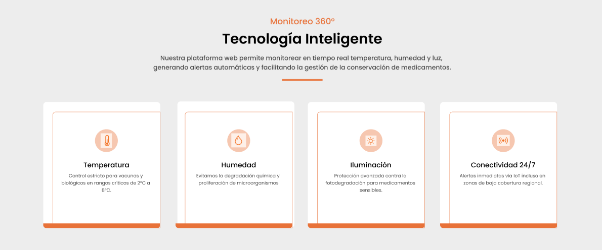
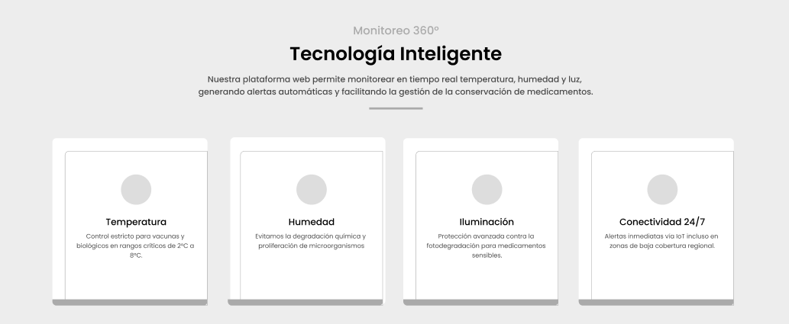

# Capítulo IV: Product Design

> **Nota metodológica (1ASI0732):** el diseño de producto se trata como objeto de experimentación UX/UI y de arquitectura verificable. Los prototipos y diagramas sustentan hipótesis de usabilidad y de calidad estructural; ``(completar)`` indica artefactos o evidencias pendientes de actualización para el ciclo actual.

> **Nota metodológica (1ASI0732):** el diseño de producto se trata como objeto de experimentación UX/UI y de arquitectura verificable. Los prototipos y diagramas sustentan hipótesis de usabilidad y de calidad estructural; ``(completar)`` indica artefactos o evidencias pendientes de actualización para el ciclo actual.

## 4.1. Style Guidelines

En este apartado, se mostrará de manera organizada los estilos y herramientas que se usarán para diseñar nuestra solución.

### 4.1.1. General Style Guidelines

  <strong style="font-size: 1.05rem;">Brand Overview</strong>
  

    En la industria farmacéutica y de salud, el almacenamiento inadecuado de medicamentos representa un riesgo crítico para la salud pública y grandes pérdidas económicas. Actualmente, muchas organizaciones dependen de procesos manuales de registro de temperatura y humedad que son propensos a errores humanos, carecen de alertas en tiempo real y dificultan el cumplimiento de las estrictas normativas de trazabilidad. Esta falta de visibilidad impide una respuesta rápida ante fallas en la cadena de frío, poniendo en duda la eficacia de productos sensibles.
  

  

    KairoLabs nace como una solución tecnológica avanzada de IoT diseñada para garantizar la integridad de los activos farmacéuticos. Nuestra plataforma integra sensores de alta precisión con un sistema de monitoreo inteligente que permite la supervisión constante de las condiciones ambientales. Con alertas automatizadas, análisis de datos en tiempo real y reportes de cumplimiento digitalizados, KairoLabs transforma la gestión de almacenes en un proceso preventivo, seguro y transparente. De esta manera, no solo protegemos la calidad de los medicamentos, sino que optimizamos la eficiencia operativa y aseguramos el cumplimiento de los estándares internacionales de salud.
  

  <strong style="font-size: 1.05rem;">Brand Name</strong>
  
El nombre de nuestra solución, KairoLabs, sintetiza su propósito técnico y funcional:

<table>
  <tr>
    <th>Componente</th>
    <th>Significado</th>
  </tr>
  <tr>
    <td><strong>Medi</strong></td>
    <td>Establece una conexión directa con el sector médico y farmacéutico, delimitando claramente el mercado objetivo.</td>
  </tr>
  <tr>
    <td><strong>Track</strong></td>
    <td>Refleja la capacidad central del sistema para realizar un seguimiento, rastreo y monitoreo continuo de las variables críticas.</td>
  </tr>
  <tr>
    <td><strong>Sensor</strong></td>
    <td>Enfatiza el componente tecnológico y de hardware que permite la recolección de datos precisos en el entorno físico.</td>
  </tr>
</table>

  Hemos elegido un nombre en inglés con una estructura clara y profesional para proyectar una imagen de innovación tecnológica y escalabilidad global, facilitando su posicionamiento como una herramienta de alta ingeniería dentro de entornos corporativos y regulatorios de salud.

Logo:

  <strong style="font-size: 1.05rem;">Typography Analysis</strong>
  

    En KairoLabs, la tipografía es un pilar fundamental para proyectar una identidad de alta precisión, innovación tecnológica y seguridad farmacéutica. A diferencia de esquemas tradicionales, hemos optado por una tipografía única versátil que cohesiona toda la experiencia visual.
  

<table>
  <tr>
    <th>Elemento Tipográfico</th>
    <th>Configuración</th>
    <th>Aplicación</th>
  </tr>
  <tr>
    <td><strong>Outfit</strong></td>
    <td>Fuente principal</td>
    <td>Tipografía geométrica inspirada en interfaces modernas y productos tecnológicos. Su estructura limpia y minimalista comunica eficiencia y exactitud en un entorno de monitoreo IoT médico.</td>
  </tr>
  <tr>
    <td><strong>Headings & Titulos</strong></td>
    <td>Bold (700) y SemiBold (600)</td>
    <td>Establecen una jerarquía visual fuerte y profesional, asegurando que los datos críticos (como temperatura y humedad) sean el foco de atención.</td>
  </tr>
  <tr>
    <td><strong>Body Text</strong></td>
    <td>Regular (400) y Light (300)</td>
    <td>Se usa en contenido general y descripciones técnicas, garantizando legibilidad óptima en reportes y paneles de control durante supervisiones prolongadas.</td>
  </tr>
</table>

    La elección de Outfit logra un equilibrio perfecto entre la estética premium del software moderno y la rigurosidad institucional requerida por entidades como DIGEMID o MINSA. Al ser una fuente de Google Fonts, asegura una carga rápida y una visualización consistente en cualquier dispositivo o plataforma web.

### Colors

La paleta de KairoLabs combina tonos saturados para acciones y metricas criticas con fondos pastel que mejoran legibilidad y jerarquia visual.

#### Colores Principales de Marca

<table>
  <tr>
    <th>Color</th>
    <th>Muestra</th>
    <th>Hex</th>
    <th>Uso</th>
  </tr>
  <tr>
    <td>Naranja Energia</td>
    <td></td>
    <td><strong>#F37021</strong></td>
    <td>CTA principal, alertas criticas y variable de temperatura.</td>
  </tr>
  <tr>
    <td>Azul Marino Profundo</td>
    <td></td>
    <td><strong>#112433</strong></td>
    <td>Navbar, titulos y estructura visual institucional.</td>
  </tr>
</table>

#### Paleta Funcional de Metricas

<table>
  <tr>
    <th>Variable</th>
    <th>Saturado</th>
    <th>Pastel</th>
    <th>Uso</th>
  </tr>
  <tr>
    <td>Temperatura</td>
    <td>
       
      <strong>#F37021</strong>
    </td>
    <td>
       
      <strong>#FFF5F1</strong>
    </td>
    <td>Codifica temperatura y alerta; fondo suave de tarjeta e icono.</td>
  </tr>
  <tr>
    <td>Humedad</td>
    <td>
       
      <strong>#3B82F6</strong>
    </td>
    <td>
       
      <strong>#EFF6FF</strong>
    </td>
    <td>Valor de humedad y datos tecnicos; fondo de apoyo en tarjetas.</td>
  </tr>
  <tr>
    <td>Luz / Iluminacion</td>
    <td>
       
      <strong>#FBBF24</strong>
    </td>
    <td>
       
      <strong>#FFFBEB</strong>
    </td>
    <td>Variable de luz y fondo pastel para contraste sin deslumbrar.</td>
  </tr>
</table>

#### Gama de Apoyo y Estados

<table>
  <tr>
    <th>Color</th>
    <th>Muestra</th>
    <th>Hex</th>
    <th>Uso</th>
  </tr>
  <tr>
    <td>Blanco Pureza</td>
    <td></td>
    <td><strong>#FFFFFF</strong></td>
    <td>Fondo principal de la interfaz.</td>
  </tr>
  <tr>
    <td>Gris Carbon</td>
    <td></td>
    <td><strong>#333333</strong></td>
    <td>Texto principal, subtitulos y contenido descriptivo.</td>
  </tr>
  <tr>
    <td>Verde Estado</td>
    <td></td>
    <td><strong>#10B981</strong></td>
    <td>Indicadores positivos como "Sistema activo".</td>
  </tr>
  <tr>
    <td>Pastel Menta</td>
    <td></td>
    <td><strong>#ECFDF5</strong></td>
    <td>Fondo sutil para chips e indicadores de estado.</td>
  </tr>
</table>

Spacing
El espaciado en KairoLabs es el componente invisible que garantiza el orden, la legibilidad y la precisión técnica de la interfaz. En un entorno donde se monitorean datos críticos de salud e IoT, una estructura clara de márgenes y paddings es vital para evitar errores de lectura y reducir la carga cognitiva del usuario.

Siguiendo las mejores prácticas de desarrollo web moderno, hemos adoptado un Sistema de 8px como unidad base. Este sistema modular asegura que todos los componentes (tarjetas de sensores, botones y formularios) mantengan una armonía matemática perfecta en cualquier resolución.

Micro-spacing (4px): Utilizado para separaciones internas mínimas, como la distancia entre el icono del termómetro y el valor numérico de la temperatura.

Base-spacing (8px): Nuestra unidad estándar para paddings internos en botones y separaciones de texto secundario.

Medium-spacing (16px): El espacio por defecto para separar las tarjetas de métricas (Temperatura, Humedad, Luz) dentro del Grid del dashboard.

Large-spacing (24px – 48px): Aplicado en los márgenes exteriores de los contenedores principales y para separar secciones de la landing page, permitiendo que la interfaz "respire" con un estilo sofisticado.

Este sistema de espaciado no solo mejora la estética, sino que optimiza la jerarquía de la información, permitiendo que los reportes técnicos y las alertas de cumplimiento (DIGEMID/MINSA) sean detectados e interpretados de forma inmediata por el personal encargado.

Tone of Voice and Communication
El tono de comunicación de KairoLabs se alinea con nuestros valores fundamentales: precisión, fiabilidad y vanguardia tecnológica. Hemos adoptado un estilo:

Técnico pero Intuitivo: Reflejamos el rigor de la logística farmacéutica y el cumplimiento de normativas como DIGEMID/MINSA, pero manteniendo una interfaz fácil de operar para el personal de almacén o laboratorio.

Preventivo y Directo: Nuestra comunicación prioriza la claridad en las alertas. El lenguaje es conciso para facilitar la toma de decisiones inmediata ante variaciones de temperatura o humedad.

Profesional y Sofisticado: Transmitimos la seguridad de un sistema de grado industrial (Seguridad AES-256) mediante un lenguaje que proyecta modernidad y robustez.

Empoderador: Motivamos al usuario a tener el control total de su inventario, transformando datos complejos de sensores en información accionable y valiosa.

De esta manera, el lenguaje utilizado refuerza la misión de la plataforma: garantizar la conservación perfecta de medicamentos mediante el monitoreo inteligente en tiempo real.

### 4.1.2. Web Style Guidelines

  <strong style="font-size: 1.05rem;">Responsive-First Approach</strong>
  

    Nuestra plataforma web está diseñada bajo un enfoque Responsive-First, garantizando que el monitoreo de suministros y la visualización de sensores sean claros, accesibles y consistentes en cualquier dispositivo (Desktop, Tablet o Mobile). Todas las decisiones visuales se han tomado siguiendo principios de sofisticación, legibilidad técnica y usabilidad de alto rendimiento, asegurando que el personal de salud y logística pueda tomar decisiones críticas sin fricciones.
  

  <strong style="font-size: 1.05rem;">Layout y Grid System</strong>
  
El diseño de KairoLabs se basa en un sistema de rejilla de 12 columnas, permitiendo una disposición flexible de paneles de control y tarjetas de datos.

<table>
  <tr>
    <th>Componente</th>
    <th>Descripción</th>
    <th>Impacto UX</th>
  </tr>
  <tr>
    <td><strong>Grid de 12 columnas</strong></td>
    <td>Base estructural para organizar dashboards, paneles y tarjetas de forma flexible.</td>
    <td>Escalabilidad visual y consistencia entre módulos.</td>
  </tr>
  <tr>
    <td><strong>Estructura del Dashboard</strong></td>
    <td>Diseño modular con métricas clave (Temperatura, Humedad, Luz) en espacios jerárquicos definidos.</td>
    <td>Lectura rápida de información crítica y expansión fluida según nodos conectados.</td>
  </tr>
</table>

  <strong>Patrón de Navegación (lectura en F)</strong>
  
En la landing page y el panel principal se utiliza un patrón de lectura en F, optimizado para el escaneo rápido de datos técnicos y alertas:

  <ul style="margin: 0; padding-left: 18px;">
    <li><strong>Identidad y Navegación:</strong> logo y acceso a sectores/tecnología en la parte superior izquierda.</li>
    <li><strong>Acción Inmediata:</strong> botón principal "Contáctanos" resaltado en la parte superior derecha.</li>
    <li><strong>Visualización Central:</strong> hero section con propuesta de valor y dashboard en tiempo real como foco principal.</li>
    <li><strong>Validación:</strong> sellos de cumplimiento (DIGEMID/MINSA) y estados del sistema en zonas estratégicas.</li>
  </ul>

  Este sistema asegura una jerarquía visual donde la información crítica siempre tiene prioridad, manteniendo la coherencia estética "glassmorphism" y profesional de la marca.

  <strong style="font-size: 1.05rem;">Responsive Design</strong>
  

    En KairoLabs, la capacidad de respuesta no es solo una cuestión estética, sino una necesidad operativa. Hemos definido breakpoints estratégicos para asegurar que el monitoreo de la cadena de frío y los suministros farmacéuticos sea impecable, ya sea desde un smartphone en un almacén o desde una estación de control central.
  

<table>
  <tr>
    <th>Dispositivo</th>
    <th>Breakpoint</th>
    <th>Navegación</th>
    <th>Dashboard e Interacción</th>
  </tr>
  <tr>
    <td><strong>Mobile</strong></td>
    <td>&lt;= 480px</td>
    <td>Menú comprimido en formato hamburguesa para priorizar el espacio de visualización de datos.</td>
    <td>Tarjetas de sensores en una sola columna y botones de acción (como "Contáctanos" y alertas) al 100% del ancho para uso táctil.</td>
  </tr>
  <tr>
    <td><strong>Tablet</strong></td>
    <td>481 - 768px</td>
    <td>Distribución en dos columnas para comparar métricas de distintos nodos simultáneamente.</td>
    <td>Descripciones cortas bajo iconos y botones de tamaño mediano con spacing de 16px para equilibrio visual.</td>
  </tr>
  <tr>
    <td><strong>Desktop</strong></td>
    <td>&gt;= 1024px</td>
    <td>Menú principal completamente desplegado en el navbar superior.</td>
    <td>Aprovechamiento total del grid de 12 columnas y espacio expandido para históricos, trazabilidad DIGEMID/MINSA y administración robusta.</td>
  </tr>
</table>

### 4.2.1. Organization Systems

En la plataforma KairoLabs, se emplean distintos sistemas de organización de contenido con el objetivo
de optimizar la supervisión y gestión de las condiciones ambientales en almacenes farmacéuticos. Estos sistemas permiten estructurar la información de manera clara y accesible, facilitando el monitoreo en tiempo real y la toma de decisiones tanto para el personal operativo como para las entidades de salud. A continuación, se describen los enfoques utilizados:

#### Organización Visual del Contenido

**Jerárquica (Visual Hierarchy):**

La organización jerárquica se aplica en dashboards, paneles de monitoreo y módulos de alertas, priorizando
visualmente información crítica como variaciones de temperatura, humedad y exposición a la luz. Elementos como alertas activas, indicadores de riesgo y estados de sensores destacan mediante el uso de colores, tamaños y distribución visual, permitiendo que los usuarios identifiquen rápidamente situaciones que requieren atención inmediata.

**Secuencial (Step-by-Step to Accomplish):**

En procesos como el registro de sensores, configuración de almacenes o gestión de alertas, la plataforma 
utiliza una estructura secuencial que guía al usuario paso a paso. Esto facilita la correcta configuración del sistema y reduce errores durante procesos operativos importantes.

Esquemas de Categorización de Contenido

**Por Audiencia (Roles de Usuario):**

KairoLabs distingue principalmente entre dos tipos de usuarios: personal operativo de almacenes
farmacéuticos y entidades de salud o gestores farmacéuticos.

El personal operativo accede a funcionalidades enfocadas en el monitoreo en tiempo real, visualización de 
condiciones ambientales, recepción de alertas y registro de incidencias.
Las entidades de salud y gestores farmacéuticos cuentan con herramientas orientadas a la supervisión c
entralizada, análisis de datos históricos, generación de reportes y control de múltiples sedes o almacenes.

La interfaz adapta la navegación y funcionalidades según el rol del usuario, mostrando únicamente las h
erramientas relevantes para cada segmento y mejorando la experiencia de uso.

**Por Tópicos:**

El contenido de la plataforma también se organiza en categorías funcionales que facilitan la navegación y 
localización de información. Entre las principales categorías se encuentran:

- Monitoreo ambiental
- Gestión de sensores
- Alertas e incidencias
- Reportes e historial de datos
- Gestión de almacenes y sedes
- Configuración y soporte

Esta organización permite que los usuarios encuentren rápidamente la información o funcionalidad requerida 
dentro del sistema.

**Implementación en la Interfaz**

La organización jerárquica y secuencial se refleja en dashboards estructurados, formularios progresivos y 
paneles de monitoreo donde la información crítica se presenta de manera priorizada y comprensible.

Por otro lado, la categorización por audiencia y tópicos se implementa mediante menús de navegación 
diferenciados, vistas adaptadas según el tipo de usuario y módulos organizados por funcionalidades 
específicas. El uso de tarjetas, gráficos, tablas y estados visuales facilita la interpretación rápida de 
las condiciones ambientales y eventos registrados por el sistema.

Este enfoque permite que KairoLabs ofrezca una experiencia intuitiva, organizada y alineada con 
las necesidades operativas del sector salud, facilitando el monitoreo eficiente y la gestión centralizada
de medicamentos.

### 4.2.2. Labeling Systems

En KairoLabs, el sistema de etiquetado ha sido diseñado priorizando la claridad, simplicidad y rápida 
comprensión de la información por parte del personal operativo y las entidades de salud. Las etiquetas 
utilizadas dentro de la plataforma buscan reducir la carga cognitiva de los usuarios, facilitando la navegación
y el acceso inmediato a funcionalidades críticas relacionadas al monitoreo ambiental de medicamentos.

##### 1. Landing Page Labels

Las etiquetas del sitio web estático están orientadas a comunicar la propuesta de valor del producto y 
facilitar el acceso a la información principal de la plataforma.

-**Home**: Representa la página principal y presenta una visión general de KairoLabs y su propuesta de
valor.

-**Technology**: Agrupa la información relacionada al funcionamiento del sistema, sensores IoT y monitoreo en
tiempo real.

-**Benefits**: Presenta las ventajas y beneficios que ofrece la plataforma para el control y conservación de
medicamentos.

-**Sectors**: Muestra los distintos sectores y tipos de instituciones donde el sistema puede ser implementado.

-**About Us**: Incluye información sobre el equipo responsable del desarrollo de KairoLabs, así como 
la misión y visión del proyecto.

-**Pricing**: Agrupa los planes de suscripción y características disponibles según las necesidades de cada 
institución.

-**Contact**: Representa la sección destinada a la comunicación directa con el equipo mediante formularios 
o información de contacto.

##### 2. Web Application Labels (Dashboard & Navigation)

Las etiquetas dentro de la aplicación web están orientadas a facilitar el acceso rápido a funciones 
operativas y de supervisión a ambos sectores objetivos.

-**Dashboard**: Representa el panel principal con información resumida sobre sensores, condiciones 
ambientales y alertas activas.

-**Sensors**: Agrupa la gestión y visualización de sensores conectados al sistema.

-**Alerts**: Incluye las alertas generadas ante variaciones críticas de temperatura, humedad o luz.

-**Warehouses**: Representa la gestión de almacenes, sedes o áreas monitoreadas.

-**Reports**: Agrupa reportes históricos, métricas y análisis relacionados a las condiciones ambientales 
registradas.

-**Incidents**: Permite visualizar y registrar incidencias relacionadas al almacenamiento de medicamentos.

-**Settings**: Incluye configuraciones generales del sistema, preferencias y administración de cuentas.

##### 3. Status Labels (Estados del Sistema)

Para mejorar la comprensión rápida del estado de las condiciones ambientales y eventos del sistema, 
se utilizan etiquetas estandarizadas:

-**Normal**: Las condiciones ambientales se encuentran dentro de los rangos permitidos.

-**Warning**: Se detecta una variación cercana al límite permitido y requiere supervisión.

-**Critical**: Las condiciones ambientales exceden los rangos seguros establecidos.

-**Offline**: El sensor o dispositivo no se encuentra conectado o disponible.

-**Resolved**: La incidencia o alerta ha sido atendida y solucionada correctamente.

Este sistema de etiquetado permite que la navegación y comprensión de la plataforma sean más intuitivas, 
facilitando la supervisión y gestión eficiente de las condiciones de almacenamiento dentro del sector salud.

### 4.2.3. SEO Tags and Meta Tags

En KairoLabs, se implementan etiquetas SEO (Search Engine Optimization) y Meta Tags dentro del 
< head > del sitio web con el objetivo de mejorar la visibilidad de la plataforma en motores de búsqueda 
como Google, así como optimizar la experiencia de navegación en distintos dispositivos y contextos de uso.

Estas etiquetas permiten describir el contenido de la plataforma, mejorar su indexación y facilitar que 
instituciones de salud, hospitales, clínicas y almacenes farmacéuticos encuentren soluciones relacionadas 
con el monitoreo ambiental y la conservación de medicamentos. Porque aparentemente hoy en día si tu web no 
tiene SEO, Google la manda al vacío cósmico donde viven las tareas entregadas fuera de fecha.

A continuación, se describen las principales etiquetas utilizadas:

**Meta Tags Básicas**

- charset="utf-8": Define la codificación de caracteres, permitiendo que el contenido se visualice correctamente, incluyendo caracteres especiales y acentos.
- viewport: Permite que la página sea responsive y se adapte correctamente a dispositivos móviles, tablets y computadoras.

**SEO Tags**

- title: Define el título de la página mostrado en los resultados de búsqueda. Resume la propuesta de valor de KairoLabs.
- meta description: Proporciona un resumen breve del contenido del sitio web, destacando el monitoreo en tiempo real de medicamentos y la gestión de condiciones ambientales.
- meta keywords: Incluye palabras clave relacionadas con monitoreo farmacéutico, sensores IoT, temperatura, humedad y almacenamiento de medicamentos.
- meta author: Identifica al equipo responsable del desarrollo de la plataforma.

**Optimización de Recursos**
- Preconnect (Google Fonts): Mejora el rendimiento estableciendo conexiones anticipadas con servidores externos utilizados por las tipografías.
- CSS e íconos: Se integran librerías visuales para mantener consistencia gráfica y facilitar el diseño responsive de la plataforma.
- Favicon: Representa visualmente a KairoLabs en pestañas del navegador y marcadores.

Codigo de ejemplo del head con SEO y Meta Tags:

    <head>
      <meta charset="utf-8">
      <meta name="viewport" content="width=device-width, initial-scale=1">
    
      <title>KairoLabs - Monitoreo inteligente de medicamentos</title>
    
      <meta name="description" content="KairoLabs permite monitorear en tiempo real temperatura, 
        humedad y luz en almacenes farmacéuticos mediante sensores IoT y dashboards inteligentes.">
    
      <meta name="keywords" content="KairoLabs, monitoreo farmacéutico, IoT salud, temperatura 
        medicamentos, humedad almacenes, conservación de medicamentos, hospitales, farmacias, sensores IoT">
    
      <meta name="author" content="Equipo KairoLabs">
    
      <!-- CSS & Icons -->
      <link href="https://cdn.jsdelivr.net/npm/bootstrap@5.3.3/dist/css/bootstrap.min.css" rel="stylesheet">
    
      <link rel="stylesheet" href="https://cdn.jsdelivr.net/npm/bootstrap-icons@1.11.3/font/bootstrap-icons.min.css">
    
      <!-- Fonts -->
      <link rel="preconnect" href="https://fonts.googleapis.com">
    
      <link rel="preconnect" href="https://fonts.gstatic.com" crossorigin>
    
      <link href="https://fonts.googleapis.com/css2?family=Inter:wght@300;400;500;600;700&display=swap" rel="stylesheet">
    
      <!-- Custom Styles -->
      <link rel="stylesheet" href="css/style.css">
    
      <!-- Favicon -->
      <link rel="icon" href="/assets/KairoLabs.png">
    </head>

### 4.2.4. Searching Systems

En KairoLabs, se implementa un sistema de búsqueda y filtrado que permite a los usuarios acceder 
rápidamente a información relevante relacionada con el monitoreo ambiental de medicamentos. Este sistema 
busca reducir el tiempo de búsqueda, facilitar la supervisión de condiciones críticas y mejorar la toma de 
decisiones dentro de la plataforma. Porque claramente revisar veinte tablas manualmente mientras un lote de 
medicamentos se cocina lentamente a 32°C no es precisamente eficiencia operativa.

El sistema está diseñado considerando los dos segmentos principales de usuarios: personal operativo de 
almacenes farmacéuticos y entidades de salud o gestores farmacéuticos, adaptando las opciones de búsqueda 
según sus necesidades específicas.

#### Búsqueda y filtros en monitoreo de almacenes

**Personal operativo de almacenes farmacéuticos**

- Búsqueda por almacén o área: Permite localizar rápidamente un almacén, sala o zona específica dentro de la institución.
- Filtrar por estado ambiental: Permite visualizar áreas según su estado actual, como “Normal”, “Alerta” o “Crítico”.
- Filtrar por tipo de variable: Facilita consultar registros relacionados con temperatura, humedad o exposición a la luz.
- Filtrar por rango de fechas: Permite revisar incidencias o registros históricos dentro de un periodo determinado.
- Historial de alertas: Acceso a eventos previos relacionados con variaciones ambientales y condiciones fuera de rango.

**Entidades de salud y gestores farmacéuticos**

- Filtrar por sede o institución: Permite supervisar múltiples almacenes o establecimientos desde un único entorno centralizado.
- Filtrar por estado de monitoreo: Visualización rápida de sedes con incidencias activas o condiciones críticas.
- Filtrar por rango de fechas: Facilita el análisis histórico y la generación de reportes para auditorías o control interno.
- Búsqueda de registros históricos: Permite acceder a datos almacenados relacionados con temperatura, humedad y luz en diferentes sedes.
- Filtrar por tipo de incidencia: Permite identificar eventos específicos asociados a fallas ambientales o incumplimientos de condiciones de almacenamiento.

#### Búsqueda en módulos adicionales

- Alertas: Búsqueda y filtrado de alertas según prioridad, fecha o estado.
- Reportes: Localización de reportes históricos por sede, fecha o tipo de variable monitoreada.
- Usuarios y sedes: Búsqueda de usuarios registrados o almacenes asociados a la institución.

**Visualización de resultados**

Los resultados de búsqueda se presentan mediante tablas y paneles organizados que muestran información clave como estado ambiental, fecha del registro, sede asociada y nivel de alerta.
Cada resultado permite acceder a una vista detallada donde el usuario puede revisar información específica sobre las condiciones monitoreadas y el historial relacionado.
En caso de no existir coincidencias, el sistema muestra mensajes informativos como “No se encontraron resultados”, evitando confusión y mejorando la experiencia de navegación. Un pequeño gesto de humanidad digital en medio del sufrimiento académico colectivo.

#### Flujo de búsqueda**

El sistema de búsqueda se encuentra integrado dentro de los módulos principales de monitoreo, alertas y reportes mediante barras de búsqueda y filtros visibles e intuitivos.
Los usuarios pueden aplicar, combinar o eliminar filtros fácilmente, permitiendo una navegación fluida y facilitando el acceso rápido a la información más relevante dentro de la plataforma.

### 4.2.5. Navigation Systems

En KairoLabs, la navegación ha sido diseñada para ser clara, intuitiva y eficiente tanto en la Landing 
Page como en la Web Application. La estructura de navegación busca facilitar el acceso rápido a información 
crítica relacionada con el monitoreo ambiental de medicamentos, reduciendo la complejidad operativa y mejorando
la experiencia de uso para los distintos segmentos del sistema. Porque si alguien tiene que encontrar una alerta
crítica escondida entre veinte menús desplegables, el verdadero peligro ya no es la humedad. Es el diseñador.

#### Navegación en la Landing Page

La Landing Page guía a los visitantes a través de la propuesta de valor de KairoLabs, permitiéndoles 
comprender rápidamente el problema, la solución tecnológica y los beneficios del sistema.

**Elementos de navegación**

**Menú de navegación superior**

Incluye accesos directos a las principales secciones de la página:

- Inicio
- Tecnología
- Beneficios
- Sectores
- Nosotros
- Planes
- Contacto

**Llamadas a la acción (CTAs)**

Se implementan botones visibles orientados a incentivar la interacción del usuario, tales como:

- “Solicitar información”
- “Conocer más”
- “Ver planes”

**Desplazamiento fluido**

La navegación entre secciones se realiza mediante desplazamiento continuo dentro de la misma página, 
permitiendo una experiencia fluida y evitando interrupciones innecesarias durante la exploración del contenido.

#### Navegación en la Web Application

La navegación dentro de la aplicación web se adapta según las necesidades de los dos segmentos principales 
de usuarios: personal operativo de almacenes farmacéuticos y entidades de salud o gestores farmacéuticos.

**Para personal operativo de almacenes farmacéuticos**

**Menú lateral fijo con opciones principales**

- Dashboard
- Monitoreo en tiempo real
- Alertas
- Historial de registros
- Reportes
- Configuración

**Accesos rápidos**

Se incorporan botones de acceso inmediato para acciones frecuentes como:

- Revisar alertas críticas
- Visualizar condiciones actuales
- Consultar historial reciente

**Para entidades de salud y gestores farmacéuticos**

**Menú lateral de supervisión centralizada**

- Dashboard general
- Gestión de sedes
- Reportes históricos
- Alertas globales
- Usuarios
- Configuración institucional

**Navegación entre sedes**

El sistema permite alternar rápidamente entre diferentes almacenes o sedes monitoreadas mediante filtros y 
paneles de selección.

**Visualización centralizada**

Las entidades pueden acceder a vistas generales que resumen el estado ambiental de múltiples almacenes en 
tiempo real, facilitando la supervisión integral.

#### Interacción con el sistema

**Accesibilidad**

La navegación utiliza etiquetas claras, iconografía comprensible y estructuras visuales organizadas para 
facilitar el uso de la plataforma por distintos perfiles de usuario.

**Navegación de búsqueda**

Se integran filtros rápidos y barras de búsqueda para localizar sedes, alertas, registros o reportes 
específicos de manera eficiente.

**Ayuda y soporte**

La plataforma incorpora secciones de asistencia y orientación para apoyar al usuario en la comprensión de
las funcionalidades principales del sistema y reducir la dificultad de adopción tecnológica. 

---

## 4.3. Landing Page UI Design

El diseño de la interfaz de usuario (UI) de la página de inicio de KairoLabs
es fundamental para captar la atención de los visitantes y comunicar de forma clara 
su propuesta de valor: el monitoreo en tiempo real de las condiciones ambientales en el 
almacenamiento de medicamentos. El enfoque del diseño se centra en ofrecer una experiencia 
intuitiva, estructurada y orientada a la toma de decisiones, garantizando que cada elemento
sea comprensible y fácil de utilizar, reflejando el compromiso del producto con la eficiencia,
la precisión y la confiabilidad en el sector salud.

### 4.3.1. Landing Page Wireframe

El wireframe de la página de inicio funciona como un mapa visual que define la estructura, jerarquía, distribución y flujo de la información dentro de la plataforma. Este esquema no solo organiza los elementos gráficos, sino que establece las bases funcionales de la experiencia de usuario, asegurando coherencia entre diseño, navegación y objetivos estratégicos del sistema.

En KairoLabs, el wireframe está diseñado bajo principios de usabilidad, claridad estructural y enfoque en la conversión. Cada sección cumple un propósito específico dentro del recorrido del usuario, guiándolo desde la comprensión inicial del problema hasta la interacción directa con la solución. La estructura general prioriza la propuesta de valor, la confianza institucional y la accesibilidad de la información.

El diseño sigue un enfoque modular y jerárquico, permitiendo que cada bloque de contenido sea independiente, escalable y fácilmente adaptable a futuras mejoras o ampliaciones del sistema.

---

**Nav y Hero**

La sección inicial representa el punto de entrada principal de la plataforma y tiene como objetivo generar impacto inmediato. Aquí se establece la identidad visual de KairoLabs mediante la incorporación del logotipo y un mensaje introductorio que comunica precisión, control y monitoreo inteligente en el almacenamiento de medicamentos.

La barra de navegación superior permite acceder de manera directa a las secciones clave del sitio, asegurando una experiencia fluida y organizada. Entre las opciones disponibles se incluyen Tecnología, Beneficios, Sectores, Nosotros, Planes y Contacto. Esta estructura facilita la exploración progresiva del contenido sin generar sobrecarga informativa.

El área Hero destaca la propuesta de valor principal del sistema: el monitoreo en tiempo real de variables críticas como temperatura, humedad y luz. Además, incorpora un llamado a la acción visible que orienta al usuario hacia la obtención de información adicional o el contacto directo con el equipo.

El uso de un recurso visual relacionado al entorno farmacéutico refuerza el contexto del producto y genera una conexión inmediata con el sector salud.

---

**Tecnología (How It Works)**

Esta sección explica el funcionamiento del sistema de manera estructurada y comprensible. Su objetivo es detallar cómo los sensores IoT integrados capturan datos ambientales y los transmiten hacia la plataforma web para su procesamiento y visualización en tiempo real.

Se presentan las variables monitoreadas:

- Temperatura  
- Humedad  
- Luz  

El contenido está organizado en bloques informativos que describen el flujo completo del sistema, desde la recolección de datos hasta su representación en dashboards interactivos. Esta estructura permite que el usuario comprenda claramente la arquitectura funcional sin necesidad de conocimientos técnicos avanzados.

---

**Beneficios del sistema**

En esta sección se resaltan los principales valores agregados de KairoLabs. El objetivo es demostrar cómo la plataforma contribuye a la reducción de pérdidas, mejora la trazabilidad y fortalece el cumplimiento de normativas sanitarias.

Entre los beneficios destacados se incluyen:

- Alertas automáticas ante variaciones críticas.  
- Acceso a datos en tiempo real.  
- Historial de registros para auditorías.  
- Mejora en la toma de decisiones.  
- Supervisión centralizada.  
- Prevención de deterioro de medicamentos.  

La organización visual de esta sección permite una lectura clara y rápida, reforzando el impacto del sistema dentro del sector salud.

---

**Sectores (Aplicación del sistema)**

Esta sección demuestra la adaptabilidad y escalabilidad del sistema, mostrando los distintos contextos donde puede ser implementado.

Los principales sectores incluyen:

- Hospitales  
- Clínicas  
- Farmacias  
- Centros de distribución  
- Almacenes farmacéuticos  

Cada segmento está presentado de manera breve y clara, permitiendo que el usuario identifique rápidamente la relevancia del sistema en su entorno operativo. Esto refuerza la flexibilidad del producto y su capacidad de integración en diferentes instituciones.

---

**Sobre el Equipo (Nosotros)**

Esta sección tiene como finalidad generar confianza y credibilidad institucional. Presenta al equipo responsable del desarrollo de KairoLabs, destacando el compromiso con la innovación tecnológica y la mejora de procesos en el sector salud.

La inclusión de esta sección humaniza la solución y fortalece la percepción profesional del proyecto, elemento clave en plataformas tecnológicas orientadas a instituciones sanitarias.

---

**Planes (Pricing)**

La sección de planes está diseñada para facilitar la comparación entre las diferentes opciones de suscripción disponibles.

Incluye información sobre:

- Número de sedes permitidas.  
- Acceso a monitoreo en tiempo real.  
- Gestión centralizada.  
- Reportes históricos.  
- Sistema de alertas.  
- Funcionalidades adicionales según el plan.  

El diseño estructurado permite que el usuario evalúe rápidamente cuál opción se adapta mejor a sus necesidades operativas y presupuestarias.

---

**Contacto**

La sección de contacto facilita la comunicación directa entre los interesados y el equipo de KairoLabs. Su objetivo es permitir que instituciones puedan solicitar información adicional, demostraciones del sistema o propuestas de implementación.

Se busca ofrecer un canal claro, accesible y confiable que apoye el proceso de adopción tecnológica dentro del sector salud.

---

**Footer**

El pie de página cumple una función estructural y de cierre dentro del diseño. Incluye enlaces relevantes como términos de servicio, políticas de privacidad y medios de contacto.

Este elemento permite acceder rápidamente a información complementaria sin afectar la jerarquía principal del contenido, manteniendo una experiencia organizada y profesional.

---

Este wireframe establece una estructura sólida que garantiza claridad, coherencia y orientación estratégica dentro de la Landing Page. Su diseño permite comunicar eficazmente la propuesta de valor de KairoLabs, guiando al usuario de manera progresiva desde la comprensión del problema hasta la interacción con la solución tecnológica.

### 4.3.2. Landing Page Mock-up

Los mockups de KairoLabs representan la versión visual de alta fidelidad de la Landing Page, incorporando la identidad gráfica, la paleta de colores definida en el sistema de diseño y el estilo visual final del producto. A diferencia del wireframe, que establece la estructura funcional, el mockup incorpora elementos reales de diseño como tipografía, colores, iconografía, imágenes y jerarquía visual definitiva.

La propuesta utiliza como colores principales el azul oscuro #1B304C, asociado a confianza, estabilidad y profesionalismo, y el naranja #E87239, utilizado estratégicamente para resaltar información importante, botones de acción y llamados a la conversión. Esta combinación cromática refuerza la identidad institucional del sistema y mantiene coherencia con el enfoque tecnológico y del sector salud.

Asimismo, se incorporan imágenes relacionadas al entorno farmacéutico y al monitoreo de medicamentos, reforzando visualmente el propósito del sistema en la seguridad, supervisión y control dentro del almacenamiento de productos sensibles. La composición visual busca transmitir modernidad, precisión y confiabilidad.

Los mockups permiten validar aspectos como:

- Distribución final de los componentes.
- Contraste visual y legibilidad.
- Jerarquía tipográfica.
- Ubicación estratégica de los CTAs.
- Coherencia estética entre secciones.
- Experiencia visual en distintos dispositivos.

De esta manera, esta etapa representa la transición del diseño estructural a la experiencia visual completa del usuario.

---

**Nav y Hero**

La sección principal presenta una interfaz moderna, limpia y visualmente equilibrada que comunica de forma inmediata la propuesta de valor de KairoLabs. Se prioriza un mensaje claro orientado al monitoreo en tiempo real, acompañado de un llamado a la acción visible y destacado mediante el color de marca.

El diseño del Hero incluye:

- Imagen contextual del sector farmacéutico.
- Mensaje principal con jerarquía tipográfica destacada.
- Botón de acción con alto contraste.
- Espaciado adecuado para mejorar la lectura.
- Distribución visual centrada en conversión.

Este diseño busca captar la atención del usuario en los primeros segundos de interacción y facilitar la comprensión inmediata del sistema.

---

**Tecnología (How It Works)**

El mockup de esta sección muestra de forma visual el funcionamiento del sistema y la integración con sensores IoT. Se utilizan tarjetas informativas, íconos representativos y una estructura organizada que facilita la comprensión del flujo de datos.

La representación visual permite identificar claramente:

- Captura de datos mediante sensores.
- Transmisión de información.
- Procesamiento en la plataforma.
- Visualización en dashboards.
- Generación de alertas automáticas.

El diseño refuerza la claridad técnica sin sobrecargar la interfaz, manteniendo un equilibrio entre información y estética.

---

**Beneficios del sistema**

Esta sección resalta los beneficios principales mediante elementos visuales estructurados que permiten una lectura rápida y clara. El diseño enfatiza conceptos como monitoreo continuo, alertas automáticas, trazabilidad digital y cumplimiento normativo.

Se destacan ventajas como:

- Supervisión en tiempo real.
- Prevención de pérdidas.
- Acceso a historial de datos.
- Soporte para auditorías.
- Gestión centralizada.
- Mayor eficiencia operativa.

El uso de tarjetas y bloques diferenciados facilita la comprensión del valor agregado del sistema.

---

**Sectores (Aplicación del sistema)**

El diseño presenta los diferentes entornos donde KairoLabs puede ser implementado, utilizando imágenes representativas y bloques visuales organizados.

Esta sección permite identificar claramente la adaptabilidad del sistema en:

- Hospitales.
- Clínicas.
- Farmacias.
- Centros de distribución.
- Almacenes farmacéuticos.

El objetivo visual es demostrar escalabilidad y flexibilidad del producto dentro del sector salud.

---

**Sobre el Equipo (Nosotros)**

Esta sección adopta un diseño profesional y cercano para presentar al equipo responsable del desarrollo del sistema. Se busca fortalecer la confianza institucional mediante una presentación visual clara y coherente con la identidad del proyecto.

El mockup incluye:

- Fotografías o representaciones del equipo.
- Descripciones breves.
- Diseño alineado con la identidad de marca.
- Espacios bien definidos para generar orden visual.

Este componente refuerza la credibilidad del producto.

---

**Planes (Pricing)**

El mockup de planes organiza la información de manera estructurada y visualmente diferenciada, facilitando la comparación entre las distintas opciones de suscripción.

El diseño permite visualizar claramente:

- Características incluidas en cada plan.
- Número de sedes.
- Nivel de funcionalidades.
- Acceso a reportes.
- Sistema de alertas.
- Opciones de gestión centralizada.

La estructura está pensada para mejorar la toma de decisiones del usuario y orientar la conversión.

---

**Contacto**

La sección de contacto presenta un diseño accesible, ordenado y coherente con el resto de la plataforma. Su objetivo es facilitar la comunicación directa entre los usuarios interesados y el equipo de KairoLabs.

Incluye:

- Formulario estructurado.
- Información de contacto.
- Elementos visuales consistentes.
- Distribución limpia y profesional.

Esta sección cumple una función estratégica dentro del flujo de conversión.

---

**Footer**

El footer mantiene una estructura limpia y funcional, integrando accesos rápidos a información relevante como términos de servicio, políticas de privacidad y enlaces institucionales.

Su diseño asegura:

- Cierre visual equilibrado.
- Acceso a información legal.
- Consistencia con la identidad gráfica.
- Organización clara de enlaces secundarios.

Este elemento completa la experiencia visual de la Landing Page, manteniendo coherencia y profesionalismo en todo el diseño.

## 4.4. Web Applications UX/UI Design

### 4.4.1. Web Applications Wireframes

En esta sección se presentan los wireframes de la versión web de KairoLabs,
organizados según los dos perfiles principales de usuario: personal operativo de almacenes
farmacéuticos y entidades de salud. Cada diseño está orientado a ofrecer una experiencia
clara, coherente y centrada en las necesidades de cada segmento, facilitando la supervisión
de condiciones ambientales, el acceso a información relevante y la toma de decisiones.
Asimismo, se busca asegurar una navegación intuitiva y fluida a lo largo de la plataforma.

### 4.4.2. Web Applications Wireflow Diagrams

En esta sección se presentan los diagramas de flujo de interacción (wireflows) de 
la aplicación web de KairoLabs, los cuales ilustran la navegación y las 
principales acciones que pueden realizar los distintos segmentos de usuarios dentro 
de la plataforma. Estos diagramas permiten visualizar cómo los usuarios interactúan con el sistema, 
facilitando la comprensión de la estructura funcional y de la experiencia de uso orientada al 
monitoreo de condiciones ambientales en tiempo real.

**Flujo tras inicio de sesión de Segmento Personal Operativo**

Este flujo representa el recorrido del personal operativo de almacenes farmacéuticos, enfocado en
la supervisión en tiempo real de condiciones ambientales. El usuario visualiza variables como 
temperatura, humedad y luz, detecta variaciones fuera de rango y registra incidencias.

**Flujo tras inicio de sesión de Segmento Entidades de Salud**

Este flujo describe la experiencia de entidades de salud y gestores farmacéuticos, quienes 
requieren una visión estratégica del sistema. Desde su panel, supervisan múltiples almacenes, 
acceden a datos históricos, analizan tendencias y apoyan la toma de decisiones.

### 4.4.3. Web Applications Mock-ups

Esta sección presenta los mockups de la aplicación web de KairoLabs, diseñados para ofrecer una experiencia visual coherente con la identidad gráfica del producto y adaptada a las necesidades operativas de los usuarios. Los mockups representan la fase de diseño de alta fidelidad, donde se integran completamente la paleta de colores, la tipografía definida, los componentes UI y la estructura funcional establecida en los wireframes.

Cada pantalla ha sido diseñada considerando los dos perfiles principales del sistema: Personal Operativo y Entidades de Salud, asegurando que cada usuario acceda únicamente a las funcionalidades relevantes para su rol.

---

### 🔹 Mockups de Autenticación y Gestión de Cuenta

**Login:**  
Pantalla de inicio de sesión que permite el acceso seguro al sistema mediante credenciales. Incluye validación de datos y diseño centrado en simplicidad y seguridad.

**Login Entidades:**  
Versión del inicio de sesión adaptada al perfil de entidades de salud, manteniendo coherencia visual y diferenciación funcional.

**Registro de Entidades:**  
Formulario de creación de cuenta para instituciones, estructurado de manera clara para facilitar el proceso de registro.

**Registro Personal Operativo:**  
Pantalla destinada al registro del personal operativo, permitiendo la creación de usuarios con permisos específicos.

**Login Personal Operativo:**  
Acceso específico para usuarios encargados del monitoreo diario de dispositivos y almacenes.

---

### 🔹 Mockups del Dashboard y Home

**Home Entidades:**  
Panel principal para gestores, donde se muestra una vista general del estado de múltiples sedes y métricas institucionales.

**Home Personal Operativo:**  
Vista principal enfocada en dispositivos activos, alertas y monitoreo en tiempo real.

---

### 🔹 Gestión de Dispositivos y Sensores

**Agregar Dispositivo:**  
Permite registrar nuevos sensores IoT en el sistema, vinculándolos a un almacén específico.

**Vista de Dispositivo:**  
Muestra información detallada del sensor, incluyendo estado, lecturas y configuración.

**Listado de Dispositivos:**  
Pantalla que organiza todos los sensores registrados para facilitar su administración.

---

### 🔹 Gestión de Transporte

**Agregar Transporte:**  
Permite registrar unidades de transporte utilizadas en distribución de medicamentos con monitoreo ambiental.

**Lista de Transportes:**  
Visualiza todos los medios de transporte monitoreados por el sistema.

**Detalle de Transporte:**  
Presenta información específica del vehículo y sus condiciones ambientales registradas.

---

### 🔹 Gestión de Sedes e Instituciones

**Agregar Establecimiento:**  
Permite a entidades registrar nuevas sedes o almacenes dentro del sistema.

**Listado de Establecimientos:**  
Muestra todas las sedes asociadas a una institución.

**Información del Establecimiento:**  
Detalle completo de una sede específica, incluyendo estado y dispositivos vinculados.

---

### 🔹 Perfil y Configuración

**Editar Perfil Entidades:**  
Permite actualizar información institucional y datos de contacto.

**Editar Perfil Personal:**  
Pantalla para modificar datos del usuario operativo.

**Perfil Básico:**  
Vista de información estándar de la cuenta institucional.

**Perfil Premium:**  
Muestra beneficios adicionales según el plan contratado.

---

### 🔹 Planes y Pagos

**Planes:**  
Presenta las opciones de suscripción disponibles con sus características diferenciadas.

**Pagar Plan:**  
Pantalla destinada al proceso de pago y activación del servicio.

**Cancelar Plan:**  
Permite gestionar la cancelación de suscripción de manera controlada.

**Confirmación de Cancelación:**  
Modal de validación para evitar acciones accidentales.

---

### 🔹 Gestión Operativa y Supervisión

**Mapa de Sedes:**  
Visualización geográfica de establecimientos para supervisión centralizada.

**Información de Dispositivo (Entidad):**  
Detalle técnico de sensores asociados a la institución.

**Sin Establecimiento:**  
Pantalla que informa cuando el usuario aún no tiene sedes registradas.

---

En conjunto, estos mockups consolidan la identidad visual de KairoLabs dentro de la aplicación web, garantizando coherencia estética, claridad funcional y una experiencia optimizada para ambos segmentos de usuarios. Cada pantalla ha sido diseñada para cumplir un objetivo específico dentro del flujo operativo del sistema, reforzando la usabilidad, la organización y la eficiencia en el monitoreo de condiciones ambientales.

### 4.4.4. Web Applications User Flow Diagrams

Los User Flow Diagrams de la aplicación web de KairoLabs representan la visualización estructurada de los recorridos que realizan los usuarios dentro del sistema para cumplir objetivos específicos. Estos diagramas permiten comprender la secuencia de acciones, decisiones y transiciones entre pantallas, facilitando el análisis de la experiencia de usuario y la validación de la lógica de navegación implementada.

El diseño de los flujos está basado en los objetivos principales de cada tipo de usuario, asegurando que cada recorrido sea claro, eficiente y coherente con su rol dentro del sistema. De esta manera, se optimiza la interacción, se reducen pasos innecesarios y se mejora la usabilidad general de la plataforma.

Los User Flow Diagrams cumplen una función fundamental en el proceso de diseño, ya que permiten:

- Visualizar el camino completo desde el ingreso hasta la acción final.
- Identificar puntos de decisión dentro del sistema.
- Validar la estructura de navegación.
- Detectar posibles mejoras en la experiencia.
- Garantizar coherencia entre mockups y funcionalidad.
- Asegurar una experiencia diferenciada por tipo de usuario.

En KairoLabs, los flujos están organizados principalmente en torno a procesos clave como autenticación y edición de perfil, tanto para Entidades como para Personal Operativo. Estos recorridos representan acciones esenciales dentro del uso cotidiano de la plataforma.

---

### 🔹 User Flow – Login Entidades

Este flujo describe el proceso de inicio de sesión para usuarios pertenecientes al perfil de entidades (instituciones de salud). El recorrido inicia desde la pantalla de acceso, continúa con la validación de credenciales y finaliza en el acceso al panel principal.

El diagrama permite visualizar:

- Ingreso de credenciales.
- Validación del sistema.
- Acceso exitoso al dashboard institucional.
- Manejo de posibles errores de autenticación.

Este flujo garantiza seguridad, control de acceso y separación de roles dentro de la plataforma.

---

### 🔹 User Flow – Login Personal

Este diagrama representa el proceso de autenticación para el personal operativo. El flujo sigue una estructura similar al de entidades, pero dirigido a usuarios encargados del monitoreo diario y la gestión técnica de dispositivos.

El recorrido incluye:

- Pantalla de inicio de sesión.
- Validación de datos.
- Acceso al panel operativo.
- Gestión de posibles errores o credenciales incorrectas.

Este flujo asegura que únicamente usuarios autorizados puedan acceder a funciones de monitoreo y administración técnica.

---

### 🔹 User Flow – Editar Perfil Entidades

Este flujo describe el proceso mediante el cual los usuarios institucionales pueden modificar su información de perfil. El recorrido inicia desde el panel principal y conduce a la sección de configuración de cuenta.

Incluye:

- Acceso a la sección de perfil.
- Visualización de datos actuales.
- Edición de información.
- Confirmación de cambios.
- Actualización exitosa del sistema.

Este flujo garantiza que las instituciones puedan mantener su información actualizada de manera segura y controlada.

---

### 🔹 User Flow – Editar Perfil Personal

Este diagrama representa el proceso de actualización de datos para usuarios del perfil personal operativo. El recorrido es similar al de entidades, pero adaptado a las funcionalidades disponibles para este tipo de usuario.

El flujo contempla:

- Acceso al perfil.
- Modificación de datos personales.
- Validación de información.
- Confirmación de cambios.

Este proceso mejora la autonomía del usuario y mantiene la integridad de la información dentro del sistema.

---

En conjunto, los User Flow Diagrams permiten validar la estructura lógica de la aplicación web, asegurando que cada acción del usuario tenga una ruta clara y definida dentro del sistema. Estos diagramas fortalecen la planificación del diseño, mejoran la coherencia entre pantallas y garantizan una experiencia de usuario organizada, intuitiva y alineada con los objetivos funcionales de KairoLabs.

## 4.5. Web Applications Prototyping

En esta etapa se ha desarrollado un prototipo interactivo de alta fidelidad utilizando **Figma**, con el objetivo de validar la experiencia de usuario (UX) y la interfaz (UI) de la plataforma KairoLabs. Este prototipo permite simular de manera precisa la navegación real, las transiciones de estado y la interacción con los dashboards de telemetría, asegurando que los flujos de trabajo diseñados para el personal operativo y las entidades de salud sean intuitivos y libres de fricciones operativas.

La simulación abarca desde el flujo de autenticación hasta la gestión avanzada de alertas críticas, permitiendo testear la jerarquía visual y la efectividad del sistema de etiquetado antes de pasar a la fase de desarrollo.

> [Ver video del prototipo en Figma](https://drive.google.com/drive/folders/1i6KZDtYcAT-HQNS06tekE2Z9jYt_wBFw?usp=sharing)

## 4.6. Domain-Driven Software Architecture

### 4.6.1. Design-Level EventStorming

En esta sección se presenta el Design-Level EventStorming realizado para el sistema KairoLabs. A través de esta actividad, se identificaron detalladamente los eventos de dominio, comandos, actores, políticas y vistas que conforman cada Bounded Context, desde la ingesta de telemetría IoT hasta la gestión de cumplimiento regulatorio. El resultado permite visualizar la dinámica interna de la solución y la interacción entre sus componentes, facilitando un entendimiento profundo del dominio farmacéutico y garantizando una arquitectura reactiva capaz de mitigar riesgos críticos en tiempo real.

Link del miro: 

> [Enlace Del Miro](https://miro.com/welcomeonboard/SVV1K0dFRzEyVTVDdUcyWnlZaldBTHRyTkxMTWorOXlLaXNRbmQ1czlsZkJuOFROVHh3YWkzN2JsT01wRHRKQXJUaW5LQXJ0cEovUkdzR2VWaCtiTFZ2YUJkTW5YRUthaW8wL1grTXh3MnBEdDhDQjc0SENoOXYxQ0pGd2VHeU1yVmtkMG5hNDA3dVlncnBvRVB2ZXBnPT0hdjE=?share_link_id=632091220772)

### 4.6.2. Software Architecture Context Diagram

A continuación, se presenta el diagrama de contexto para el sistema KairoLabs. Este nivel muestra cómo la plataforma se relaciona con los segmentos objetivo principales: el personal operativo, encargado de supervisar las condiciones ambientales en almacenes, y los gestores farmacéuticos, que analizan reportes históricos y cumplimiento normativo. Asimismo, se ilustra la interacción con los sensores IoT que proveen la telemetría en tiempo real y los sistemas externos de notificaciones y regulación que aseguran la trazabilidad y seguridad de los productos farmacéuticos.

### 4.6.3. Software Architecture Container Diagrams

A continuación, se presenta el diagrama de contenedores de KairoLabs. El sistema se compone de una Web Application desarrollada en Vue.js, que ofrece una interfaz reactiva para los usuarios, y una API Application que centraliza la lógica de negocio y la ingesta de datos IoT. Finalmente, se utiliza SQL Server como base de datos para garantizar la persistencia de registros históricos y perfiles, permitiendo una comunicación fluida entre el monitoreo en tiempo real y el almacenamiento seguro.

### 4.6.4. Software Architecture Components Diagrams

A continuación, se presenta el diagrama de componentes para la API Application de KairoLabs. Este nivel detalla los módulos internos responsables de gestionar los flujos críticos del sistema. Se incluyen el Auth Component para la seguridad mediante JWT, el Monitoring Controller que expone los servicios de telemetría y el Environment Service como núcleo de la lógica para el control de variables ambientales. Asimismo, se integran el Data Repository para la persistencia en SQL Server, y adaptadores específicos para la comunicación con el servicio de alertas y los sistemas regulatorios. Este diagrama refleja cómo la arquitectura interna garantiza la escalabilidad y el monitoreo eficiente de los medicamentos.

---

## 4.7. Software Object-Oriented Design

### 4.7.1. Class Diagrams

El diagrama de clases de **KairoLabs** constituye la piedra angular del diseño orientado a objetos (SOOD) de la plataforma. Ha sido estructurado bajo principios de **Sólida Arquitectura** y **Alta Cohesión**, permitiendo modelar la complejidad del ecosistema IoT farmacéutico y garantizando la integridad de los datos en entornos de misión crítica.

---

A continuación, se detalla la lógica de cada módulo y su justificación técnica basada en los requerimientos del dominio:

#### **1. Arquitectura de Usuarios y Gestión de Acceso (Herencia)**
El sistema implementa el patrón de **Generalización/Herencia** para centralizar la gestión de perfiles, optimizando la reutilización de código y facilitando la escalabilidad de roles de acuerdo con las necesidades de seguridad institucional.

* **Users (Clase Base)**: Actúa como el núcleo de identidad del sistema. Almacena atributos transversales como credenciales cifradas, datos personales (`dni`, `email`, `phone`) y metadatos de auditoría (`created_at`). Sus métodos `login()`, `logout()` y `updateProfile()` encapsulan la lógica de autenticación y gestión de cuenta compartida por todos los actores.
* **Operators (Subclase)**: Esta clase está especializada en la supervisión táctica. Incluye atributos operativos como su horario asignado (`schedule`) y métodos específicos para interactuar con la infraestructura física, tales como `viewDevices()`, `viewTransports()` y `answerAlert()`, permitiendo un flujo de trabajo enfocado en la mitigación de riesgos inmediatos.
* **Admins (Subclase)**: Representa la autoridad administrativa de la entidad de salud. Sus métodos `manageEstablishments()` y `manageSubscriptions()` le otorgan el control total sobre la configuración organizacional y el ciclo de vida comercial del servicio.

#### **2. Núcleo Operativo: Establishments y Organización**
La clase **Establishments** funciona como el contenedor lógico principal (Aggregate Root) que orquestra la relación entre la infraestructura física, el personal y la ubicación geográfica de los activos.

* **Atributos de Localización**: Almacena datos críticos para la trazabilidad como dirección, distrito, ciudad y coordenadas geográficas (`latitude`, `longitude`), fundamentales para auditorías de entes reguladores como DIGEMID o MINSA.
* **Relaciones de Composición**: Mantiene una relación de composición fuerte con los dispositivos y transportes. Esto garantiza que la existencia de estos nodos dependa directamente de la vigencia del establecimiento dentro de la plataforma, asegurando la integridad referencial del sistema.

#### **3. Monitoreo IoT y Telemetría: Devices y Transports**
Estas clases modelan los puntos físicos de captura de datos (sensores), compartiendo una estructura simétrica de atributos técnicos necesarios para el control de suministros.

* **Atributos de Precisión Multivariante**: Ambas clases registran variables ambientales críticas como `temperature`, `humidity`, `light_intensity`, `air_quality`, `vibration`, `door_status` y `atmospheric_pressure`. Esta granularidad permite un análisis forense exhaustivo ante cualquier desviación de la cadena de frío.
* **Comportamiento Reactivo**: Los métodos `readData()` y `generateAlert()` representan el núcleo de la inteligencia del sistema. El primero gestiona la ingesta de telemetría constante, mientras que el segundo ejecuta la lógica de negocio para disparar notificaciones instantáneas cuando se superan los umbrales de seguridad configurados.

#### **4. Ciclo de Vida Comercial: Subscriptions**
Para soportar la sostenibilidad del modelo de negocio, la clase **Subscriptions** gestiona los niveles de servicio vinculados a los administradores.

* **Control de Estado y Acceso**: Mediante los métodos `activate()`, `cancel()` y `expire()`, el sistema gestiona automáticamente el acceso a funcionalidades avanzadas, el límite de sensores permitidos y la persistencia histórica de los reportes de acuerdo con el plan (`plan: Enum`) contratado.

---

**Resumen de Interacciones Técnicas**
* **Generalización**: `Operators` y `Admins` heredan el comportamiento de `Users` para una gestión de seguridad centralizada.
* **Composición**: Un `Establishment` es el dueño total de sus `Devices` y `Transports`, garantizando que no existan nodos huérfanos en la base de datos.
* **Asociación Directa**: La vinculación entre `Admins` y `Subscriptions` asegura un rastro de auditoría claro sobre quién gestiona la infraestructura y bajo qué términos de servicio.
---

## 4.8. Database Design

### 4.8.1. Database Diagrams

El diseño del esquema de base de datos de **KairoLabs** representa la infraestructura de persistencia robusta necesaria para garantizar la integridad y trazabilidad de los datos en el sector salud. El modelo ha sido normalizado siguiendo los estándares de la **Tercera Forma Normal (3NF)** para eliminar la redundancia y asegurar la consistencia transaccional durante el procesamiento de telemetría IoT masiva.

---

A continuación, se presenta un desglose técnico de los módulos que integran el modelo relacional y su impacto en la operatividad del sistema:

#### **1. Gestión de Identidad y Seguridad (Users, Admins, Operators)**
El esquema implementa un modelo de segregación de perfiles para garantizar que el acceso a la información sensible se rija por el principio de mínimo privilegio.

* **Table `users`**: Centraliza los atributos de identidad digital, incluyendo credenciales cifradas y metadatos personales (`dni`, `email`, `job_title`). Actúa como la entidad de autenticación primaria para el sistema.
* **Table `admins`**: Extiende la funcionalidad de usuario para los gestores institucionales, vinculándolos directamente con el código de entidad y la gestión de planes operativos.
* **Table `operators`**: Vincula a los usuarios técnicos con establecimientos específicos. Incluye métricas de rendimiento como `alerts_answered`, permitiendo auditar la eficiencia de respuesta ante crisis térmicas.

#### **2. Arquitectura de Infraestructura (Establishments)**
La tabla **`establishments`** funciona como el núcleo relacional que organiza la jerarquía física de la red de salud.

* **Trazabilidad Geoespacial**: Almacena datos de ubicación precisos (`latitude`, `longitude`) y detalles de contacto, permitiendo la supervisión multisede y la generación de reportes de cumplimiento localizados para entidades como DIGEMID.
* **Relación de Dependencia**: Cada establecimiento está subordinado a un administrador, centralizando la gobernanza de los suministros dentro de una única unidad operativa.

#### **3. Motor de Telemetría IoT (Devices y Transports)**
Estas entidades están diseñadas para la ingesta de datos ambientales de alta precisión, utilizando tipos de datos `DECIMAL` para evitar errores de redondeo en métricas críticas.

* **Variables Multivariantes**: Ambas tablas registran simultáneamente `temperature`, `humidity`, `light_intensity`, `air_quality`, `vibration` y `atmospheric_pressure`. Esta estructura permite un monitoreo holístico del entorno de conservación.
* **Estado de Activos**: Se incluyen campos específicos como `door_status` y `suspended_particles`, fundamentales para validar protocolos de esterilidad y seguridad física en almacenes de medicamentos biológicos.
* **Sincronización Temporal**: Los campos `created_at` y `updated_at` garantizan un rastro de auditoría temporal inmutable para cada lectura capturada por el hardware.

#### **4. Gobernanza Comercial (Subscriptions)**
Para asegurar la sostenibilidad y escalabilidad del servicio, se implementa una capa de gestión de licencias.

* **Table `subscriptions`**: Gestiona el ciclo de vida de los planes (`plan: ENUM`), controlando las fechas de vigencia y el estado del servicio para cada administrador de salud.

---

**Análisis de Integridad Relacional y Escalabilidad**
* **Foreign Keys**: El uso estricto de claves foráneas asegura que no existan lecturas de sensores ("huérfanas") sin un establecimiento o dispositivo de origen claramente identificado.
* **Indexación Estratégica**: El modelo está optimizado para consultas de agregación de datos históricos, facilitando que los gestores farmacéuticos accedan a métricas de rendimiento mensual en milisegundos.
* **Resiliencia Operativa**: La separación entre dispositivos fijos (`devices`) y móviles (`transports`) permite que la plataforma gestione tanto almacenes centrales como la logística de distribución ("última milla") bajo un mismo estándar de datos.
