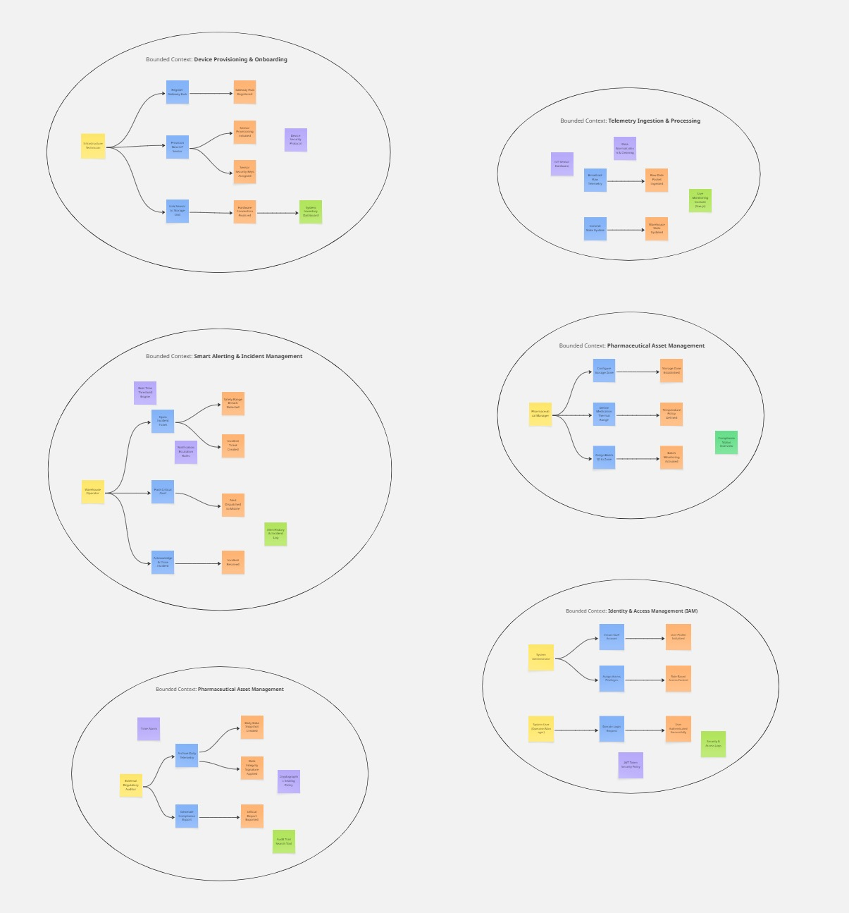

# Capítulo IV: Product Design

> **Nota metodológica (1ASI0732):** el diseño de producto se trata como objeto de experimentación UX/UI y de arquitectura verificable. Los prototipos y diagramas sustentan hipótesis de usabilidad y de calidad estructural; ``(completar)`` indica artefactos o evidencias pendientes de actualización para el ciclo actual.

> **Nota metodológica (1ASI0732):** el diseño de producto se trata como objeto de experimentación UX/UI y de arquitectura verificable. Los prototipos y diagramas sustentan hipótesis de usabilidad y de calidad estructural; ``(completar)`` indica artefactos o evidencias pendientes de actualización para el ciclo actual.

## 4.1. Style Guidelines

En este apartado, se mostrará de manera organizada los estilos y herramientas que se usarán para diseñar nuestra solución.

### 4.1.1. General Style Guidelines

  <strong style="font-size: 1.05rem;">Brand Overview</strong>
  

    En la industria farmacéutica y de salud, el almacenamiento inadecuado de medicamentos representa un riesgo crítico para la salud pública y grandes pérdidas económicas. Actualmente, muchas organizaciones dependen de procesos manuales de registro de temperatura y humedad que son propensos a errores humanos, carecen de alertas en tiempo real y dificultan el cumplimiento de las estrictas normativas de trazabilidad. Esta falta de visibilidad impide una respuesta rápida ante fallas en la cadena de frío, poniendo en duda la eficacia de productos sensibles.
  

  

    KairoLabs nace como una solución tecnológica avanzada de IoT diseñada para garantizar la integridad de los activos farmacéuticos. Nuestra plataforma integra sensores de alta precisión con un sistema de monitoreo inteligente que permite la supervisión constante de las condiciones ambientales. Con alertas automatizadas, análisis de datos en tiempo real y reportes de cumplimiento digitalizados, KairoLabs transforma la gestión de almacenes en un proceso preventivo, seguro y transparente. De esta manera, no solo protegemos la calidad de los medicamentos, sino que optimizamos la eficiencia operativa y aseguramos el cumplimiento de los estándares internacionales de salud.
  

  <strong style="font-size: 1.05rem;">Brand Name</strong>
  
El nombre de nuestra solución, KairoLabs, sintetiza su propósito técnico y funcional:

<table>
  <tr>
    <th>Componente</th>
    <th>Significado</th>
  </tr>
  <tr>
    <td><strong>Medi</strong></td>
    <td>Establece una conexión directa con el sector médico y farmacéutico, delimitando claramente el mercado objetivo.</td>
  </tr>
  <tr>
    <td><strong>Track</strong></td>
    <td>Refleja la capacidad central del sistema para realizar un seguimiento, rastreo y monitoreo continuo de las variables críticas.</td>
  </tr>
  <tr>
    <td><strong>Sensor</strong></td>
    <td>Enfatiza el componente tecnológico y de hardware que permite la recolección de datos precisos en el entorno físico.</td>
  </tr>
</table>

  Hemos elegido un nombre en inglés con una estructura clara y profesional para proyectar una imagen de innovación tecnológica y escalabilidad global, facilitando su posicionamiento como una herramienta de alta ingeniería dentro de entornos corporativos y regulatorios de salud.

Logo:

  <strong style="font-size: 1.05rem;">Typography Analysis</strong>
  

    En KairoLabs, la tipografía es un pilar fundamental para proyectar una identidad de alta precisión, innovación tecnológica y seguridad farmacéutica. A diferencia de esquemas tradicionales, hemos optado por una tipografía única versátil que cohesiona toda la experiencia visual.
  

<table>
  <tr>
    <th>Elemento Tipográfico</th>
    <th>Configuración</th>
    <th>Aplicación</th>
  </tr>
  <tr>
    <td><strong>Outfit</strong></td>
    <td>Fuente principal</td>
    <td>Tipografía geométrica inspirada en interfaces modernas y productos tecnológicos. Su estructura limpia y minimalista comunica eficiencia y exactitud en un entorno de monitoreo IoT médico.</td>
  </tr>
  <tr>
    <td><strong>Headings & Titulos</strong></td>
    <td>Bold (700) y SemiBold (600)</td>
    <td>Establecen una jerarquía visual fuerte y profesional, asegurando que los datos críticos (como temperatura y humedad) sean el foco de atención.</td>
  </tr>
  <tr>
    <td><strong>Body Text</strong></td>
    <td>Regular (400) y Light (300)</td>
    <td>Se usa en contenido general y descripciones técnicas, garantizando legibilidad óptima en reportes y paneles de control durante supervisiones prolongadas.</td>
  </tr>
</table>

    La elección de Outfit logra un equilibrio perfecto entre la estética premium del software moderno y la rigurosidad institucional requerida por entidades como DIGEMID o MINSA. Al ser una fuente de Google Fonts, asegura una carga rápida y una visualización consistente en cualquier dispositivo o plataforma web.

### Colors

La paleta de KairoLabs combina tonos saturados para acciones y metricas criticas con fondos pastel que mejoran legibilidad y jerarquia visual.

#### Colores Principales de Marca

<table>
  <tr>
    <th>Color</th>
    <th>Muestra</th>
    <th>Hex</th>
    <th>Uso</th>
  </tr>
  <tr>
    <td>Naranja Energia</td>
    <td></td>
    <td><strong>#F37021</strong></td>
    <td>CTA principal, alertas criticas y variable de temperatura.</td>
  </tr>
  <tr>
    <td>Azul Marino Profundo</td>
    <td></td>
    <td><strong>#112433</strong></td>
    <td>Navbar, titulos y estructura visual institucional.</td>
  </tr>
</table>

#### Paleta Funcional de Metricas

<table>
  <tr>
    <th>Variable</th>
    <th>Saturado</th>
    <th>Pastel</th>
    <th>Uso</th>
  </tr>
  <tr>
    <td>Temperatura</td>
    <td>
       
      <strong>#F37021</strong>
    </td>
    <td>
       
      <strong>#FFF5F1</strong>
    </td>
    <td>Codifica temperatura y alerta; fondo suave de tarjeta e icono.</td>
  </tr>
  <tr>
    <td>Humedad</td>
    <td>
       
      <strong>#3B82F6</strong>
    </td>
    <td>
       
      <strong>#EFF6FF</strong>
    </td>
    <td>Valor de humedad y datos tecnicos; fondo de apoyo en tarjetas.</td>
  </tr>
  <tr>
    <td>Luz / Iluminacion</td>
    <td>
       
      <strong>#FBBF24</strong>
    </td>
    <td>
       
      <strong>#FFFBEB</strong>
    </td>
    <td>Variable de luz y fondo pastel para contraste sin deslumbrar.</td>
  </tr>
</table>

#### Gama de Apoyo y Estados

<table>
  <tr>
    <th>Color</th>
    <th>Muestra</th>
    <th>Hex</th>
    <th>Uso</th>
  </tr>
  <tr>
    <td>Blanco Pureza</td>
    <td></td>
    <td><strong>#FFFFFF</strong></td>
    <td>Fondo principal de la interfaz.</td>
  </tr>
  <tr>
    <td>Gris Carbon</td>
    <td></td>
    <td><strong>#333333</strong></td>
    <td>Texto principal, subtitulos y contenido descriptivo.</td>
  </tr>
  <tr>
    <td>Verde Estado</td>
    <td></td>
    <td><strong>#10B981</strong></td>
    <td>Indicadores positivos como "Sistema activo".</td>
  </tr>
  <tr>
    <td>Pastel Menta</td>
    <td></td>
    <td><strong>#ECFDF5</strong></td>
    <td>Fondo sutil para chips e indicadores de estado.</td>
  </tr>
</table>

Spacing
El espaciado en KairoLabs es el componente invisible que garantiza el orden, la legibilidad y la precisión técnica de la interfaz. En un entorno donde se monitorean datos críticos de salud e IoT, una estructura clara de márgenes y paddings es vital para evitar errores de lectura y reducir la carga cognitiva del usuario.

Siguiendo las mejores prácticas de desarrollo web moderno, hemos adoptado un Sistema de 8px como unidad base. Este sistema modular asegura que todos los componentes (tarjetas de sensores, botones y formularios) mantengan una armonía matemática perfecta en cualquier resolución.

Micro-spacing (4px): Utilizado para separaciones internas mínimas, como la distancia entre el icono del termómetro y el valor numérico de la temperatura.

Base-spacing (8px): Nuestra unidad estándar para paddings internos en botones y separaciones de texto secundario.

Medium-spacing (16px): El espacio por defecto para separar las tarjetas de métricas (Temperatura, Humedad, Luz) dentro del Grid del dashboard.

Large-spacing (24px – 48px): Aplicado en los márgenes exteriores de los contenedores principales y para separar secciones de la landing page, permitiendo que la interfaz "respire" con un estilo sofisticado.

Este sistema de espaciado no solo mejora la estética, sino que optimiza la jerarquía de la información, permitiendo que los reportes técnicos y las alertas de cumplimiento (DIGEMID/MINSA) sean detectados e interpretados de forma inmediata por el personal encargado.

Tone of Voice and Communication
El tono de comunicación de KairoLabs se alinea con nuestros valores fundamentales: precisión, fiabilidad y vanguardia tecnológica. Hemos adoptado un estilo:

Técnico pero Intuitivo: Reflejamos el rigor de la logística farmacéutica y el cumplimiento de normativas como DIGEMID/MINSA, pero manteniendo una interfaz fácil de operar para el personal de almacén o laboratorio.

Preventivo y Directo: Nuestra comunicación prioriza la claridad en las alertas. El lenguaje es conciso para facilitar la toma de decisiones inmediata ante variaciones de temperatura o humedad.

Profesional y Sofisticado: Transmitimos la seguridad de un sistema de grado industrial (Seguridad AES-256) mediante un lenguaje que proyecta modernidad y robustez.

Empoderador: Motivamos al usuario a tener el control total de su inventario, transformando datos complejos de sensores en información accionable y valiosa.

De esta manera, el lenguaje utilizado refuerza la misión de la plataforma: garantizar la conservación perfecta de medicamentos mediante el monitoreo inteligente en tiempo real.

### 4.1.2. Web Style Guidelines

  <strong style="font-size: 1.05rem;">Responsive-First Approach</strong>
  

    Nuestra plataforma web está diseñada bajo un enfoque Responsive-First, garantizando que el monitoreo de suministros y la visualización de sensores sean claros, accesibles y consistentes en cualquier dispositivo (Desktop, Tablet o Mobile). Todas las decisiones visuales se han tomado siguiendo principios de sofisticación, legibilidad técnica y usabilidad de alto rendimiento, asegurando que el personal de salud y logística pueda tomar decisiones críticas sin fricciones.
  

  <strong style="font-size: 1.05rem;">Layout y Grid System</strong>
  
El diseño de KairoLabs se basa en un sistema de rejilla de 12 columnas, permitiendo una disposición flexible de paneles de control y tarjetas de datos.

<table>
  <tr>
    <th>Componente</th>
    <th>Descripción</th>
    <th>Impacto UX</th>
  </tr>
  <tr>
    <td><strong>Grid de 12 columnas</strong></td>
    <td>Base estructural para organizar dashboards, paneles y tarjetas de forma flexible.</td>
    <td>Escalabilidad visual y consistencia entre módulos.</td>
  </tr>
  <tr>
    <td><strong>Estructura del Dashboard</strong></td>
    <td>Diseño modular con métricas clave (Temperatura, Humedad, Luz) en espacios jerárquicos definidos.</td>
    <td>Lectura rápida de información crítica y expansión fluida según nodos conectados.</td>
  </tr>
</table>

  <strong>Patrón de Navegación (lectura en F)</strong>
  
En la landing page y el panel principal se utiliza un patrón de lectura en F, optimizado para el escaneo rápido de datos técnicos y alertas:

  <ul style="margin: 0; padding-left: 18px;">
    <li><strong>Identidad y Navegación:</strong> logo y acceso a sectores/tecnología en la parte superior izquierda.</li>
    <li><strong>Acción Inmediata:</strong> botón principal "Contáctanos" resaltado en la parte superior derecha.</li>
    <li><strong>Visualización Central:</strong> hero section con propuesta de valor y dashboard en tiempo real como foco principal.</li>
    <li><strong>Validación:</strong> sellos de cumplimiento (DIGEMID/MINSA) y estados del sistema en zonas estratégicas.</li>
  </ul>

  Este sistema asegura una jerarquía visual donde la información crítica siempre tiene prioridad, manteniendo la coherencia estética "glassmorphism" y profesional de la marca.

  <strong style="font-size: 1.05rem;">Responsive Design</strong>
  

    En KairoLabs, la capacidad de respuesta no es solo una cuestión estética, sino una necesidad operativa. Hemos definido breakpoints estratégicos para asegurar que el monitoreo de la cadena de frío y los suministros farmacéuticos sea impecable, ya sea desde un smartphone en un almacén o desde una estación de control central.
  

<table>
  <tr>
    <th>Dispositivo</th>
    <th>Breakpoint</th>
    <th>Navegación</th>
    <th>Dashboard e Interacción</th>
  </tr>
  <tr>
    <td><strong>Mobile</strong></td>
    <td>&lt;= 480px</td>
    <td>Menú comprimido en formato hamburguesa para priorizar el espacio de visualización de datos.</td>
    <td>Tarjetas de sensores en una sola columna y botones de acción (como "Contáctanos" y alertas) al 100% del ancho para uso táctil.</td>
  </tr>
  <tr>
    <td><strong>Tablet</strong></td>
    <td>481 - 768px</td>
    <td>Distribución en dos columnas para comparar métricas de distintos nodos simultáneamente.</td>
    <td>Descripciones cortas bajo iconos y botones de tamaño mediano con spacing de 16px para equilibrio visual.</td>
  </tr>
  <tr>
    <td><strong>Desktop</strong></td>
    <td>&gt;= 1024px</td>
    <td>Menú principal completamente desplegado en el navbar superior.</td>
    <td>Aprovechamiento total del grid de 12 columnas y espacio expandido para históricos, trazabilidad DIGEMID/MINSA y administración robusta.</td>
  </tr>
</table>

### 4.2.1. Organization Systems

En la plataforma KairoLabs, se emplean distintos sistemas de organización de contenido con el objetivo
de optimizar la supervisión y gestión de las condiciones ambientales en almacenes farmacéuticos. Estos sistemas permiten estructurar la información de manera clara y accesible, facilitando el monitoreo en tiempo real y la toma de decisiones tanto para el personal operativo como para las entidades de salud. A continuación, se describen los enfoques utilizados:

#### Organización Visual del Contenido

**Jerárquica (Visual Hierarchy):**

La organización jerárquica se aplica en dashboards, paneles de monitoreo y módulos de alertas, priorizando
visualmente información crítica como variaciones de temperatura, humedad y exposición a la luz. Elementos como alertas activas, indicadores de riesgo y estados de sensores destacan mediante el uso de colores, tamaños y distribución visual, permitiendo que los usuarios identifiquen rápidamente situaciones que requieren atención inmediata.

**Secuencial (Step-by-Step to Accomplish):**

En procesos como el registro de sensores, configuración de almacenes o gestión de alertas, la plataforma 
utiliza una estructura secuencial que guía al usuario paso a paso. Esto facilita la correcta configuración del sistema y reduce errores durante procesos operativos importantes.

Esquemas de Categorización de Contenido

**Por Audiencia (Roles de Usuario):**

KairoLabs distingue principalmente entre dos tipos de usuarios: personal operativo de almacenes
farmacéuticos y entidades de salud o gestores farmacéuticos.

El personal operativo accede a funcionalidades enfocadas en el monitoreo en tiempo real, visualización de 
condiciones ambientales, recepción de alertas y registro de incidencias.
Las entidades de salud y gestores farmacéuticos cuentan con herramientas orientadas a la supervisión c
entralizada, análisis de datos históricos, generación de reportes y control de múltiples sedes o almacenes.

La interfaz adapta la navegación y funcionalidades según el rol del usuario, mostrando únicamente las h
erramientas relevantes para cada segmento y mejorando la experiencia de uso.

**Por Tópicos:**

El contenido de la plataforma también se organiza en categorías funcionales que facilitan la navegación y 
localización de información. Entre las principales categorías se encuentran:

- Monitoreo ambiental
- Gestión de sensores
- Alertas e incidencias
- Reportes e historial de datos
- Gestión de almacenes y sedes
- Configuración y soporte

Esta organización permite que los usuarios encuentren rápidamente la información o funcionalidad requerida 
dentro del sistema.

**Implementación en la Interfaz**

La organización jerárquica y secuencial se refleja en dashboards estructurados, formularios progresivos y 
paneles de monitoreo donde la información crítica se presenta de manera priorizada y comprensible.

Por otro lado, la categorización por audiencia y tópicos se implementa mediante menús de navegación 
diferenciados, vistas adaptadas según el tipo de usuario y módulos organizados por funcionalidades 
específicas. El uso de tarjetas, gráficos, tablas y estados visuales facilita la interpretación rápida de 
las condiciones ambientales y eventos registrados por el sistema.

Este enfoque permite que KairoLabs ofrezca una experiencia intuitiva, organizada y alineada con 
las necesidades operativas del sector salud, facilitando el monitoreo eficiente y la gestión centralizada
de medicamentos.

### 4.2.2. Labeling Systems

En KairoLabs, el sistema de etiquetado ha sido diseñado priorizando la claridad, simplicidad y rápida 
comprensión de la información por parte del personal operativo y las entidades de salud. Las etiquetas 
utilizadas dentro de la plataforma buscan reducir la carga cognitiva de los usuarios, facilitando la navegación
y el acceso inmediato a funcionalidades críticas relacionadas al monitoreo ambiental de medicamentos.

##### 1. Landing Page Labels

Las etiquetas del sitio web estático están orientadas a comunicar la propuesta de valor del producto y 
facilitar el acceso a la información principal de la plataforma.

-**Home**: Representa la página principal y presenta una visión general de KairoLabs y su propuesta de
valor.

-**Technology**: Agrupa la información relacionada al funcionamiento del sistema, sensores IoT y monitoreo en
tiempo real.

-**Benefits**: Presenta las ventajas y beneficios que ofrece la plataforma para el control y conservación de
medicamentos.

-**Sectors**: Muestra los distintos sectores y tipos de instituciones donde el sistema puede ser implementado.

-**About Us**: Incluye información sobre el equipo responsable del desarrollo de KairoLabs, así como 
la misión y visión del proyecto.

-**Pricing**: Agrupa los planes de suscripción y características disponibles según las necesidades de cada 
institución.

-**Contact**: Representa la sección destinada a la comunicación directa con el equipo mediante formularios 
o información de contacto.

##### 2. Web Application Labels (Dashboard & Navigation)

Las etiquetas dentro de la aplicación web están orientadas a facilitar el acceso rápido a funciones 
operativas y de supervisión a ambos sectores objetivos.

-**Dashboard**: Representa el panel principal con información resumida sobre sensores, condiciones 
ambientales y alertas activas.

-**Sensors**: Agrupa la gestión y visualización de sensores conectados al sistema.

-**Alerts**: Incluye las alertas generadas ante variaciones críticas de temperatura, humedad o luz.

-**Warehouses**: Representa la gestión de almacenes, sedes o áreas monitoreadas.

-**Reports**: Agrupa reportes históricos, métricas y análisis relacionados a las condiciones ambientales 
registradas.

-**Incidents**: Permite visualizar y registrar incidencias relacionadas al almacenamiento de medicamentos.

-**Settings**: Incluye configuraciones generales del sistema, preferencias y administración de cuentas.

##### 3. Status Labels (Estados del Sistema)

Para mejorar la comprensión rápida del estado de las condiciones ambientales y eventos del sistema, 
se utilizan etiquetas estandarizadas:

-**Normal**: Las condiciones ambientales se encuentran dentro de los rangos permitidos.

-**Warning**: Se detecta una variación cercana al límite permitido y requiere supervisión.

-**Critical**: Las condiciones ambientales exceden los rangos seguros establecidos.

-**Offline**: El sensor o dispositivo no se encuentra conectado o disponible.

-**Resolved**: La incidencia o alerta ha sido atendida y solucionada correctamente.

Este sistema de etiquetado permite que la navegación y comprensión de la plataforma sean más intuitivas, 
facilitando la supervisión y gestión eficiente de las condiciones de almacenamiento dentro del sector salud.

### 4.2.3. SEO Tags and Meta Tags

En KairoLabs, se implementan etiquetas SEO (Search Engine Optimization) y Meta Tags dentro del 
< head > del sitio web con el objetivo de mejorar la visibilidad de la plataforma en motores de búsqueda 
como Google, así como optimizar la experiencia de navegación en distintos dispositivos y contextos de uso.

Estas etiquetas permiten describir el contenido de la plataforma, mejorar su indexación y facilitar que 
instituciones de salud, hospitales, clínicas y almacenes farmacéuticos encuentren soluciones relacionadas 
con el monitoreo ambiental y la conservación de medicamentos. Porque aparentemente hoy en día si tu web no 
tiene SEO, Google la manda al vacío cósmico donde viven las tareas entregadas fuera de fecha.

A continuación, se describen las principales etiquetas utilizadas:

**Meta Tags Básicas**

- charset="utf-8": Define la codificación de caracteres, permitiendo que el contenido se visualice correctamente, incluyendo caracteres especiales y acentos.
- viewport: Permite que la página sea responsive y se adapte correctamente a dispositivos móviles, tablets y computadoras.

**SEO Tags**

- title: Define el título de la página mostrado en los resultados de búsqueda. Resume la propuesta de valor de KairoLabs.
- meta description: Proporciona un resumen breve del contenido del sitio web, destacando el monitoreo en tiempo real de medicamentos y la gestión de condiciones ambientales.
- meta keywords: Incluye palabras clave relacionadas con monitoreo farmacéutico, sensores IoT, temperatura, humedad y almacenamiento de medicamentos.
- meta author: Identifica al equipo responsable del desarrollo de la plataforma.

**Optimización de Recursos**
- Preconnect (Google Fonts): Mejora el rendimiento estableciendo conexiones anticipadas con servidores externos utilizados por las tipografías.
- CSS e íconos: Se integran librerías visuales para mantener consistencia gráfica y facilitar el diseño responsive de la plataforma.
- Favicon: Representa visualmente a KairoLabs en pestañas del navegador y marcadores.

Codigo de ejemplo del head con SEO y Meta Tags:

    <head>
      <meta charset="utf-8">
      <meta name="viewport" content="width=device-width, initial-scale=1">
    
      <title>KairoLabs - Monitoreo inteligente de medicamentos</title>
    
      <meta name="description" content="KairoLabs permite monitorear en tiempo real temperatura, 
        humedad y luz en almacenes farmacéuticos mediante sensores IoT y dashboards inteligentes.">
    
      <meta name="keywords" content="KairoLabs, monitoreo farmacéutico, IoT salud, temperatura 
        medicamentos, humedad almacenes, conservación de medicamentos, hospitales, farmacias, sensores IoT">
    
      <meta name="author" content="Equipo KairoLabs">
    
      <!-- CSS & Icons -->
      <link href="https://cdn.jsdelivr.net/npm/bootstrap@5.3.3/dist/css/bootstrap.min.css" rel="stylesheet">
    
      <link rel="stylesheet" href="https://cdn.jsdelivr.net/npm/bootstrap-icons@1.11.3/font/bootstrap-icons.min.css">
    
      <!-- Fonts -->
      <link rel="preconnect" href="https://fonts.googleapis.com">
    
      <link rel="preconnect" href="https://fonts.gstatic.com" crossorigin>
    
      <link href="https://fonts.googleapis.com/css2?family=Inter:wght@300;400;500;600;700&display=swap" rel="stylesheet">
    
      <!-- Custom Styles -->
      <link rel="stylesheet" href="css/style.css">
    
      <!-- Favicon -->
      <link rel="icon" href="/assets/KairoLabs.png">
    </head>

### 4.2.4. Searching Systems

En KairoLabs, se implementa un sistema de búsqueda y filtrado que permite a los usuarios acceder 
rápidamente a información relevante relacionada con el monitoreo ambiental de medicamentos. Este sistema 
busca reducir el tiempo de búsqueda, facilitar la supervisión de condiciones críticas y mejorar la toma de 
decisiones dentro de la plataforma. Porque claramente revisar veinte tablas manualmente mientras un lote de 
medicamentos se cocina lentamente a 32°C no es precisamente eficiencia operativa.

El sistema está diseñado considerando los dos segmentos principales de usuarios: personal operativo de 
almacenes farmacéuticos y entidades de salud o gestores farmacéuticos, adaptando las opciones de búsqueda 
según sus necesidades específicas.

#### Búsqueda y filtros en monitoreo de almacenes

**Personal operativo de almacenes farmacéuticos**

- Búsqueda por almacén o área: Permite localizar rápidamente un almacén, sala o zona específica dentro de la institución.
- Filtrar por estado ambiental: Permite visualizar áreas según su estado actual, como “Normal”, “Alerta” o “Crítico”.
- Filtrar por tipo de variable: Facilita consultar registros relacionados con temperatura, humedad o exposición a la luz.
- Filtrar por rango de fechas: Permite revisar incidencias o registros históricos dentro de un periodo determinado.
- Historial de alertas: Acceso a eventos previos relacionados con variaciones ambientales y condiciones fuera de rango.

**Entidades de salud y gestores farmacéuticos**

- Filtrar por sede o institución: Permite supervisar múltiples almacenes o establecimientos desde un único entorno centralizado.
- Filtrar por estado de monitoreo: Visualización rápida de sedes con incidencias activas o condiciones críticas.
- Filtrar por rango de fechas: Facilita el análisis histórico y la generación de reportes para auditorías o control interno.
- Búsqueda de registros históricos: Permite acceder a datos almacenados relacionados con temperatura, humedad y luz en diferentes sedes.
- Filtrar por tipo de incidencia: Permite identificar eventos específicos asociados a fallas ambientales o incumplimientos de condiciones de almacenamiento.

#### Búsqueda en módulos adicionales

- Alertas: Búsqueda y filtrado de alertas según prioridad, fecha o estado.
- Reportes: Localización de reportes históricos por sede, fecha o tipo de variable monitoreada.
- Usuarios y sedes: Búsqueda de usuarios registrados o almacenes asociados a la institución.

**Visualización de resultados**

Los resultados de búsqueda se presentan mediante tablas y paneles organizados que muestran información clave como estado ambiental, fecha del registro, sede asociada y nivel de alerta.
Cada resultado permite acceder a una vista detallada donde el usuario puede revisar información específica sobre las condiciones monitoreadas y el historial relacionado.
En caso de no existir coincidencias, el sistema muestra mensajes informativos como “No se encontraron resultados”, evitando confusión y mejorando la experiencia de navegación. Un pequeño gesto de humanidad digital en medio del sufrimiento académico colectivo.

#### Flujo de búsqueda**

El sistema de búsqueda se encuentra integrado dentro de los módulos principales de monitoreo, alertas y reportes mediante barras de búsqueda y filtros visibles e intuitivos.
Los usuarios pueden aplicar, combinar o eliminar filtros fácilmente, permitiendo una navegación fluida y facilitando el acceso rápido a la información más relevante dentro de la plataforma.

### 4.2.5. Navigation Systems

En KairoLabs, la navegación ha sido diseñada para ser clara, intuitiva y eficiente tanto en la Landing 
Page como en la Web Application. La estructura de navegación busca facilitar el acceso rápido a información 
crítica relacionada con el monitoreo ambiental de medicamentos, reduciendo la complejidad operativa y mejorando
la experiencia de uso para los distintos segmentos del sistema. Porque si alguien tiene que encontrar una alerta
crítica escondida entre veinte menús desplegables, el verdadero peligro ya no es la humedad. Es el diseñador.

#### Navegación en la Landing Page

La Landing Page guía a los visitantes a través de la propuesta de valor de KairoLabs, permitiéndoles 
comprender rápidamente el problema, la solución tecnológica y los beneficios del sistema.

**Elementos de navegación**

**Menú de navegación superior**

Incluye accesos directos a las principales secciones de la página:

- Inicio
- Tecnología
- Beneficios
- Sectores
- Nosotros
- Planes
- Contacto

**Llamadas a la acción (CTAs)**

Se implementan botones visibles orientados a incentivar la interacción del usuario, tales como:

- “Solicitar información”
- “Conocer más”
- “Ver planes”

**Desplazamiento fluido**

La navegación entre secciones se realiza mediante desplazamiento continuo dentro de la misma página, 
permitiendo una experiencia fluida y evitando interrupciones innecesarias durante la exploración del contenido.

#### Navegación en la Web Application

La navegación dentro de la aplicación web se adapta según las necesidades de los dos segmentos principales 
de usuarios: personal operativo de almacenes farmacéuticos y entidades de salud o gestores farmacéuticos.

**Para personal operativo de almacenes farmacéuticos**

**Menú lateral fijo con opciones principales**

- Dashboard
- Monitoreo en tiempo real
- Alertas
- Historial de registros
- Reportes
- Configuración

**Accesos rápidos**

Se incorporan botones de acceso inmediato para acciones frecuentes como:

- Revisar alertas críticas
- Visualizar condiciones actuales
- Consultar historial reciente

**Para entidades de salud y gestores farmacéuticos**

**Menú lateral de supervisión centralizada**

- Dashboard general
- Gestión de sedes
- Reportes históricos
- Alertas globales
- Usuarios
- Configuración institucional

**Navegación entre sedes**

El sistema permite alternar rápidamente entre diferentes almacenes o sedes monitoreadas mediante filtros y 
paneles de selección.

**Visualización centralizada**

Las entidades pueden acceder a vistas generales que resumen el estado ambiental de múltiples almacenes en 
tiempo real, facilitando la supervisión integral.

#### Interacción con el sistema

**Accesibilidad**

La navegación utiliza etiquetas claras, iconografía comprensible y estructuras visuales organizadas para 
facilitar el uso de la plataforma por distintos perfiles de usuario.

**Navegación de búsqueda**

Se integran filtros rápidos y barras de búsqueda para localizar sedes, alertas, registros o reportes 
específicos de manera eficiente.

**Ayuda y soporte**

La plataforma incorpora secciones de asistencia y orientación para apoyar al usuario en la comprensión de
las funcionalidades principales del sistema y reducir la dificultad de adopción tecnológica. 

---

## 4.3. Landing Page UI Design

El diseño de la interfaz de usuario (UI) de la página de inicio de KairoLabs
es fundamental para captar la atención de los visitantes y comunicar de forma clara 
su propuesta de valor: el monitoreo en tiempo real de las condiciones ambientales en el 
almacenamiento de medicamentos. El enfoque del diseño se centra en ofrecer una experiencia 
intuitiva, estructurada y orientada a la toma de decisiones, garantizando que cada elemento
sea comprensible y fácil de utilizar, reflejando el compromiso del producto con la eficiencia,
la precisión y la confiabilidad en el sector salud.

### 4.3.1. Landing Page Wireframe

El wireframe de la Landing Page de KairoLabs define la estructura base de la experiencia de entrada al producto. Su propósito es organizar la información de manera progresiva, permitiendo que el visitante comprenda la propuesta de valor, identifique los segmentos atendidos y encuentre rutas claras hacia el registro, contacto o exploración de planes.

El diseño se plantea como una secuencia de bloques independientes, pero conectados por una narrativa común: presentar el problema de conservación de medicamentos, explicar las capacidades tecnológicas de la solución, reforzar la confianza institucional y guiar al usuario hacia una acción concreta. Esta distribución facilita la lectura, reduce la carga cognitiva y permite validar la jerarquía de contenidos antes de aplicar la identidad visual final.

---

**Landing / Hero**

La sección inicial concentra los elementos de mayor prioridad para la primera impresión del usuario. Incluye una barra de navegación con accesos a las secciones principales, un espacio reservado para el logotipo, selector de idioma y un CTA visible para iniciar el recorrido de conversión.

El área Hero presenta el mensaje principal de la propuesta de valor: alertas en tiempo real para hospitales, farmacias y distribución. El wireframe reserva un bloque visual amplio para reforzar el contexto del producto y acompaña el mensaje con una bajada orientada a temperatura, humedad, luz, merma, trazabilidad y cumplimiento. Además, se incorpora una franja de marco regulatorio e instituciones para reforzar confianza desde el primer tramo de la página.

---

**Nosotros / Proyecto**

Esta sección funciona como bloque de credibilidad y explicación institucional. El wireframe organiza la información en dos zonas: una columna de tarjetas tipo acordeón para misión, visión, equipo académico y verificación continua; y un bloque principal donde se resume el enfoque del proyecto como solución tecnológica para la conservación de medicamentos.

La disposición permite presentar a KairoLabs no solo como producto, sino como iniciativa respaldada por un equipo, un propósito y un proceso de validación. El bloque inferior de contraste destaca el costo operativo de no contar con datos claros, conectando el problema con pérdidas por merma, desviaciones y auditoría.

---

**Tecnología Inteligente**

El bloque de tecnología presenta las capacidades centrales del sistema IoT en formato de tarjetas. La estructura permite que el usuario identifique rápidamente las funciones principales: temperatura, humedad, iluminación, conectividad, alertas, trazabilidad y operación multi-sede.

El uso de cards facilita el escaneo visual y permite separar cada capacidad sin sobrecargar la interfaz. Esta sección cumple una función educativa dentro del recorrido, ya que traduce la propuesta técnica del producto en beneficios comprensibles para usuarios operativos y gestores.

---

**Sectores Objetivo**

Esta sección segmenta la solución en dos públicos principales: personal operativo de almacenes y gestores responsables de farmacia. El wireframe utiliza dos cards grandes para comparar necesidades, contexto de uso y acciones esperadas de cada segmento.

La estructura permite comunicar que KairoLabs atiende tanto la operación diaria como la supervisión institucional. Para el personal operativo se priorizan tiempo real, alertas y cadena de frío; para los gestores se resaltan auditoría, cumplimiento DIGEMID/MINSA y administración multi-sede.

---

**Equipo**

El bloque de equipo está diseñado como un carrusel de integrantes, útil para presentar al grupo responsable del proyecto sin extender demasiado la longitud de la página. Cada tarjeta reserva espacio para foto o avatar, nombre del integrante, referencia al equipo Aether System y enlaces a evidencias complementarias.

Esta sección aporta confianza y humaniza el producto, mostrando que la solución tiene responsables identificables. La presencia de botones para video e imagen también permite asociar el equipo con evidencias académicas o demostraciones del desarrollo.

---

**Planes**

La sección de planes organiza la oferta del producto mediante tarjetas de suscripción. El wireframe contempla cinco alternativas: Piloto, Básico, Profesional, Hospitalario y Premium, destacando el plan Profesional como recomendado.

Esta composición permite comparar precios, características y llamadas a la acción de forma directa. La inclinación ligera de algunas tarjetas genera dinamismo visual, mientras que el plan central conserva mayor peso jerárquico para orientar la decisión del usuario hacia una opción principal.

---

**CTA Final / Footer**

El cierre de la Landing Page combina un CTA final con el footer institucional. El primer bloque refuerza el mensaje de valor: almacenes más inteligentes y conservación más segura, acompañado por un botón de acción orientado al inicio del registro o contacto.

El footer agrupa accesos rápidos a las secciones principales, enlaces de navegación secundaria, botón de prueba del producto y espacio para redes sociales o copyright. Esta estructura asegura que el usuario conserve rutas de acción incluso al final del recorrido.

---

En conjunto, estos wireframes permiten validar la arquitectura de información de la Landing Page antes de desarrollar la propuesta visual definitiva. La secuencia prioriza claridad, confianza, comprensión técnica y conversión, manteniendo una navegación lineal que acompaña al visitante desde el descubrimiento del problema hasta la acción final.

### 4.3.2. Landing Page Mock-up

Los mockups de la Landing Page de KairoLabs representan la versión de alta fidelidad del diseño, incorporando la identidad visual final del producto, la paleta cromática, la jerarquía tipográfica, los componentes de interfaz y los elementos gráficos que comunican el enfoque tecnológico de la solución.

A diferencia del wireframe, que se centra en estructura y distribución, el mockup permite validar la experiencia visual completa. En esta etapa se observa cómo los colores, botones, tarjetas, contrastes, espaciados e imágenes refuerzan la percepción de confianza, innovación y control en el monitoreo de medicamentos.

La propuesta visual utiliza una composición limpia, con predominio de tonos azul oscuro y fondos claros, complementados por acentos naranjas para destacar acciones principales, etiquetas y elementos de conversión. Esta combinación mantiene coherencia con el carácter institucional del producto y con el sector salud, sin perder dinamismo tecnológico.

---

**Landing / Hero final**

El mockup del Hero presenta la primera experiencia visual del usuario con KairoLabs. La navegación superior integra el logotipo, accesos principales, selector de idioma y botón de inicio, manteniendo una estructura clara y compacta.

El mensaje central se refuerza mediante una jerarquía tipográfica amplia, orientada a comunicar alertas en tiempo real para hospitales, farmacias y distribución. El uso de formas abstractas en el fondo aporta una lectura tecnológica sin distraer del contenido principal. Además, el bloque de respaldo institucional permite asociar la solución con cumplimiento, validación y confianza regulatoria.

---

**Nosotros / Proyecto final**

Esta sección consolida la identidad institucional del proyecto. El mockup utiliza un esquema de tarjetas tipo acordeón para organizar misión, visión, equipo académico y verificación continua, permitiendo mostrar contenido relevante sin saturar la pantalla.

La composición divide el bloque en información institucional, mensaje de valor y apoyo visual. El contraste entre el fondo claro y el bloque oscuro inferior enfatiza una idea crítica del producto: la falta de datos claros genera merma, desviaciones y riesgos de auditoría. De esta manera, el diseño conecta la presentación del equipo con el problema operativo que KairoLabs busca resolver.

---

**Tecnología Inteligente final**

El mockup de tecnología traduce las capacidades del sistema IoT en tarjetas visuales de fácil lectura. Cada card presenta una capacidad clave: temperatura, humedad, iluminación, conectividad 24/7, alertas accionables, trazabilidad auditable y supervisión multi-sede.

El diseño utiliza íconos y acentos naranjas para destacar cada capacidad, mientras que las franjas superiores en azul oscuro mantienen consistencia con la identidad de marca. La distribución en dos filas permite escanear rápidamente las funciones principales y entender el alcance técnico de la solución sin recurrir a explicaciones extensas.

---

**Sectores Objetivo final**

La sección de sectores objetivo presenta los dos perfiles principales atendidos por la solución: personal operativo de almacenes farmacéuticos y gestores responsables de farmacia. El mockup utiliza tarjetas amplias con imagen, etiqueta de segmento, iconografía central y una breve descripción del perfil objetivo.

La diferenciación visual entre segmentos facilita comprender que KairoLabs cubre necesidades operativas y de gestión. El diseño refuerza la idea de implementación estratégica, vinculando el control diario de condiciones ambientales con la supervisión institucional, auditoría y cumplimiento.

---

**Planes final**

El mockup de planes organiza la oferta comercial en tarjetas de suscripción claras y comparables. Se presentan los planes Piloto, Básico, Profesional, Hospitalario y Premium, manteniendo una jerarquía visual que resalta el plan Profesional como opción recomendada.

El uso del naranja en el plan destacado orienta la atención del usuario hacia la alternativa principal sin romper la coherencia visual. Las listas de beneficios con íconos de validación facilitan la comparación rápida entre opciones y apoyan la toma de decisiones según número de sedes, sensores y necesidades de monitoreo.

---

**CTA Final / Footer final**

El cierre de la Landing Page combina un llamado a la acción final con un footer funcional. El bloque superior refuerza el mensaje central del producto: almacenes más inteligentes y conservación más segura, invitando al usuario a comenzar el proceso.

El footer utiliza un fondo azul oscuro para generar cierre visual y mantener contraste. Agrupa enlaces principales, navegación secundaria, botón de prueba del producto y accesos a redes sociales. Esta estructura conserva rutas de interacción al final del recorrido y refuerza la continuidad de marca hasta el último punto de contacto.

---

En conjunto, los mockups permiten validar cómo la arquitectura definida en los wireframes se convierte en una interfaz visual coherente, moderna y orientada a conversión. Cada sección mantiene consistencia de marca, jerarquía clara y componentes diseñados para comunicar confianza, trazabilidad y monitoreo inteligente en el sector farmacéutico.

## 4.4. Web Applications UX/UI Design

### 4.4.1. Web Applications Wireframes

Los wireframes de la Web Application de KairoLabs definen la estructura funcional de las pantallas principales antes de aplicar el diseño visual final. Su propósito es validar la distribución de navegación, formularios, módulos operativos y jerarquía de información dentro de una plataforma orientada al monitoreo farmacéutico.

La propuesta se organiza alrededor de un layout administrativo con barra lateral, encabezado superior y área principal de trabajo. Esta estructura permite mantener accesos constantes a los módulos clave, como inicio, establecimientos, asignación de operadores, mapa y planes. Los wireframes priorizan claridad, consistencia y reducción de fricción en tareas recurrentes.

---

**Login**

La pantalla de login concentra el acceso inicial al sistema. Presenta campos para correo y contraseña, además de una selección de rol entre entidad y operador, lo que permite dirigir la experiencia hacia funcionalidades diferenciadas según el tipo de usuario.

El diseño mantiene una estructura simple y directa, evitando elementos secundarios que puedan distraer durante el ingreso. Esta decisión favorece la seguridad, la comprensión rápida y la validación temprana del rol dentro de la plataforma.

---

**Registro**

El wireframe de registro propone un formulario adaptable por rol. Incluye campos básicos como nombre completo, correo, contraseña y entidad o código de entidad, permitiendo que el sistema capture la información mínima necesaria para crear una cuenta.

La estructura vertical facilita completar el formulario de forma ordenada y permite adaptar el contenido según el perfil seleccionado. Esta pantalla funciona como entrada para usuarios nuevos y conecta con el proceso posterior de selección de plan o acceso a módulos principales.

---

**Inicio**

La pantalla de inicio funciona como dashboard de entrada luego de la autenticación. Incluye barra lateral de navegación, encabezado superior, bloque de bienvenida y tarjetas de acceso rápido hacia establecimientos, asignación de operadores, creación de sede y mapa.

También se reserva un espacio para indicadores KPI, estado y tendencia, permitiendo que el usuario obtenga una visión general del estado operativo. Esta pantalla prioriza tareas frecuentes y reduce el número de pasos necesarios para acceder a funciones críticas.

---

**Establecimientos**

El módulo de establecimientos organiza la información de sedes registradas. El wireframe incluye tarjetas de resumen por tipo de establecimiento, buscador por nombre o ciudad y una tabla para listar nombre, ubicación, tipo y acciones disponibles.

Esta estructura facilita la supervisión administrativa de la red de establecimientos. Al combinar métricas resumidas con una tabla operativa, el usuario puede revisar el estado general y ejecutar acciones específicas desde una misma pantalla.

---

**Asignar Operador**

La pantalla de asignación de operador divide el espacio principal en dos columnas: operadores y establecimientos. Esta distribución permite relacionar personal operativo con sedes específicas de manera clara y visual.

El wireframe está pensado para una tarea administrativa concreta: seleccionar un operador y asociarlo a un establecimiento. La organización por listas paralelas reduce ambigüedad y facilita validar que cada sede cuente con responsables asignados.

---

**Agregar Establecimiento**

El wireframe de agregar establecimiento presenta un formulario para registrar nuevos centros operativos dentro de la red. Incluye campos como nombre, tipo de establecimiento, ciudad o región, distrito y dirección.

La pantalla incorpora una acción de retorno al inicio y un bloque inferior para establecimientos registrados, permitiendo que el usuario mantenga contexto sobre la gestión de sedes. El formulario prioriza datos esenciales para habilitar trazabilidad y posterior monitoreo.

---

**Mapa de Establecimientos**

El mapa de establecimientos ofrece una vista geográfica de sedes y estado operativo. La pantalla combina filtros por establecimiento, estado, tipo y región con una zona central destinada al mapa.

Esta composición permite analizar distribución territorial y ubicar rápidamente sedes monitoreadas. La presencia de una lista lateral mantiene acceso a establecimientos específicos mientras el mapa brinda contexto espacial para la toma de decisiones.

---

**Perfil**

La pantalla de perfil reúne los datos principales del usuario o entidad, incluyendo nombre, DNI, correo, teléfono, cargo, contraseña y plan actual. También incorpora acciones para editar información y actualizar el plan.

El diseño ordena los campos en una grilla de dos columnas, lo que facilita lectura y mantenimiento de datos administrativos. Esta pantalla funciona como centro de configuración personal e institucional dentro de la plataforma.

---

**Planes + Billing**

La sección de planes y billing presenta una vista simplificada para seleccionar plan y registrar datos de pago o referencia. El wireframe contempla tres tarjetas principales: Básico, Pro y Premium, acompañadas por un bloque de datos de tarjeta.

Esta pantalla permite validar el flujo comercial dentro de la aplicación web, conectando la gestión de cuenta con la suscripción activa. La distribución por tarjetas facilita comparar opciones antes de confirmar la selección.

---

**Elige un plan**

La pantalla de selección de plan presenta una versión más detallada del proceso de suscripción. Incluye navegación lateral, botón de retorno al perfil y tarjetas con precios, características y acciones para confirmar la elección.

Esta vista refuerza la toma de decisión del usuario al mostrar beneficios por plan, como monitoreo de sede, alertas avanzadas, historial e informes. El diseño está orientado a que el usuario pueda comparar alternativas y continuar con el flujo de actualización o contratación.

---

En conjunto, estos wireframes permiten validar la arquitectura de la Web Application antes del diseño visual final. La estructura propuesta cubre autenticación, registro, panel principal, administración de establecimientos, asignación operativa, mapa, perfil y planes, asegurando que los flujos principales del producto estén representados de forma coherente y funcional.

### 4.4.2. Web Applications Wireflow Diagrams

Los wireflow diagrams de la aplicación web de KairoLabs permiten visualizar la relación entre pantallas, acciones del usuario y rutas de navegación esperadas dentro del sistema. A diferencia de un wireframe aislado, el wireflow muestra cómo cada vista se conecta con la siguiente, facilitando la validación de continuidad, jerarquía funcional y coherencia entre módulos.

Este flujo representa el recorrido principal del usuario desde el ingreso a la plataforma hasta la exploración de funcionalidades clave. La secuencia inicia con el acceso por login o registro, continúa con la selección de plan y habilita el ingreso a los módulos operativos de la aplicación. A partir del panel principal, el usuario puede desplazarse hacia secciones como perfil, establecimientos, almacenes, dispositivos y gestión de suscripción.

El diagrama también evidencia decisiones importantes de navegación:

- El usuario puede ingresar o registrarse antes de acceder a las funciones principales.
- El registro puede conducir al proceso de selección de plan o pago.
- El inicio de entidad abre los módulos principales de administración.
- El perfil permite actualizar información del usuario o institución.
- Las flechas definen la navegación esperada entre pantallas y módulos.

Esta representación ayuda a comprobar que la experiencia no dependa de pantallas aisladas, sino de un flujo ordenado, donde cada acción tiene una salida clara y una relación directa con los objetivos del usuario.

En conjunto, el wireflow permite validar la estructura lógica de la aplicación web antes de pasar a implementación. Su lectura confirma que los procesos de autenticación, registro, pago, actualización de perfil y navegación por módulos están conectados dentro de una ruta comprensible, reduciendo fricción y facilitando una experiencia coherente para los usuarios de KairoLabs.

### 4.4.3. Web Applications Mock-ups

Los mockups de la Web Application representan la versión visual de alta fidelidad de las pantallas principales de KairoLabs. En esta etapa se incorporan colores, tipografía, botones, estados activos, navegación lateral e indicadores visuales que permiten validar la experiencia final antes de la implementación.

El diseño mantiene una identidad consistente con la Landing Page: predominan fondos claros, paneles blancos, navegación lateral persistente, acentos naranjas para acciones principales y azul oscuro para elementos de jerarquía o confirmación. Esta combinación permite que la aplicación se perciba profesional, limpia y orientada al trabajo operativo.

---

**Login landing**

El mockup de login presenta una pantalla de acceso dividida en dos zonas: una sección visual de marca y un formulario de autenticación. Esta estructura refuerza la identidad de KairoLabs mientras mantiene el proceso de inicio de sesión simple y directo.

El formulario incluye correo electrónico, contraseña, botón principal de inicio de sesión y enlace para crear cuenta. El uso del botón naranja destaca la acción principal y guía al usuario hacia el acceso seguro a la plataforma.

---

**Registro personal**

La pantalla de registro permite crear una cuenta seleccionando el perfil del usuario. El mockup incluye un selector entre gestor y personal de almacén, reforzando que la experiencia se adapta según el rol operativo.

El formulario solicita nombre, correo electrónico, contraseña y código de entidad. Esta organización facilita capturar los datos esenciales sin sobrecargar la interfaz. Además, el botón de creación de cuenta mantiene la jerarquía visual mediante el color naranja.

---

**Inicio dashboard**

El dashboard inicial funciona como punto de control general tras la autenticación. El mockup muestra una navegación lateral persistente, encabezado superior con notificaciones e idioma, bloque de bienvenida y tarjetas de acceso rápido a los módulos principales.

La sección de centro de control operativo resume métricas en vivo sobre dispositivos, sedes, transportes y operadores. Esta pantalla prioriza visibilidad, acceso rápido y comprensión inmediata del estado del sistema.

---

**Ver establecimientos**

Este mockup presenta la visualización y gestión de la red operativa. Incluye tarjetas resumen para total de sedes, hospitales, almacenes y otros tipos de establecimiento, además de un filtro por nombre o ciudad.

La tabla central organiza información por nombre, ubicación, tipo y estado activo. Los badges visuales facilitan identificar rápidamente el tipo de sede y su condición operativa, apoyando tareas de supervisión institucional.

---

**Agregar establecimiento**

La pantalla de agregar establecimiento permite registrar nuevos centros operativos dentro de la red. El mockup conserva la navegación lateral y presenta un formulario claro para nombre, tipo, ciudad, región y distrito.

El bloque principal utiliza una tarjeta amplia con jerarquía centrada para reforzar la acción de registro. El botón naranja de registrar establecimiento marca la acción principal y mantiene consistencia con la identidad visual de KairoLabs.

---

**Asignar operador**

El mockup de asignación de operador presenta una interacción enfocada en vincular personal calificado con establecimientos activos. La pantalla divide la información en dos bloques: operadores y establecimientos.

La selección visual resalta tanto el operador como la sede elegida, y el botón de confirmación permite cerrar la acción con claridad. Esta composición reduce ambigüedad y favorece una asignación rápida dentro de procesos administrativos.

---

**Mapa de establecimientos**

La vista de mapa permite ubicar geográficamente las sedes registradas. El mockup combina una lista lateral de establecimientos con un mapa visual que muestra puntos por ciudad o ubicación.

Esta pantalla fortalece la supervisión multi-sede, ya que permite entender distribución territorial, consultar establecimientos específicos y relacionar el estado de operación con su ubicación geográfica.

---

**Elige un plan**

La pantalla de selección de plan muestra las opciones disponibles para la cuenta: Básico, Profesional y Premium. El plan profesional se diferencia mediante borde y color naranja, indicando una alternativa recomendada o destacada.

Cada tarjeta resume precio y beneficios principales, permitiendo comparar rápidamente las opciones antes de continuar. El mockup también contempla acciones diferenciadas como cancelar plan, comenzar ahora o contactar ventas.

---

**Perfil usuario**

El perfil de usuario centraliza datos de cuenta e información institucional. El mockup muestra nombre, correo, entidad, DNI, cargo y plan actual, además de una acción clara para editar datos o actualizar el plan.

El bloque superior en azul oscuro refuerza la jerarquía del perfil y muestra información de horario, útil para usuarios operativos o gestores. La distribución de campos permite lectura rápida y facilita auditoría de datos personales.

---

**Perfil edición**

La pantalla de edición activa los campos principales del perfil y presenta acciones de guardar o cancelar. Esta separación entre modo lectura y modo edición evita cambios accidentales y permite que el usuario confirme explícitamente sus modificaciones.

El diseño mantiene la misma navegación lateral y estructura visual, asegurando continuidad con el resto de la aplicación. Los campos editables se organizan en dos columnas, lo que facilita modificar nombre, entidad, correo y contraseña sin perder claridad.

---

En conjunto, estos mockups consolidan la experiencia visual de la Web Application de KairoLabs. La interfaz prioriza navegación persistente, acciones claras, estados activos reconocibles y módulos administrativos enfocados en la gestión de establecimientos, operadores, planes y perfil. Esto permite validar una experiencia coherente, funcional y alineada con el monitoreo operativo del producto.

### 4.4.4. Web Applications User Flow Diagrams

Los User Flow Diagrams de la Web Application de KairoLabs representan los recorridos principales que realiza el usuario dentro del sistema. Estos diagramas permiten visualizar decisiones, rutas alternativas y conexiones entre pantallas, asegurando que cada proceso tenga una secuencia clara y coherente.

A diferencia del wireflow general, los user flows se enfocan en tareas específicas. Cada flujo permite validar si el usuario puede completar una acción concreta, como autenticarse, navegar por módulos, gestionar establecimientos, asignar operadores, revisar el perfil o consultar la red operativa desde el dashboard.

Estos diagramas ayudan a:

- Identificar puntos de decisión dentro de cada proceso.
- Validar continuidad entre pantallas.
- Reducir pasos innecesarios.
- Detectar rutas de retorno o confirmación.
- Asegurar que la navegación responda a objetivos reales del usuario.
- Relacionar mockups y funcionalidades esperadas.

---

### 🔹 User Flow 1 – Autenticación, registro, planes y dashboard

Este flujo describe el acceso inicial a la plataforma. El recorrido inicia en la pantalla de login, donde el usuario decide si ya cuenta con una cuenta o necesita registrarse. Si no tiene cuenta, pasa al formulario de registro y selecciona su rol.

El diagrama contempla dos rutas principales: el gestor puede pasar por la selección de plan, mientras que el personal debe validar el código de entidad. Ambas rutas conducen finalmente al dashboard, garantizando que el sistema adapte la experiencia según el tipo de usuario.

Este flujo valida que la entrada al sistema sea ordenada, diferenciada por rol y conectada con las condiciones necesarias para acceder al panel principal.

---

### 🔹 User Flow 2 – Dashboard y navegación principal

Este flujo representa la navegación desde el dashboard hacia los módulos clave del sistema. Desde el panel principal, el gestor puede acceder a ver establecimientos, asignar operador, agregar establecimiento, mapa y planes.

La estructura permite comprobar que el dashboard funciona como centro de control operativo. Cada acción principal conduce a una pantalla específica, reduciendo la dependencia de rutas ocultas y facilitando el acceso rápido a funciones recurrentes.

Este flujo valida que la navegación principal mantenga coherencia con la barra lateral y que el usuario pueda desplazarse entre módulos sin perder contexto.

---

### 🔹 User Flow 3 – Gestión de establecimientos

Este diagrama muestra el proceso de consulta, búsqueda, registro y ubicación de establecimientos. El usuario inicia desde el dashboard, accede al módulo de establecimientos y puede filtrar la información o registrar un nuevo centro operativo.

Después del registro, el flujo permite visualizar el establecimiento en el mapa o retornar al listado actualizado. Esta estructura asegura continuidad entre gestión administrativa y supervisión geográfica de la red.

El flujo valida que las tareas de alta, búsqueda y visualización de establecimientos estén conectadas de forma lógica dentro de la aplicación.

---

### 🔹 User Flow 4 – Asignación de operador

El flujo de asignación de operador describe cómo el gestor vincula personal operativo con una sede. Desde el dashboard, el usuario accede al módulo de asignación, selecciona un operador y elige el establecimiento correspondiente.

El diagrama incluye una validación de datos antes de confirmar la asignación. Si los datos no son válidos, el flujo retorna a la revisión; si la selección es correcta, se confirma la relación entre operador y sede.

Este proceso garantiza que la asignación operativa tenga un punto de control antes de ejecutarse, reduciendo errores administrativos.

---

### 🔹 User Flow 5 – Perfil, planes y suscripción

Este flujo representa la gestión del perfil y la actualización de suscripción. Desde el dashboard, el usuario accede a su perfil, donde puede editar datos o actualizar el plan activo.

Si decide cambiar de plan, el sistema conduce a la pantalla de selección de suscripción y luego retorna al perfil con la información actualizada. Esta ruta permite vincular configuración personal, estado de cuenta y gestión comercial en una misma experiencia.

El flujo valida que el usuario pueda mantener sus datos actualizados y modificar su plan sin salir del contexto de cuenta.

---

### 🔹 User Flow 6 – Monitoreo operativo desde dashboard

Este flujo muestra cómo el usuario consulta la red operativa desde el dashboard. El recorrido inicia con la revisión de establecimientos y puede continuar hacia el mapa si se requiere información de ubicación.

El diagrama contempla una decisión: si el usuario necesita ubicación, accede al mapa de establecimientos; si no, puede retornar al dashboard. Esta ruta permite supervisar sedes y volver al centro operativo sin generar navegación innecesaria.

Este flujo valida la relación entre indicadores operativos, listado de establecimientos y vista geográfica, fortaleciendo el monitoreo general del sistema.

---

En conjunto, los User Flow Diagrams permiten confirmar que la Web Application de KairoLabs mantiene recorridos claros para autenticación, navegación, gestión de sedes, asignación de operadores, perfil, suscripción y monitoreo operativo. Estos flujos refuerzan la coherencia entre pantallas y aseguran que cada tarea principal cuente con una ruta definida.

## 4.5. Web Applications Prototyping

En esta etapa se implementó el prototipo interactivo de la Web Application de KairoLabs en **Figma**, conectando las pantallas principales en un flujo continuo y ordenado. El prototipo permite validar la navegación desde el acceso inicial hasta la edición de perfil, pasando por registro, dashboard, gestión de establecimientos, asignación de operador, mapa, selección de plan y perfil de usuario.

La secuencia del prototipo sigue el recorrido numérico de las pantallas diseñadas, lo que facilita evaluar la continuidad entre mockups y comprobar que las acciones principales del usuario mantengan una ruta clara dentro de la aplicación.

El prototipo permite revisar la experiencia completa de navegación antes de pasar a implementación, asegurando coherencia visual, consistencia en la estructura de módulos y correspondencia con los wireflows y user flows definidos previamente.

> [Ver prototipo interactivo en Figma](https://www.figma.com/proto/fFGcLQGnLVFJOYDHAIwktD/Untitled?node-id=49-17&t=BzflcHXXl3OzPg6e-0&scaling=contain&content-scaling=fixed&page-id=3%3A2&starting-point-node-id=49%3A17)

## 4.6. Domain-Driven Software Architecture

### 4.6.1. Design-Level EventStorming

En esta sección se presenta el Design-Level EventStorming realizado para el sistema KairoLabs. A través de esta actividad, se identificaron detalladamente los eventos de dominio, comandos, actores, políticas y vistas que conforman cada Bounded Context, desde la ingesta de telemetría IoT hasta la gestión de cumplimiento regulatorio. El resultado permite visualizar la dinámica interna de la solución y la interacción entre sus componentes, facilitando un entendimiento profundo del dominio farmacéutico y garantizando una arquitectura reactiva capaz de mitigar riesgos críticos en tiempo real.

Link del miro: 

> [Enlace Del Miro](https://miro.com/welcomeonboard/SVV1K0dFRzEyVTVDdUcyWnlZaldBTHRyTkxMTWorOXlLaXNRbmQ1czlsZkJuOFROVHh3YWkzN2JsT01wRHRKQXJUaW5LQXJ0cEovUkdzR2VWaCtiTFZ2YUJkTW5YRUthaW8wL1grTXh3MnBEdDhDQjc0SENoOXYxQ0pGd2VHeU1yVmtkMG5hNDA3dVlncnBvRVB2ZXBnPT0hdjE=?share_link_id=632091220772)

### 4.6.2. Software Architecture Context Diagram

A continuación, se presenta el diagrama de contexto para el sistema KairoLabs. Este nivel muestra cómo la plataforma se relaciona con los segmentos objetivo principales: el personal operativo, encargado de supervisar las condiciones ambientales en almacenes, y los gestores farmacéuticos, que analizan reportes históricos y cumplimiento normativo. Asimismo, se ilustra la interacción con los sensores IoT que proveen la telemetría en tiempo real y los sistemas externos de notificaciones y regulación que aseguran la trazabilidad y seguridad de los productos farmacéuticos.

### 4.6.3. Software Architecture Container Diagrams

A continuación, se presenta el diagrama de contenedores de KairoLabs. El sistema se compone de una Web Application desarrollada en Vue.js, que ofrece una interfaz reactiva para los usuarios, y una API Application que centraliza la lógica de negocio y la ingesta de datos IoT. Finalmente, se utiliza SQL Server como base de datos para garantizar la persistencia de registros históricos y perfiles, permitiendo una comunicación fluida entre el monitoreo en tiempo real y el almacenamiento seguro.

### 4.6.4. Software Architecture Components Diagrams

A continuación, se presenta el diagrama de componentes para la API Application de KairoLabs. Este nivel detalla los módulos internos responsables de gestionar los flujos críticos del sistema. Se incluyen el Auth Component para la seguridad mediante JWT, el Monitoring Controller que expone los servicios de telemetría y el Environment Service como núcleo de la lógica para el control de variables ambientales. Asimismo, se integran el Data Repository para la persistencia en SQL Server, y adaptadores específicos para la comunicación con el servicio de alertas y los sistemas regulatorios. Este diagrama refleja cómo la arquitectura interna garantiza la escalabilidad y el monitoreo eficiente de los medicamentos.

---

## 4.7. Software Object-Oriented Design

### 4.7.1. Class Diagrams

El diagrama de clases de **KairoLabs** constituye la piedra angular del diseño orientado a objetos (SOOD) de la plataforma. Ha sido estructurado bajo principios de **Sólida Arquitectura** y **Alta Cohesión**, permitiendo modelar la complejidad del ecosistema IoT farmacéutico y garantizando la integridad de los datos en entornos de misión crítica.

---

A continuación, se detalla la lógica de cada módulo y su justificación técnica basada en los requerimientos del dominio:

#### **1. Arquitectura de Usuarios y Gestión de Acceso (Herencia)**
El sistema implementa el patrón de **Generalización/Herencia** para centralizar la gestión de perfiles, optimizando la reutilización de código y facilitando la escalabilidad de roles de acuerdo con las necesidades de seguridad institucional.

* **Users (Clase Base)**: Actúa como el núcleo de identidad del sistema. Almacena atributos transversales como credenciales cifradas, datos personales (`dni`, `email`, `phone`) y metadatos de auditoría (`created_at`). Sus métodos `login()`, `logout()` y `updateProfile()` encapsulan la lógica de autenticación y gestión de cuenta compartida por todos los actores.
* **Operators (Subclase)**: Esta clase está especializada en la supervisión táctica. Incluye atributos operativos como su horario asignado (`schedule`) y métodos específicos para interactuar con la infraestructura física, tales como `viewDevices()`, `viewTransports()` y `answerAlert()`, permitiendo un flujo de trabajo enfocado en la mitigación de riesgos inmediatos.
* **Admins (Subclase)**: Representa la autoridad administrativa de la entidad de salud. Sus métodos `manageEstablishments()` y `manageSubscriptions()` le otorgan el control total sobre la configuración organizacional y el ciclo de vida comercial del servicio.

#### **2. Núcleo Operativo: Establishments y Organización**
La clase **Establishments** funciona como el contenedor lógico principal (Aggregate Root) que orquestra la relación entre la infraestructura física, el personal y la ubicación geográfica de los activos.

* **Atributos de Localización**: Almacena datos críticos para la trazabilidad como dirección, distrito, ciudad y coordenadas geográficas (`latitude`, `longitude`), fundamentales para auditorías de entes reguladores como DIGEMID o MINSA.
* **Relaciones de Composición**: Mantiene una relación de composición fuerte con los dispositivos y transportes. Esto garantiza que la existencia de estos nodos dependa directamente de la vigencia del establecimiento dentro de la plataforma, asegurando la integridad referencial del sistema.

#### **3. Monitoreo IoT y Telemetría: Devices y Transports**
Estas clases modelan los puntos físicos de captura de datos (sensores), compartiendo una estructura simétrica de atributos técnicos necesarios para el control de suministros.

* **Atributos de Precisión Multivariante**: Ambas clases registran variables ambientales críticas como `temperature`, `humidity`, `light_intensity`, `air_quality`, `vibration`, `door_status` y `atmospheric_pressure`. Esta granularidad permite un análisis forense exhaustivo ante cualquier desviación de la cadena de frío.
* **Comportamiento Reactivo**: Los métodos `readData()` y `generateAlert()` representan el núcleo de la inteligencia del sistema. El primero gestiona la ingesta de telemetría constante, mientras que el segundo ejecuta la lógica de negocio para disparar notificaciones instantáneas cuando se superan los umbrales de seguridad configurados.

#### **4. Ciclo de Vida Comercial: Subscriptions**
Para soportar la sostenibilidad del modelo de negocio, la clase **Subscriptions** gestiona los niveles de servicio vinculados a los administradores.

* **Control de Estado y Acceso**: Mediante los métodos `activate()`, `cancel()` y `expire()`, el sistema gestiona automáticamente el acceso a funcionalidades avanzadas, el límite de sensores permitidos y la persistencia histórica de los reportes de acuerdo con el plan (`plan: Enum`) contratado.

---

**Resumen de Interacciones Técnicas**
* **Generalización**: `Operators` y `Admins` heredan el comportamiento de `Users` para una gestión de seguridad centralizada.
* **Composición**: Un `Establishment` es el dueño total de sus `Devices` y `Transports`, garantizando que no existan nodos huérfanos en la base de datos.
* **Asociación Directa**: La vinculación entre `Admins` y `Subscriptions` asegura un rastro de auditoría claro sobre quién gestiona la infraestructura y bajo qué términos de servicio.
---

## 4.8. Database Design

### 4.8.1. Database Diagrams

El diseño del esquema de base de datos de **KairoLabs** representa la infraestructura de persistencia robusta necesaria para garantizar la integridad y trazabilidad de los datos en el sector salud. El modelo ha sido normalizado siguiendo los estándares de la **Tercera Forma Normal (3NF)** para eliminar la redundancia y asegurar la consistencia transaccional durante el procesamiento de telemetría IoT masiva.

---

A continuación, se presenta un desglose técnico de los módulos que integran el modelo relacional y su impacto en la operatividad del sistema:

#### **1. Gestión de Identidad y Seguridad (Users, Admins, Operators)**
El esquema implementa un modelo de segregación de perfiles para garantizar que el acceso a la información sensible se rija por el principio de mínimo privilegio.

* **Table `users`**: Centraliza los atributos de identidad digital, incluyendo credenciales cifradas y metadatos personales (`dni`, `email`, `job_title`). Actúa como la entidad de autenticación primaria para el sistema.
* **Table `admins`**: Extiende la funcionalidad de usuario para los gestores institucionales, vinculándolos directamente con el código de entidad y la gestión de planes operativos.
* **Table `operators`**: Vincula a los usuarios técnicos con establecimientos específicos. Incluye métricas de rendimiento como `alerts_answered`, permitiendo auditar la eficiencia de respuesta ante crisis térmicas.

#### **2. Arquitectura de Infraestructura (Establishments)**
La tabla **`establishments`** funciona como el núcleo relacional que organiza la jerarquía física de la red de salud.

* **Trazabilidad Geoespacial**: Almacena datos de ubicación precisos (`latitude`, `longitude`) y detalles de contacto, permitiendo la supervisión multisede y la generación de reportes de cumplimiento localizados para entidades como DIGEMID.
* **Relación de Dependencia**: Cada establecimiento está subordinado a un administrador, centralizando la gobernanza de los suministros dentro de una única unidad operativa.

#### **3. Motor de Telemetría IoT (Devices y Transports)**
Estas entidades están diseñadas para la ingesta de datos ambientales de alta precisión, utilizando tipos de datos `DECIMAL` para evitar errores de redondeo en métricas críticas.

* **Variables Multivariantes**: Ambas tablas registran simultáneamente `temperature`, `humidity`, `light_intensity`, `air_quality`, `vibration` y `atmospheric_pressure`. Esta estructura permite un monitoreo holístico del entorno de conservación.
* **Estado de Activos**: Se incluyen campos específicos como `door_status` y `suspended_particles`, fundamentales para validar protocolos de esterilidad y seguridad física en almacenes de medicamentos biológicos.
* **Sincronización Temporal**: Los campos `created_at` y `updated_at` garantizan un rastro de auditoría temporal inmutable para cada lectura capturada por el hardware.

#### **4. Gobernanza Comercial (Subscriptions)**
Para asegurar la sostenibilidad y escalabilidad del servicio, se implementa una capa de gestión de licencias.

* **Table `subscriptions`**: Gestiona el ciclo de vida de los planes (`plan: ENUM`), controlando las fechas de vigencia y el estado del servicio para cada administrador de salud.

---

**Análisis de Integridad Relacional y Escalabilidad**
* **Foreign Keys**: El uso estricto de claves foráneas asegura que no existan lecturas de sensores ("huérfanas") sin un establecimiento o dispositivo de origen claramente identificado.
* **Indexación Estratégica**: El modelo está optimizado para consultas de agregación de datos históricos, facilitando que los gestores farmacéuticos accedan a métricas de rendimiento mensual en milisegundos.
* **Resiliencia Operativa**: La separación entre dispositivos fijos (`devices`) y móviles (`transports`) permite que la plataforma gestione tanto almacenes centrales como la logística de distribución ("última milla") bajo un mismo estándar de datos.
