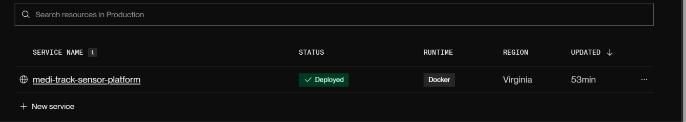

# Capítulo V: Product Implementation, Validation & Deployment

> **Nota metodológica (1ASI0732):** la implementación se articula con verificación, validación y entrega continua. Además de evidencias de producto, este capítulo orienta la configuración de pipelines DevOps (construcción, pruebas automatizadas, versionado y despliegue) y deja explícitos los puntos ``(completar)`` para experimentos de calidad de software y responsabilidades éticas (ABET SO4).

> **Nota metodológica (1ASI0732):** la implementación se articula con verificación, validación y entrega continua. Además de evidencias de producto, este capítulo orienta la configuración de pipelines DevOps (construcción, pruebas automatizadas, versionado y despliegue) y deja explícitos los puntos ``(completar)`` para experimentos de calidad de software y responsabilidades éticas (ABET SO4).

## 5.1. Software Configuration Management

### 5.1.1. Software Development Environment Configuration

A continuación, se describen los productos de software empleados en el desarrollo del proyecto. Esta sección tiene como objetivo facilitar la comprensión y continuidad
del trabajo a los actuales y futuros desarrolladores, asegurando una colaboración efectiva a lo largo del ciclo de vida del producto digital.

**Project Management**
- Trello – https://trello.com/ 
  Se ha utilizado Trello como herramienta principal de gestión de tareas. Esta plataforma permite visualizar el progreso de cada etapa del proyecto mediante
  tableros personalizables, facilitando la organización de pendientes, tareas en desarrollo y actividades finalizadas. Además, su interfaz intuitiva y accesibilidad
  desde cualquier navegador con una cuenta registrada la convierten en una solución ágil para el seguimiento de proyectos en equipo.

**Requirements Management**
- Google Docs – https://docs.google.com/ 
  Para la redacción, gestión y revisión de los requisitos del sistema se ha empleado Google Docs. Su funcionalidad de edición colaborativa en tiempo real ha
  permitido que todos los integrantes del equipo puedan aportar, comentar y revisar los documentos desde cualquier dispositivo.

**Product UX/UI Design**
- Figma – https://www.figma.com/ 
  Figma ha sido fundamental para el diseño de interfaces y la creación de prototipos interactivos. Permite que varios usuarios trabajen simultáneamente en los
  wireframes y mockups, lo que ha facilitado una comunicación más eficiente entre el equipo de diseño y desarrollo.
- Miro https://miro.com/es/  
  Pizarra digital colaborativa utilizada para sesiones de Big Picture EventStorming y Design-Level EventStorming, facilitando la identificación de Bounded Contexts, Events, Commands y Aggregates del dominio.
- LucidChart https://www.lucidchart.com/pages/es  
  Aplicación de diagramación colaborativa para la creación de Wireflows, User Flows, diagramas UML (Class Diagrams) y Database Diagrams de la arquitectura del software.

**Software Development**
- **Landing Page** (HTML5, CSS3, JavaScript) — https://www.jetbrains.com/idea/ 
  Sitio estático desplegado en Vercel. Desarrollo con HTML5, CSS3 y JavaScript.
- **Frontend Web Application** (Vue.js 3, PrimeVue, Vue Router, Pinia, Axios) — https://www.jetbrains.com/webstorm/ 
  Aplicación SPA desarrollada con **Vue.js 3**, biblioteca de componentes **PrimeVue** (Material Design), **Vue Router** para navegación, **Pinia** para gestión de estado, **Axios** para consumo de API REST y **vue-i18n** para soporte multiidioma (es_419 / en_US).
- **Web Services** (ASP.NET Core, C#) — https://www.jetbrains.com/rider/ 
  API RESTful desarrollada en **ASP.NET Core** con **C#**, documentada con **OpenAPI/Swagger**. SDK .NET: https://dotnet.microsoft.com/download

**Deployment & Hosting**
- **Vercel** — Landing Page y Frontend Web Application. Auto-deploy desde GitHub con CDN global y HTTPS.
- **Render** — Backend API (Docker). Auto-deploy desde rama `master`.
- **Filess.io** — Base de datos PostgreSQL para persistencia de datos del backend.

**Software Documentation**
- Google Docs y GitHub README  
  La documentación del software se ha centralizado en Google Docs. El archivo README en GitHub incluye instrucciones de despliegue, estructura del repositorio y requerimientos técnicos.
- Markdown https://www.markdownguide.org/  
  Lenguaje de marcado ligero para la elaboración del Project Report en el repositorio GitHub. Permite estructurar documentación con formato consistente y compatible con control de versiones.

**Internacionalización y accesibilidad:** La Web Application implementa **vue-i18n** con soporte para español (es_419) e inglés (en_US). Los componentes PrimeVue incluyen atributos **ARIA** para navegación accesible. El idioma por defecto de la API y la documentación Swagger es inglés, conforme al estándar del curso.

### 5.1.2. Source Code Management

En esta sección se establece el medio y esquema de organización
que el equipo aplicará para el seguimiento y control de
modificaciones en el código fuente. Para ello se utiliza
**GitHub** como plataforma de control de versiones, organizado
bajo la organización pública **1ASI0732-2610-9082-TBL-KairoLabs**.

Se aplica **GitFlow** como workflow de control de versiones,
**Conventional Commits** para los mensajes de commit y
**Semantic Versioning** para el nombramiento de releases.

A continuación se presentan los repositorios correspondientes
a cada producto de la solución:

| Producto                 | Repositorio                                                                                   |
|--------------------------|-----------------------------------------------------------------------------------------------|
| Project Report           | https://github.com/1ASI0732-2610-9082-TBL-KairoLabs/KairoLabs-Project-Report.git |
| Landing Page             | https://github.com/1ASI0732-2610-9082-TBL-KairoLabs/KairoLabs-Landing-Page.git   |
| Frontend Web Application | https://github.com/1ASI0732-2610-9082-TBL-KairoLabs/KairoLabs-Frontend.git       |
| Web Services             | https://github.com/1ASI0732-2610-9082-TBL-KairoLabs/KairoLabs-Backend.git        |

### GitFlow Workflow

El equipo implementa GitFlow como workflow de control de versiones.
Las ramas definidas son las siguientes:

**Ramas principales:**
- `main` — rama principal que contiene la versión estable y desplegada
  del producto. Solo se actualiza mediante merges de ramas release.
- `develop` — rama de integración donde se consolidan las features
  completadas antes de pasar a producción.

**Ramas de soporte:**
- `feature/<nombre>` — una rama por cada funcionalidad o sección
  en desarrollo. Se crean desde `develop` y se fusionan de vuelta a `develop`
  al completarse.
- `release/<version>` — se crean desde `develop` cuando se prepara
  una entrega. Se fusionan a `main` y `develop` al finalizarse.

**Convenciones de nomenclatura para ramas:**

| Tipo | Convención | Ejemplo |
|------|-----------|---------|
| Feature | `feature/<nombre-descriptivo>` | `feature/login-view` |
| Release | `release/<version>` | `release/1.0.0` |

### Conventional Commits

Los mensajes de commit siguen la especificación de Conventional Commits
con la siguiente estructura:

`<type>(<scope>): <description>`

Los tipos permitidos son:

| Tipo | Uso |
|------|-----|
| `feat` | Nueva funcionalidad |
| `fix` | Corrección de errores |
| `docs` | Cambios en documentación |
| `style` | Cambios de formato sin afectar lógica |
| `refactor` | Refactorización de código |
| `test` | Añadir o modificar pruebas |
| `chore` | Tareas de mantenimiento |

### 5.1.3. Source Code Style Guide & Conventions

En este apartado se definen los estándares de codificación y nomenclatura adoptados por el equipo para garantizar la mantenibilidad y legibilidad del código de **KairoLabs**. Se aplican las siguientes convenciones basadas en las guías de estilo de Google (para entornos Web) y Microsoft (para el ecosistema .NET):

* **Language Standards**: Todo el código fuente, incluyendo nombres de variables, funciones, clases, IDs de CSS y comentarios, se redacta exclusivamente en idioma **inglés** para mantener un estándar profesional global.
* **Naming Conventions**:
  * **Backend (C# / .NET)**: Se utiliza el estándar `PascalCase` para nombres de clases, métodos y propiedades (ej. `SensorDataController`). Para variables locales y parámetros se emplea `camelCase`.
  * **Frontend (HTML/CSS)**: Se utiliza `kebab-case` para nombres de archivos de estilo (ej. `style.css`) y para nombres de clases e IDs en las hojas de estilo (ej. `.hero-section`, `.btn-orange-rounded`).
  * **JavaScript**: Se aplica `camelCase` para variables y funciones (ej. `initIoTSimulation`, `tempElement`) y `kebab-case` para la nomenclatura de archivos de script (ej. `script.js`).
* **Source Control Conventions**: Se aplica el estándar de **Conventional Commits**, utilizando prefijos descriptivos en inglés como `feat:`, `fix:`, `docs:`, y `chore:` para asegurar un historial de versiones estructurado y rastreable.
* **Code Formatting**: Se mantiene una indentación consistente de 4 espacios en archivos HTML, CSS y JS para mejorar la jerarquía visual del código. En el desarrollo backend, se sigue el formato automático de Visual Studio para asegurar la limpieza de los archivos de clase.

### 5.1.4. Software Deployment Configuration

Esta sección detalla la configuración del despliegue de la solución en su versión final, permitiendo que los productos digitales sean accesibles de forma continua en entornos de producción.

* **Hosting & Cloud Platforms**:
  * **Landing Page**: Desplegada en **Vercel** — [https://KairoLabs-sensor.vercel.app/](https://KairoLabs-sensor.vercel.app/)
  * **Web Application (Frontend)**: Desplegada en **Vercel** — [https://kairolabs-frontend.vercel.app/login](https://kairolabs-frontend.vercel.app/login)
  * **Web Services & API (Backend)**: Desplegada en **Render** — [https://kairolabs-platform.onrender.com](https://kairolabs-platform.onrender.com)
  * **Base de datos relacional**: Alojada en **Filess.io** (PostgreSQL), conectada al backend mediante variables de entorno en Render.
* **Continuous Deployment (CD) Pipeline**:
  * Cada repositorio en GitHub (`KairoLabs-Landing-Page`, `KairoLabs-Frontend`, `KairoLabs-Backend`) está vinculado a su plataforma de despliegue correspondiente.
  * La rama `main` (o `master` en backend) activa despliegue automático al integrar cambios mediante merge o push.
* **Environment Configuration**:
  * **Frontend**: Variable `VITE_API_BASE_URL` apuntando a la URL de producción del backend en Render.
  * **Backend (Render)**: `DATABASE_HOST`, `DATABASE_PORT`, `DATABASE_NAME`, `DATABASE_USER`, `DATABASE_PASSWORD`, y configuración JWT para autenticación.
  * **Landing Page**: Despliegue estático sin variables sensibles; contenido público de presentación del producto.

---

## 5.2. Landing Page, Services & Applications Implementation

### 5.2.1. Sprint 1

En este Sprint se desarrolló e implementó la primera versión
del Landing Page de KairoLabs, incluyendo su despliegue
en un entorno accesible públicamente.

#### 5.2.1.1. Sprint Planning 1

A continuación se presenta el resumen del Sprint Planning Meeting
realizado para el Sprint 1.

| Sprint # | Sprint 1                                                                                                                                                                                                                                                                                                                             |
|----------|--------------------------------------------------------------------------------------------------------------------------------------------------------------------------------------------------------------------------------------------------------------------------------------------------------------------------------------|
| **Sprint Planning Background** |                                                                                                                                                                                                                                                                                                                                      |
| Date | 2026-04-15                                                                                                                                                                                                                                                                                                                           |
| Time | 04:30 PM                                                                                                                                                                                                                                                                                                                             |
| Location | Reunión virtual vía Google Meet                                                                                                                                                                                                                                                                                                      |
| Prepared By | *(completar: integrante del equipo)*                                                                                                                                                                                                                                                                                                            |
| Attendees | Mallqui Vilca, Dhilsen Armil / *(completar: integrante del equipo)* / *(completar: integrante del equipo)*                                                                                                                                                                        |
| **Sprint Goal & User Stories** |                                                                                                                                                                                                                                                                                                                                      |
| Sprint 1 Goal | Our goal is to lay the groundwork for the project and launch the first version of the landing page. We believe this page will allow healthcare providers and pharmacy managers to better understand KairoLabs, which measures the status of medications in their storage environment. This will be confirmed once the landing page is live and contains relevant content for both target groups. |
| Sprint 1 Velocity | 21                                                                                                                                                                                                                                                                                                                                   |
| Sum of Story Points | 21                                                                                                                                                                                                                                                                                                                                   |

#### 5.2.1.2. Aspect Leaders and Collaborators

En esta sección se detalla la matriz de liderazgo y colaboración (LACX) para el Sprint 1. Cada aspecto representa una fase crítica de la entrega, donde se designa un líder (L) responsable de la dirección del entregable y colaboradores (C) que apoyaron en su ejecución, cumpliendo con el objetivo de proporcionar liderazgo conjunto y un entorno colaborativo (ABET Student Outcome 5).

| Team Member (Last Name, First Name) | GitHub Username | Idea de Negocio y Bases | Diseño de App Web (Figma) | Contenido y Despliegue Landing | User Stories y Funciones | Análisis de Usuario y Needfinding |
| :--- | :--- | :---: | :---: | :---: | :---: | :---: |
| *(completar: integrante del equipo)* | completar-integrante | C | **L** | C | C | C |
| Mallqui Vilca, Dhilsen Armil | Dhilsen18 | C | C | **L** | C | **L** |
| *(completar: integrante del equipo)* | completar-integrante | **L** | C | C | **L** | C |

---

**Sustento de los Aspectos de Liderazgo:**

* ***(completar: integrante del equipo)* (Diseño de App Web):** Lideró la arquitectura visual y experiencia de usuario del software, siendo responsable de los prototipos de alta fidelidad en Figma para la plataforma web.
* **Mallqui Vilca, Dhilsen Armil (Contenido y Despliegue Landing / Análisis de Usuario):** Responsable de la presencia web del producto y del proceso de investigación empática, liderando la implementación de la Landing Page en Vercel y la elaboración de User Personas y Journey Maps.
* ***(completar: integrante del equipo)* (Idea de Negocio / User Stories):** Lideró la conceptualización estratégica del proyecto, la definición de la problemática del sector salud y la traducción de necesidades en historias de usuario con criterios de aceptación.

#### 5.2.1.3. Sprint Backlog 1

Durante el primer sprint backlog, nuestro equipo tuvo como objetivo principal diseñar la Aplicación Web y Landing Page, completando esta última en el proceso. Para la organización y gestión de los miembros se utilizó Trello, lo que permitió dividir las user stories en tareas manejables y asignarlas a cada integrante según sus habilidades. El propósito de este sprint fue construir en su totalidad la landing page, asegurando que fuera atractiva, funcional y alineada con la propuesta de valor de TBL.

Enlace de Trello: https://trello.com/invite/b/69e9e940d5d58b559007b0af/ATTIbc7fef21e3ae9af5f9b1524a8311a897E9406869/KairoLabs-sensor

A continuación se presenta la descomposición de User Stories en tareas del Sprint 1:

| Sprint # | Sprint 1 | | | | | | |
|----------|----------|---|---|---|---|---|---|
| **User Story** | | **Work-Item / Task** | | | | | |
| **Id** | **Title** | **Id** | **Title** | **Description** | **Estimation (Hours)** | **Assigned To** | **Status (To-do / In-Process / To-Review / Done)** |
| US25 | Adaptación a dispositivos | T01 | Implementar diseño responsive | Configurar media queries y hacer la landing adaptable a móviles, tablets y desktop | 8 | Mallqui Vilca, Dhilsen Armil | Done |
| US01 | Navegación clara | T02 | Desarrollar navbar sticky | Implementar barra de navegación fija con smooth scroll | 4 | Mallqui Vilca, Dhilsen Armil | Done |
| US06 | Mensaje principal claro | T03 | Implementar sección hero | Desarrollar hero section con typing animation y tagline | 5 | Mallqui Vilca, Dhilsen Armil | Done |
| US13 | Presentación profesional | T04 | Diseñar mockups en Figma | Crear diseño visual profesional de todas las secciones | 10 | *(completar: integrante del equipo)* | Done |
| US13 | Presentación profesional | T05 | Aplicar design system | Implementar colores, tipografía Outfit y elementos visuales | 6 | *(completar: integrante del equipo)* / Mallqui Vilca, Dhilsen Armil | Done |
| US10 | Botón de contacto visible | T06 | Implementar CTAs | Añadir botones de contacto en navbar y hero | 2 | Mallqui Vilca, Dhilsen Armil | Done |
| US11 | Acceso a contacto | T07 | Desarrollar formulario de contacto | Crear formulario con campos de nombre, empresa, email, teléfono y mensaje | 4 | Mallqui Vilca, Dhilsen Armil | Done |
| US21 | Información de monitoreo | T08 | Implementar dashboard IoT simulado | Desarrollar tarjetas con datos simulados de temperatura, humedad y luz | 6 | Mallqui Vilca, Dhilsen Armil | Done |
| US02 | Acceso a sección de tecnología | T09 | Desarrollar sección tecnología | Crear sección con explicación del sistema y features | 4 | Mallqui Vilca, Dhilsen Armil | Done |
| US03 | Acceso a sectores | T10 | Desarrollar sección sectores | Implementar cards de hospitales, distribución y farmacias | 5 | Mallqui Vilca, Dhilsen Armil | Done |
| US16 | Contenido para almacenes | T11 | Redactar contenido segmento operativo | Escribir textos orientados a personal de almacén | 3 | Mallqui Vilca, Dhilsen Armil | Done |
| US17 | Contenido para entidades | T12 | Redactar contenido segmento gestores | Escribir textos orientados a entidades de salud | 3 | Mallqui Vilca, Dhilsen Armil | Done |
| US07 | Identificación del problema | T13 | Desarrollar sección problema | Implementar floating cards con problemática | 4 | Mallqui Vilca, Dhilsen Armil | Done |
| US04 | Información del equipo | T14 | Desarrollar sección nosotros | Crear sección con misión, visión y equipo KairoLabs | 4 | Mallqui Vilca, Dhilsen Armil | Done |
| US22 | Incentivo a contacto | T15 | Implementar planes de suscripción | Desarrollar pricing cards con planes Básico, Profesional y Premium | 5 | Mallqui Vilca, Dhilsen Armil | Done |
| US15 | Coherencia visual | T16 | Implementar animaciones | Añadir reveal animations con IntersectionObserver | 4 | Mallqui Vilca, Dhilsen Armil | Done |
| US12 | Respuesta visual a interacción | T17 | Añadir efectos hover | Implementar transiciones y efectos en botones y cards | 3 | Mallqui Vilca, Dhilsen Armil | Done |
| US26 | Carga eficiente | T18 | Optimizar assets | Comprimir imágenes y optimizar carga de fuentes | 3 | Mallqui Vilca, Dhilsen Armil | Done |
| US05 | Visualización de beneficios | T19 | Implementar sección stats | Desarrollar contador animado con métricas clave | 4 | Mallqui Vilca, Dhilsen Armil | Done |
| US14 | Información estructurada | T20 | Organizar contenido | Estructurar secciones en orden lógico y jerarquía visual | 3 | Mallqui Vilca, Dhilsen Armil | Done |
| - | - | T21 | Configurar despliegue en Vercel | Conectar repositorio y configurar deployment automático | 2 | Mallqui Vilca, Dhilsen Armil | Done |
| - | - | T22 | Definir User Stories | Documentar 27 User Stories con criterios de aceptación | 6 | *(completar: integrante del equipo)* | Done |
| - | - | T23 | Realizar entrevistas | Conducir entrevistas con ambos segmentos objetivo | 8 | *(completar: integrante del equipo)* / Mallqui Vilca, Dhilsen Armil | Done |
| - | - | T24 | Elaborar User Personas | Crear arquetipos basados en entrevistas | 4 | Mallqui Vilca, Dhilsen Armil | Done |
| - | - | T25 | Crear Journey Maps | Mapear experiencia de usuarios | 4 | Mallqui Vilca, Dhilsen Armil | Done |

#### 5.2.1.4. Development Evidence for Sprint Review

Durante el Sprint 1, el equipo utilizó GitHub como sistema de control de versiones, siguiendo el flujo de trabajo GitFlow para asegurar una integración ordenada del código. A continuación, se presenta el registro de los commits más relevantes que evidencian el desarrollo de la Landing Page y la colaboración del equipo.

**Repository:** 1ASI0732-2610-9082-TBL-KairoLabs/KairoLabs-Landing-Page

| Repository | Branch | Commit Id | Commit Message | Commit Message Body | Committed on (Date) |
| :--- | :--- | :--- | :--- | :--- | :--- |
| `KairoLabs-Landing-Page` | `main` | `cf30ba5` | `feat: implement team section` | `Added specific content and layout for the startup team profiles.` | 19/04/2026 |
| `KairoLabs-Landing-Page` | `main` | `e6420c0` | `chore: finalize landing page structure` | `Final adjustments to the HTML structure for the initial release.` | 12/04/2026 |
| `KairoLabs-Landing-Page` | `main` | `965dc26` | `fix: resolve remaining layout issues` | `Ensured all sections are correctly aligned after final review.` | 11/04/2026 |
| `KairoLabs-Landing-Page` | `main` | `03e62cb` | `fix: clean up code and remove errors` | `General debugging of CSS and HTML validation issues.` | 11/04/2026 |
| `KairoLabs-Landing-Page` | `main` | `5d82cf0` | `docs: add project readme file` | `Initial documentation of the repository and project description.` | 11/04/2026 |
| `KairoLabs-Landing-Page` | `main` | `4c8156b` | `feat: update landing page and design` | `Applied general style updates and design refinements for UX.` | 11/04/2026 |
| `KairoLabs-Landing-Page` | `main` | `74dba14` | `chore: initial commit` | `Initial repository setup with base project files.` | 10/04/2026 |

#### 5.2.1.5. Execution Evidence for Sprint Review

En esta sección se presenta la evidencia de la ejecución del Sprint 1, demostrando el cumplimiento de los objetivos establecidos y el despliegue del producto en un entorno de producción accesible.

**Enlace del Landing Page:** [https://KairoLabs-sensor.vercel.app/](https://KairoLabs-sensor.vercel.app/)

**Evidencia de Despliegue (Vercel):**

A continuación, se presenta la captura del dashboard de Vercel que confirma el despliegue exitoso (Production Deployment) de la Landing Page desde el repositorio oficial de GitHub.

#### 5.2.1.6. Services Documentation Evidence for Sprint Review

Para el presente Sprint 1, el alcance se centró exclusivamente en la implementación y despliegue del Landing Page (sitio web estático). Por lo tanto, no se han desarrollado servicios RESTful API en esta etapa. La documentación detallada de los endpoints mediante OpenAPI (Swagger) se incluirá en los informes correspondientes a los siguientes Sprints, una vez iniciada la fase de implementación de los Web Services.

#### 5.2.1.7. Software Deployment Evidence for Sprint Review

El deploy de la Landing Page se hizo en Vercel de la siguiente manera

### Paso 1: Se agregó el proyecto

### Paso 2: Se agregó el repositorio

### Paso 3: Se hace deploy con html, css y javascript

#### 5.2.1.8. Team Collaboration Insights during Sprint

La implementación de la entrega AV1 fue un esfuerzo conjunto que integró el desarrollo técnico de la Landing Page y la elaboración del reporte de ingeniería. El equipo aplicó un liderazgo compartido donde cada integrante fue responsable de la calidad de sus respectivos apartados, manteniendo una comunicación constante para asegurar la coherencia entre el diseño, los requerimientos y el producto desplegado.

A continuación, se presentan las evidencias de colaboración extraídas de los analíticos de GitHub, las cuales muestran la participación activa de todos los miembros tanto en el repositorio del código fuente como en el repositorio del informe del proyecto.

**Evidencia de Contribuciones en el Código (Landing Page):**

**Evidencia de Contribuciones en el Reporte (Documentation):**

### 5.2.2. Sprint 2

En esta sección se registra y explica el avance en términos de producto y trabajo
colaborativo para el Sprint 2. Incluye como secciones internas: Sprint Planning 2,
Aspect Leaders and Collaborators, Sprint Backlog 2, Development Evidence for Sprint
Review, Execution Evidence for Sprint Review, Services Documentation Evidence for
Sprint Review, junto con Team Collaboration Insights during Sprint.

#### 5.2.2.1. Sprint Planning 2

A continuación se presenta el resumen del Sprint Planning Meeting realizado para el Sprint 2.

| Sprint #                           | Sprint 2                                                                                                                                                                                                                                                                                                                                                                                                                                                                                             |
|------------------------------------|------------------------------------------------------------------------------------------------------------------------------------------------------------------------------------------------------------------------------------------------------------------------------------------------------------------------------------------------------------------------------------------------------------------------------------------------------------------------------------------------------|
| **Sprint Planning Background**     |                                                                                                                                                                                                                                                                                                                                                                                                                                                                                                      |
| Date                               | 2026-05-11                                                                                                                                                                                                                                                                                                                                                                                                                                                                                           |
| Time                               | 9:30 PM                                                                                                                                                                                                                                                                                                                                                                                                                                                                                              |
| Location                           | Reunión virtual vía Discord                                                                                                                                                                                                                                                                                                                                                                                                                                                                          |
| Prepared By                        | *(completar: integrante del equipo)*                                                                                                                                                                                                                                                                                                                                                                                                                                                                            |
| Attendees                          | Mallqui Vilca, Dhilsen Armil / *(completar: integrante del equipo)* / *(completar: integrante del equipo)*                                                                                                                                                                                                                                                                                                       |
| Sprint 2 – 1 Review Summary        | Sprint 1 was very well coordinated; however, we failed to meet the requirements, resulting in a noticeable decrease in the quality of the content and the software product delivered during this sprint. The landing page was of good quality; however, the established requirements regarding commits and product development were not followed. Team members are aware of these errors thanks to feedback provided by the Product Owner.                                                           |
| Sprint 2 – 1 Retrospective Summary | The team admits that the development of the previous sprint was not fully aligned with the requested requirements. We recognize that the software products were correctly oriented in terms of the stated objectives; However, its implementation and development presented deficiencies. Fortunately, the Product Owner provided us with important support through constant feedback, which allowed us to identify errors and make the necessary corrections to improve the quality of the product. **Acción de mejora aplicada en Sprint 2:** se reforzó el uso de GitFlow, Conventional Commits y evidencia en GitHub; el resultado fue la entrega del frontend funcional desplegado en Vercel con módulos IAM, monitoreo, suscripciones, establecimientos y logística. |
| **Sprint Goal & User Stories**     |                                                                                                                                                                                                                                                                                                                                                                                                                                                                                                      |
| Sprint 2 Goal                      | Our goal is to develop our first version of the frontend of our web application. We believe that this application will allow entity pharmacy administrators to manage data within the establishments belonging to the health entity, as well as its operators and devices. Likewise, operators will be able to manage the data received by the devices and transports according to the metrics received by them.                                                                                     |
| Sprint 2 Velocity                  | 20                                                                                                                                                                                                                                                                                                                                                                                                                                                                                                   |
| Sum of Story Points                | 23                                                                                                                                                                                                                                                                                                                                                                                                                                                                                                   |

#### 5.2.2.2. Aspect Leaders and Collaborators

En esta sección se detalla la matriz de liderazgo y colaboración (LACX) para el Sprint 2. Cada aspecto representa una fase crítica de la entrega del frontend, donde se designa un líder (L) responsable de la dirección del entregable y colaboradores (C) que apoyaron en su ejecución, cumpliendo con el objetivo de proporcionar liderazgo conjunto y un entorno colaborativo (ABET Student Outcome 5).

| Team Member (Last Name, First Name) | GitHub Username | Frontend Development | IAM Module | Subscriptions Module | Monitoring Module | Establishment Module | Logistics Module | Frontend UI/Design | Report & Documentation |
| :--- | :--- | :---: | :---: | :---: | :---: | :---: | :---: | :---: | :---: |
| Mallqui Vilca, Dhilsen Armil | Dhilsen18 | C | C | **L** | **L** | **L** | C | C | C |
| *(completar: integrante del equipo)* | completar-integrante | C | **L** | C | C | C | **L** | C | C |
| *(completar: integrante del equipo)* | completar-integrante | **L** | C | C | C | C | C | **L** | **L** |

---

**Sustento de los Aspectos de Liderazgo:**

* **Mallqui Vilca, Dhilsen Armil (Subscriptions & Monitoring Modules):** Dirigió el diseño e implementación de los módulos de planes, suscripciones y monitoreo, definiendo la lógica de visualización de indicadores y estados del sistema.
* ***(completar: integrante del equipo)* (IAM & Logistics Modules):** Lideró la estructuración de autenticación y los módulos de logística, coordinando flujos operativos y seguimiento de transportes farmacéuticos.
* ***(completar: integrante del equipo)* (Frontend UI/Design & Report):** Lideró la coherencia visual, la experiencia de usuario del frontend y la consolidación del reporte de Sprint 2, asegurando trazabilidad entre tareas y evidencia presentada.

#### 5.2.2.3. Sprint Backlog 2.

Durante el segundo sprint backlog, nuestro equipo tuvo como objetivo principal diseñar la Aplicación Web completándola parcialmente para esta segunda entrega. Para la organización y gestión de los miembros se utilizó Trello, lo que permitió dividir las user stories en tareas manejables y asignarlas a cada integrante según sus habilidades. El propósito de este sprint fue construir parcialmente la aplicación web, asegurando que fuera funcional, atractiva y alineada con la propuesta de valor de TBL.

Enlace de Trello: https://trello.com/invite/b/6a02a35d4f75f7ddabeabe1c/ATTIbbc3193b48f5acf5194c54a2233ca38e2EFFB77A/KairoLabs

| Sprint # | Sprint 2 | | | | | | |
|----------|----------|---|---|---|---|---|---|
| **User Story** | | **Work-Item / Task** | | | | | |
| **Id** | **Title** | **Id** | **Title** | **Description** | **Estimation (Hours)** | **Assigned To** | **Status (To-do / In-Process / To-Review / Done)** |
| US29 | Monitoreo de temperatura en dashboard | TS-US29-001 | Crear widget de temperatura | Desarrollar componente visual para mostrar temperatura en tiempo real | 4 | Mallqui Vilca, Dhilsen Armil | Done |
| US29 | Monitoreo de temperatura en dashboard | TS-US29-003 | Mostrar timestamp de última lectura | Implementar visualización de fecha y hora de la última actualización del sensor | 2 | Mallqui Vilca, Dhilsen Armil | Done |
| US30 | Monitoreo de luz | TS-US30-001 | Crear widget de intensidad lumínica | Desarrollar componente visual para mostrar niveles de luz | 4 | Mallqui Vilca, Dhilsen Armil | Done |
| US42 | Identificación de desviaciones visuales | TS-US42-002 | Resaltar sensores críticos con colores de alerta | Aplicar indicadores visuales para sensores fuera de rango | 3 | *(completar: integrante del equipo)* | Done |
| US33 | Identificación por ubicación | TS-US33-005 | Validar legibilidad de ubicaciones en móviles | Verificar correcta visualización responsive de ubicaciones | 2 | Mallqui Vilca, Dhilsen Armil | Done |
| US25 | Adaptación a dispositivos | TS-US25-001 | Implementar media queries principales | Configurar estilos responsive para dashboard y módulos | 5 | Mallqui Vilca, Dhilsen Armil | Done |
| US25 | Adaptación a dispositivos | TS-US25-002 | Adaptar navbar para dispositivos móviles | Ajustar navegación responsive para smartphones y tablets | 3 | Mallqui Vilca, Dhilsen Armil | Done |
| US25 | Adaptación a dispositivos | TS-US25-007 | Realizar pruebas responsive en múltiples resoluciones | Validar funcionamiento visual en distintos tamaños de pantalla | 4 | Mallqui Vilca, Dhilsen Armil | Done |
| US28 | Visualización de sensores activos | TS-US28-005 | Integrar estilos responsive | Aplicar diseño adaptable al panel de sensores | 3 | *(completar: integrante del equipo)* | Done |
| US30 | Monitoreo de luz | TS-US30-004 | Implementar indicador visual de rango seguro | Mostrar estado seguro o crítico de niveles lumínicos | 3 | Mallqui Vilca, Dhilsen Armil | Done |
| US34 | Estado general del sistema | TS-US34-002 | Mostrar total de sensores activos | Implementar contador general de sensores conectados | 2 | Mallqui Vilca, Dhilsen Armil | Done |
| US37 | Visualización de gráficos | TS-US37-001 | Crear gráfico de temperatura | Desarrollar gráfico dinámico de tendencias de temperatura | 5 | *(completar: integrante del equipo)* | Done |
| US42 | Identificación de desviaciones visuales | TS-US42-001 | Crear lógica visual para valores fuera de rango | Implementar detección visual de valores críticos | 4 | *(completar: integrante del equipo)* | Done |
| US28 | Visualización de sensores activos | TS-US28-007 | Validar visualización responsive de sensores | Verificar correcta adaptación responsive de tarjetas de sensores | 2 | Mallqui Vilca, Dhilsen Armil | Done |
| US29 | Monitoreo de temperatura en dashboard | TS-US29-006 | Validar visualización en dispositivos móviles | Probar visualización responsive del módulo de temperatura | 2 | Mallqui Vilca, Dhilsen Armil | Done |
| US34 | Estado general del sistema | TS-US34-004 | Implementar indicador general de estado | Mostrar estado global del sistema mediante indicadores visuales | 3 | Mallqui Vilca, Dhilsen Armil | Done |
| US42 | Identificación de desviaciones visuales | TS-US42-001 | Crear lógica visual para valores fuera de rango | Revisar funcionamiento de detección visual de alertas | 4 | *(completar: integrante del equipo)* | Done |
| US30 | Monitoreo de luz | TS-US30-006 | Validar adaptación responsive del módulo | Validar correcta adaptación responsive del widget lumínico | 2 | Mallqui Vilca, Dhilsen Armil | Done |
| US37 | Visualización de gráficos | TS-US37-002 | Diseñar estilos responsive para gráficos | Corregir problemas visuales y adaptación responsive de gráficos | 3 | *(completar: integrante del equipo)* | Done |
| US28 | Visualización de sensores activos | TS-US28-003 | Mostrar nombre y estado del sensor | Implementar visualización de información principal de sensores | 2 | Mallqui Vilca, Dhilsen Armil | Done |
| US28 | Visualización de sensores activos | TS-US28-004 | Implementar indicador visual activo/inactivo | Mostrar estado activo o desconectado mediante colores e íconos | 3 | Mallqui Vilca, Dhilsen Armil | Done |
| US28 | Visualización de sensores activos | TS-US28-005 | Consumir datos mock de sensores | Integrar datos simulados para pruebas del dashboard | 3 | *(completar: integrante del equipo)* | Done |
| US28 | Visualización de sensores activos | TS-US28-006 | Aplicar estilos al panel de sensores | Diseñar interfaz visual del módulo de sensores | 3 | *(completar: integrante del equipo)* | Done |
| US29 | Monitoreo de temperatura en dashboard | TS-US29-002 | Mostrar valor actual en °C | Implementar lectura actual de temperatura con unidad | 2 | Mallqui Vilca, Dhilsen Armil | Done |
| US29 | Monitoreo de temperatura en dashboard | TS-US29-005 | Actualizar estilos visuales según rango | Aplicar estilos dinámicos según valores críticos o normales | 3 | *(completar: integrante del equipo)* | Done |
| US34 | Estado general del sistema | TS-US34-001 | Diseñar sección resumen del dashboard | Crear layout general del resumen del sistema | 4 | *(completar: integrante del equipo)* | Done |
| US33 | Identificación por ubicación | TS-US33-001 | Mostrar ubicación física de sensores | Implementar etiquetas de ubicación física de sensores | 2 | Mallqui Vilca, Dhilsen Armil | Done |
| US33 | Identificación por ubicación | TS-US33-002 | Diseñar etiqueta visual de ubicación | Crear estilos visuales para etiquetas de ubicación | 2 | *(completar: integrante del equipo)* | Done |
| US33 | Identificación por ubicación | TS-US33-003 | Implementar agrupación visual por ubicación | Agrupar sensores visualmente según su área física | 3 | *(completar: integrante del equipo)* | Done |

#### 5.2.2.4. Development Evidence for Sprint Review

Durante el Sprint 2, el equipo de desarrollo utilizó GitHub como sistema de control de versiones, siguiendo la estrategia GitFlow para organizar el trabajo en branches por bounded context. A continuación, se presenta el registro de los commits más relevantes que evidencian el desarrollo de los módulos principales del frontend de KairoLabs.

LINK DEL DESPLIEGUE EN VERCEL: https://kairolabs-frontend.vercel.app/login

**Repository:** 1ASI0732-2610-9082-TBL-KairoLabs/KairoLabs-Frontend

| Repository | Branch | Commit Id | Commit Message | Commit Message Body | Committed on (Date) |
| :--- | :--- | :--- | :--- | :--- | :--- |
| `KairoLabs-Frontend` | `feature/iam` | `385fda5` | `Merge branch 'feature/iam' into develop` | Integración del módulo IAM con autenticación y registro de usuarios. | 12/05/2026 |
| `KairoLabs-Frontend` | `feature/monitoring` | `fa859b5` | `feat(monitoring): finalize devices view with data integration and premium UI` | Vista de dispositivos con integración de datos y UI premium. | 12/05/2026 |
| `KairoLabs-Frontend` | `feature/monitoring` | `33911c5` | `feat(control-center): implement control center panel with KPI charts` | Panel de control central con gráficos KPI y visualización de datos. | 12/05/2026 |
| `KairoLabs-Frontend` | `feature/monitoring` | `7b10919` | `feat(monitoring): add dashboard styles and responsive design configuration` | Estilos del dashboard y configuración responsive. | 12/05/2026 |
| `KairoLabs-Frontend` | `feature/establishments` | `642bdf1` | `Merge branch 'feature/establishments' into develop` | Integración del módulo de gestión de establecimientos. | 12/05/2026 |
| `KairoLabs-Frontend` | `feature/establishments` | `d2a12e6` | `feat(establishments): rename and refactor establishment detail view` | Refactorización de la vista de detalle de establecimientos. | 12/05/2026 |
| `KairoLabs-Frontend` | `feature/logistics` | `8d2c1b8` | `Merge branch 'feature/logistics' into develop` | Integración del módulo de logística y transportes. | 12/05/2026 |
| `KairoLabs-Frontend` | `feature/subscriptions` | `4b851ae` | `feat: Implement plans selection view with plan management` | Vista de selección de planes con gestión de suscripción. | 12/05/2026 |
| `KairoLabs-Frontend` | `feature/profile` | `d0dc7f4` | `feat(profile): implement user profile management with editing capabilities` | Gestión de perfil de usuario con edición y UI mejorada. | 12/05/2026 |
| `KairoLabs-Frontend` | `develop` | `327a143` | `feat: update routing, styles, and multi-language support` | Actualización de rutas, estilos y soporte multiidioma (vue-i18n). | 13/05/2026 |
| `KairoLabs-Frontend` | `develop` | `f3d3b34` | `feat(vercel): add initial configuration for URL rewrites` | Configuración inicial de despliegue en Vercel. | 12/05/2026 |
| `KairoLabs-Frontend` | `develop` | `1515e1a` | `feat(dashboard): refactor fetchDashboardData to improve error handling` | Mejora del manejo de errores en consumo de datos del dashboard. | 12/05/2026 |
| `KairoLabs-Frontend` | `release/1.0.0` | `cc5b4f6` | `Merge branch 'release/1.0.0'` | Consolidación de release del Sprint 2 con todos los módulos integrados. | 12/05/2026 |

#### 5.2.2.5. Execution Evidence for Sprint Review

Después de finalizar el Sprint 2, logramos implementar la primera versión funcional del frontend de KairoLabs. Esta entrega consolida las pantallas principales definidas en los wireframes y mockups del capítulo de diseño, permitiendo una navegación coherente entre autenticación, visualización de información y gestión operativa para los dos segmentos objetivo del sistema.

La evidencia que se presenta a continuación resume las principales vistas desarrolladas durante este sprint. Cada figura incluye una breve descripción funcional y una leyenda debajo de la captura para facilitar su revisión visual.

**1. Login y registro**

Pantalla de acceso para que los usuarios puedan iniciar sesión y autenticarse dentro de la plataforma.

*Figura 5.2.2.5-1. Pantalla de login y registro del frontend de KairoLabs.*

**2. Dashboard principal**

Panel central donde se visualiza el estado general del sistema y los indicadores más relevantes del monitoreo.

*Figura 5.2.2.5-2. Vista principal del dashboard del frontend de KairoLabs.*

*Figura 5.2.2.5-3. Vista complementaria del dashboard con información operativa adicional.*

**3. Gestión de establecimientos**

Sección orientada a registrar y consultar la información de las sedes o almacenes farmacéuticos vinculados a la entidad.

*Figura 5.2.2.5-4. Vista de gestión de establecimientos del frontend de KairoLabs.*

*Figura 5.2.2.5-5. Vista complementaria de gestión de establecimientos con información ampliada.*

**4. Gestión de dispositivos y transportes**

Espacio destinado al control de los equipos y unidades asociadas al seguimiento de las condiciones ambientales.

*Figura 5.2.2.5-6. Vista de gestión de dispositivos del frontend de KairoLabs.*

*Figura 5.2.2.5-7. Vista de gestión de transportes del frontend de KairoLabs.*

*Figura 5.2.2.5-8. Vista complementaria de gestión de transportes con mayor detalle.*

**5. Perfil de usuario**

Módulo para revisar y actualizar la información personal y la configuración de la cuenta.

*Figura 5.2.2.5-9. Pantalla de perfil de usuario del frontend de KairoLabs.*

**6. Alertas e incidencias**

Vista enfocada en la notificación de eventos críticos y su seguimiento oportuno.

*Figura 5.2.2.5-10. Pantalla de alertas e incidencias del frontend de KairoLabs.*

**7. Planes y suscripción**

Sección que presenta el estado del plan activo y las opciones de suscripción disponibles.

*Figura 5.2.2.5-11. Pantalla principal de planes y suscripción del frontend de KairoLabs.*

*Figura 5.2.2.5-12. Vista complementaria de planes y suscripción del frontend de KairoLabs.*

#### 5.2.2.6. Services Documentation Evidence for Sprint Review

Durante el Sprint 2 el alcance se centró en el **frontend web** (Vue.js). No se desarrollaron servicios RESTful en esta iteración; la comunicación con datos se realizó mediante mocks locales para validar la experiencia de usuario del dashboard y los módulos de monitoreo, establecimientos y suscripciones.

La documentación de servicios RESTful mediante OpenAPI (Swagger) se implementó en el Sprint 3 y se consolidó en el Sprint 4 con la API desplegada en producción.

#### 5.2.2.7. Software Deployment Evidence for Sprint Review

El frontend de KairoLabs se desplegó en **Vercel** como primera versión de la Web Application:

| Componente | Plataforma | URL de producción |
| :--- | :--- | :--- |
| Frontend Web Application | Vercel | [https://kairolabs-frontend.vercel.app/login](https://kairolabs-frontend.vercel.app/login) |
| Repositorio | GitHub | `1ASI0732-2610-9082-TBL-KairoLabs/KairoLabs-Frontend` |
| Rama de despliegue | `main` | Auto-deploy activo |

El despliegue permitió validar visualmente los módulos de monitoreo, establecimientos, transportes y suscripciones antes de la integración con el backend en Sprints posteriores.

#### 5.2.2.8. Team Collaboration Insights during Sprint

En esta sección se evidencia la colaboración del equipo durante el Sprint 2 en el desarrollo de la primera versión del frontend de KairoLabs, así como en la coordinación del reporte y la continuidad del Landing Page. La organización del trabajo se distribuyó por bounded contexts y permitió mantener coherencia entre diseño, implementación y documentación.

**Repositorio de Frontend:** KairoLabs-Frontend

- **Subscriptions - Dhilsen Armil Mallqui Vilca:** desarrolló la lógica y presentación de las vistas asociadas a planes y suscripción, asegurando claridad en la interacción con las opciones disponibles.
- **Monitoring - Dhilsen Armil Mallqui Vilca:** participó en la construcción del módulo de monitoreo y seguimiento, orientando la visualización de indicadores y estados del sistema.
- **Establishment - Dhilsen Armil Mallqui Vilca:** implementó las vistas y la lógica relacionadas con establecimientos, cuidando la navegación y la consistencia funcional del módulo.
- **Logistics - *(completar: integrante del equipo)*:** apoyó la implementación de la parte operativa vinculada a logística, estructurando información y flujos relacionados con el movimiento y gestión de recursos.
- **Frontend - *(completar: integrante del equipo)*:** contribuyó en la implementación general del frontend, incluyendo la coherencia visual, la adaptación responsive y la integración de los componentes principales de la interfaz.

**Repositorio del Reporte:** KairoLabs-Project-Report

- ***(completar: integrante del equipo)*:** lideró la redacción, organización y consolidación de la sección de desarrollo del reporte, asegurando trazabilidad entre el sprint y la evidencia presentada.

**Repositorio del Landing Page:** KairoLabs-Landing-Page

- **Dhilsen Armil Mallqui Vilca:** lideró la implementación y el despliegue del Landing Page, manteniendo la base visual del producto y su publicación continua.

En conjunto, la colaboración del Sprint 2 reflejó una distribución equilibrada de responsabilidades, donde el trabajo por bounded contexts permitió avanzar de forma ordenada en el frontend y sostener la documentación del proyecto.

---

### 5.2.3. Sprint 3

En esta sección se registra y explica el avance en términos de producto backend y trabajo
colaborativo para el Sprint 3. Incluye como secciones internas: Sprint Planning 3,
Aspect Leaders and Collaborators, Sprint Backlog 3, Development Evidence for Sprint
Review, Execution Evidence for Sprint Review, Services Documentation Evidence for
Sprint Review, junto con Team Collaboration Insights during Sprint.

#### 5.2.3.1. Sprint Planning 3

A continuación se presenta el resumen del Sprint Planning Meeting realizado para el Sprint 3.

| Sprint #                           | Sprint 3                                                                                                                                                                                                                                                                                                                                                                                                                                                                                             |
|------------------------------------|----------------------------------------------------------------------------------------------------------------------------------------------------------------------------------------------------------------------------------------------------------------------------------------------------------------------------------------------------------------------|
| **Sprint Planning Background**     |                                                                                                                                                                                                                                                                                                                                                                                                                                                                                                      |
| Date                               | 2026-06-12                                                                                                                                                                                                                                                                                                                                                                                                                                                                                           |
| Time                               | 5:00 PM                                                                                                                                                                                                                                                                                                                                                                                                                                                                                              |
| Location                           | Reunión virtual vía Discord                                                                                                                                                                                                                                                                                                                                                                                                                                                                          |
| Prepared By                        | *(completar: integrante del equipo)*                                                                                                                                                                                                                                                                                                                                                                                                                                                                            |
| Attendees                          | Mallqui Vilca, Dhilsen Armil / *(completar: integrante del equipo)* / *(completar: integrante del equipo)*                                                                                                                                                                                                                                                                       |
| **Sprint Goal & User Stories**     |                                                                                                                                                                                                                                                                                                                                                                                                                                                                                                      |
| Sprint 3 Goal                      | Our goal is to develop the backend API and web services for the KairoLabs platform. We believe that this implementation will provide the core functionality required by the frontend application, enabling data persistence, authentication, and RESTful API endpoints for managing subscriptions, devices, establishments, operators, and logistics. This will be confirmed once all microservices are deployed and integrated with the frontend application. |
| Sprint 3 Velocity                  | 18                                                                                                                                                                                                                                                                                                                                                                                                                                                                                                   |
| Sum of Story Points                | 18                                                                                                                                                                                                                                                                                                                                                                                                                                                                                                   |

#### 5.2.3.2. Aspect Leaders and Collaborators

En esta sección se detalla la matriz de liderazgo y colaboración (LACX) para el Sprint 3. Cada aspecto representa una fase crítica de la entrega del backend, donde se designa un líder (L) responsable de la dirección del entregable y colaboradores (C) que apoyaron en su ejecución, cumpliendo con el objetivo de proporcionar liderazgo conjunto y un entorno colaborativo (ABET Student Outcome 5).

| Team Member (Last Name, First Name) | GitHub Username | Backend Architecture | IAM Module | Subscriptions Module | Monitoring Module | Establishments Module | Logistics Module | Database Design | Services Deployment |
| :--- | :--- | :---: | :---: | :---: | :---: | :---: | :---: | :---: | :---: |
| *(completar: integrante del equipo)* | completar-integrante | **L** | **L** | C | **L** | **L** | C | **L** | C |
| Mallqui Vilca, Dhilsen Armil | Dhilsen18 | C | C | **L** | C | C | C | C | C |
| *(completar: integrante del equipo)* | completar-integrante | C | C | C | C | C | **L** | C | **L** |

---

**Sustento de los Aspectos de Liderazgo:**

* ***(completar: integrante del equipo)* (Backend Architecture, IAM, Monitoring, Establishments & Database):** Lideró la arquitectura general de microservicios, la implementación del módulo de autenticación, el diseño de la base de datos relacional y los endpoints de dispositivos y establecimientos.
* **Mallqui Vilca, Dhilsen Armil (Subscriptions Module):** Responsable de la implementación de la lógica de planes de suscripción, integrando endpoints para creación, consulta y eliminación de suscripciones vinculadas a administradores.
* ***(completar: integrante del equipo)* (Logistics Module & Services Deployment):** Lideró la implementación de endpoints de logística y transportes, además de coordinar el despliegue en Render y la configuración de infrastructure.

#### 5.2.3.3. Sprint Backlog 3

Durante el tercer sprint backlog, nuestro equipo tuvo como objetivo principal implementar los web services y API RESTful de KairoLabs, completando los endpoints principales para las cinco áreas funcionales del sistema. Para la organización y gestión se utilizó Trello, permitiendo dividir las tareas de desarrollo backend en incrementos manejables y asignarlas según especialidad técnica.

Enlace de Trello: https://trello.com/invite/b/6a2997ef988f03df0e99f5ba/ATTIe7076c2890011c022be6d9d46ec8740b24ABF214/sprint-3

| Sprint # | Sprint 3 | | | | | | |
|----------|----------|---|---|---|---|---|---|
| **User Story / Endpoint** | | **Work-Item / Task** | | | | | |
| **Id** | **Title** | **Id** | **Title** | **Description** | **Estimation (Hours)** | **Assigned To** | **Status (To-do / In-Process / To-Review / Done)** |
| EP01 | GET /api/v1/admins | TS-EP01-001 | Implementar endpoint GET Admins | Desarrollar endpoint para listar administradores | 4 | *(completar: integrante del equipo)* | Done |
| EP02 | POST /api/v1/admins | TS-EP02-001 | Implementar endpoint POST Admins | Desarrollar endpoint para crear nuevo administrador | 6 | *(completar: integrante del equipo)* | Done |
| EP03 | GET /api/v1/devices | TS-EP03-001 | Implementar endpoint GET Devices | Desarrollar endpoint para listar dispositivos | 4 | *(completar: integrante del equipo)* | Done |
| EP04 | POST /api/v1/devices | TS-EP04-001 | Implementar endpoint POST Devices | Desarrollar endpoint para crear nuevo dispositivo | 6 | *(completar: integrante del equipo)* | Done |
| EP05 | PUT /api/v1/devices/{id}/sensor-data | TS-EP05-001 | Implementar endpoint PUT Sensor Data | Desarrollar endpoint para actualizar datos de sensores | 6 | Mallqui Vilca, Dhilsen Armil | Done |
| EP06 | DELETE /api/v1/devices/{id} | TS-EP06-001 | Implementar endpoint DELETE Devices | Desarrollar endpoint para eliminar dispositivo | 4 | Mallqui Vilca, Dhilsen Armil | Done |
| EP07 | GET /api/v1/establishments | TS-EP07-001 | Implementar endpoint GET Establishments | Desarrollar endpoint para listar establecimientos | 4 | *(completar: integrante del equipo)* | Done |
| EP08 | POST /api/v1/establishments | TS-EP08-001 | Implementar endpoint POST Establishments | Desarrollar endpoint para crear establecimiento | 6 | Mallqui Vilca, Dhilsen Armil | Done |
| EP09 | DELETE /api/v1/establishments/{id} | TS-EP09-001 | Implementar endpoint DELETE Establishments | Desarrollar endpoint para eliminar establecimiento | 4 | *(completar: integrante del equipo)* | Done |
| EP10 | GET /api/v1/operators | TS-EP10-001 | Implementar endpoint GET Operators | Desarrollar endpoint para listar operadores | 4 | *(completar: integrante del equipo)* | Done |
| EP11 | POST /api/v1/operators | TS-EP11-001 | Implementar endpoint POST Operators | Desarrollar endpoint para crear operador | 6 | *(completar: integrante del equipo)* | Done |
| EP12 | PUT /api/v1/operators/{id} | TS-EP12-001 | Implementar endpoint PUT Operators | Desarrollar endpoint para actualizar operador | 5 | Mallqui Vilca, Dhilsen Armil | Done |
| EP13 | DELETE /api/v1/operators/{id} | TS-EP13-001 | Implementar endpoint DELETE Operators | Desarrollar endpoint para eliminar operador | 4 | Mallqui Vilca, Dhilsen Armil | Done |
| EP14 | PUT /api/v1/operators/{id}/alert-answered | TS-EP14-001 | Implementar endpoint PUT Alert Answered | Desarrollar endpoint para incrementar conteo de alertas respondidas | 5 | *(completar: integrante del equipo)* | Done |
| EP15 | GET /api/v1/subscriptions | TS-EP15-001 | Implementar endpoint GET Subscriptions | Desarrollar endpoint para recuperar lista de suscripciones | 4 | Mallqui Vilca, Dhilsen Armil | Done |
| EP16 | POST /api/v1/subscriptions | TS-EP16-001 | Implementar endpoint POST Subscriptions | Desarrollar endpoint para crear nueva suscripción | 6 | *(completar: integrante del equipo)* | Done |
| EP17 | DELETE /api/v1/subscriptions/{id} | TS-EP17-001 | Implementar endpoint DELETE Subscriptions | Desarrollar endpoint para eliminar suscripción | 4 | Mallqui Vilca, Dhilsen Armil | Done |
| EP18 | GET /api/v1/transports | TS-EP18-001 | Implementar endpoint GET Transports | Desarrollar endpoint para listar transportes | 4 | Mallqui Vilca, Dhilsen Armil | Done |
| EP19 | POST /api/v1/transports | TS-EP19-001 | Implementar endpoint POST Transports | Desarrollar endpoint para crear transporte | 6 | *(completar: integrante del equipo)* | Done |
| EP20 | PUT /api/v1/transports/{id}/sensor-data | TS-EP20-001 | Implementar endpoint PUT Transport Sensor Data | Desarrollar endpoint para actualizar datos de sensores en transporte | 6 | *(completar: integrante del equipo)* | Done |
| EP21 | DELETE /api/v1/transports/{id} | TS-EP21-001 | Implementar endpoint DELETE Transports | Desarrollar endpoint para eliminar transporte | 4 | *(completar: integrante del equipo)* | Done |
| EP22 | GET /api/v1/users | TS-EP22-001 | Implementar endpoint GET Users | Desarrollar endpoint para listar usuarios | 4 | *(completar: integrante del equipo)* | Done |
| EP23 | POST /api/v1/users | TS-EP23-001 | Implementar endpoint POST SignUp | Desarrollar endpoint para registrar nuevos usuarios | 6 | *(completar: integrante del equipo)* | Done |
| EP24 | POST /api/v1/users/sign-in | TS-EP24-001 | Implementar endpoint POST SignIn | Desarrollar endpoint para autenticación y generación JWT | 6 | Mallqui Vilca, Dhilsen Armil | Done |
| EP25 | DELETE /api/v1/users/{id} | TS-EP25-001 | Implementar endpoint DELETE Users | Desarrollar endpoint para eliminar usuario | 4 | *(completar: integrante del equipo)* | Done |

#### 5.2.3.4. Development Evidence for Sprint Review

Durante el Sprint 3, el equipo de backend utilizó GitHub como sistema de control de versiones, siguiendo la estrategia GitFlow con branches por bounded context. El repositorio `KairoLabs-Backend` es privado; por ello, la evidencia principal de desarrollo se documenta mediante el despliegue en Render, la especificación OpenAPI en Swagger y la verificación de endpoints en producción.

**Repository:** 1ASI0732-2610-9082-TBL-KairoLabs/KairoLabs-Backend (privado)

**Evidencia de despliegue y documentación:**

| Evidencia | URL / descripción | Fecha |
| :--- | :--- | :--- |
| Swagger UI (OpenAPI 3.0) | [https://kairolabs-platform.onrender.com/swagger/index.html](https://kairolabs-platform.onrender.com/swagger/index.html) | 23/06/2026 |
| API en producción (Render) | `kairolabs-platform.onrender.com` | 23/06/2026 |
| Base de datos PostgreSQL | Filess.io — persistencia de entidades IAM, dispositivos, establecimientos, operadores, suscripciones y transportes | 23/06/2026 |

**Endpoints implementados (verificados en Swagger):**

| Módulo | Endpoints | Métodos |
| :--- | :--- | :--- |
| IAM | `/api/v1/users`, `/api/v1/users/sign-in`, `/api/v1/admins` | GET, POST, DELETE |
| Monitoring | `/api/v1/devices`, `/api/v1/devices/{id}/sensor-data` | GET, POST, PUT, DELETE |
| Establishments | `/api/v1/establishments` | GET, POST, DELETE |
| Subscriptions | `/api/v1/subscriptions` | GET, POST, DELETE |
| Logistics | `/api/v1/operators`, `/api/v1/transports` | GET, POST, PUT, DELETE |

#### 5.2.3.5. Execution Evidence for Sprint Review

Después de finalizar el Sprint 3, logramos implementar la versión inicial del backend de KairoLabs con los endpoints principales funcionando. Esta entrega consolida los Web Services necesarios para integrar la aplicación frontend con la base de datos persistente, permitiendo operaciones CRUD completas en los cinco módulos principales del sistema.

**Enlace de Despliegue:** [https://kairolabs-platform.onrender.com/swagger/index.html](https://kairolabs-platform.onrender.com/swagger/index.html)

**Endpoints Implementados y Funcionales:**

Según el documento Swagger generado, se implementaron exitosamente los siguientes endpoints en la fase inicial:

- POST /api/v1/subscriptions — Creación de suscripciones
- POST /api/v1/devices — Registración de dispositivos de monitoreo
- PUT /api/v1/devices/{id}/sensor-data — Actualización de datos de sensores
- POST /api/v1/users/sign-in — Autenticación de usuarios con JWT
- POST /api/v1/establishments — Creación de establecimientos
- DELETE /api/v1/establishments/{id} — Eliminación de establecimientos
- GET /api/v1/operators — Consulta de operadores del sistema
- PUT /api/v1/operators/{id} — Actualización de información de operadores

#### 5.2.3.6. Services Documentation Evidence for Sprint Review

Se generó documentación OpenAPI (Swagger) de todos los endpoints implementados. La especificación técnica incluye:

- **Autenticación:** Esquema JWT Bearer en headers
- **Validación:** Reglas de negocio y restricciones de datos
- **Respuestas:** Códigos HTTP y formatos de payload según REST standards
- **Modelos:** Definiciones de entidades y value objects del dominio

La documentación interactiva está disponible en el endpoint `/swagger/ui` del servidor backend para pruebas manuales de los servicios.

#### 5.2.3.7. Software Deployment Evidence for Sprint Review

El despliegue del backend de KairoLabs se realizó exitosamente en **Render** para el Web Service y **Filess.io** para la base de datos relacional. A continuación se presenta la evidencia del proceso de deployment.

**Infrastructure & Hosting:**

**1. Database Configuration (Filess.io)**

Se configuró una base de datos PostgreSQL remota en Filess.io con los siguientes parámetros:

*Figura 5.2.3.7-1. Configuración de credenciales de base de datos en Filess.io*

- **Host:** ryne-j.h.filess.io
- **Port:** 3306
- **Database:** medi_track_sensor_db_homeworth
- **User:** medi_track_sensor_db_homeworth

**2. Web Service Deployment (Render)**

Se creó un nuevo Web Service en Render con la siguiente configuración:

*Figura 5.2.3.7-2. Panel de creación del Web Service en Render*

**Configuración:**
- **Name:** kairolabs-platform
- **Runtime:** Docker
- **Source Code Repository:** 1ASI0732-2610-9082-TBL-KairoLabs/KairoLabs-Backend
- **Branch:** master
- **Region:** Virginia (US East)
- **Instance Type:** Free plan with upgradeable capacity

**3. Deployment Status**

El servicio se desplegó exitosamente en Render:

*Figura 5.2.3.7-3. Estado de deployment exitoso en Render*

- **Service Name:** kairolabs-platform
- **Status:** Deployed
- **Runtime:** Docker
- **Region:** Virginia
- **Last Updated:** 53 minutes ago

**4. Environment Variables Configuration**

Se configuraron las siguientes variables de entorno en Render para la conexión con la base de datos:

*Figura 5.2.3.7-4. Variables de entorno configuradas en Render*

- DATABASE_HOST
- DATABASE_PORT
- DATABASE_NAME
- DATABASE_USER
- DATABASE_PASSWORD
- (Adicionales según configuración de seguridad)

**5. API Documentation & Swagger UI**

El backend está completamente documentado y accesible a través de Swagger/OpenAPI:

*Figura 5.2.3.7-5. Documentación interactiva de API en Swagger UI*

**URL de Producción:** https://kairolabs-platform.onrender.com/swagger/index.html

**Endpoints Desplegados y Accesibles:**
- POST /api/v1/subscriptions
- POST /api/v1/devices
- PUT /api/v1/devices/{id}/sensor-data
- POST /api/v1/users/sign-in
- POST /api/v1/establishments
- DELETE /api/v1/establishments/{id}
- GET /api/v1/operators
- PUT /api/v1/operators/{id}

**Deployment Summary:**

| Componente | Plataforma | Status | URL |
|---|---|---|---|
| Backend API | Render | Active | https://kairolabs-platform.onrender.com |
| Swagger UI | Render | Active | https://kairolabs-platform.onrender.com/swagger/index.html |
| Database | Filess.io | Connected | PostgreSQL (ryne-j.h.filess.io:3306) |
| Repository | GitHub | Linked | KairoLabs-Backend |
| CI/CD | Render | Auto-Deploy | Automatic on push to master |

#### 5.2.3.8. Team Collaboration Insights during Sprint

En esta sección se evidencia la colaboración del equipo durante el Sprint 3 en el desarrollo del backend de KairoLabs, con una distribución clara de módulos por bounded context y responsabilidades técnicas.

**Repositorio de Backend:** KairoLabs-Backend

- ***(completar: integrante del equipo)* (IAM & Backend Architecture):** lideró la arquitectura general de microservicios y la implementación del módulo de autenticación, estableciendo patrones de seguridad y estructuras de control.
- **Mallqui Vilca, Dhilsen Armil (Subscriptions Module):** implementó los endpoints de gestión de planes de suscripción, asegurando persistencia y validación de datos.
- ***(completar: integrante del equipo)* (Monitoring Module & Database Design):** diseñó la estructura de base de datos relacional e implementó los endpoints para dispositivos, establecimientos y sensor data.
- ***(completar: integrante del equipo)* (Logistics Module & Deployment):** implementó endpoints de operadores y transportes, además de coordinar la estrategia de deployment en Render.

**Contribuciones y Participación:**

El equipo mantuvo una comunicación constante mediante Discord y reuniones sincrónicas, colaborando en:
- Code reviews antes de merges a develop
- Resolución de conflictos Git en features complejas
- Testing manual de endpoints mediante Postman/Swagger UI
- Documentación de cambios en commits con Conventional Commits

En conjunto, el Sprint 3 consolidó las bases técnicas del backend, permitiendo una integración fluida con el frontend desarrollado en Sprint 2 y preparando el sistema para las fases siguientes de optimización y escalabilidad.

### 5.2.4. Sprint 4

En esta sección se registra y explica el avance en términos del producto backend, frontend y trabajo
colaborativo para el Sprint 4. Incluye como secciones internas: Sprint Planning 4,
Aspect Leaders and Collaborators, Sprint Backlog 4, Development Evidence for Sprint
Review, Execution Evidence for Sprint Review, Services Documentation Evidence for
Sprint Review, junto con Team Collaboration Insights during Sprint.

#### 5.2.4.1. Sprint Planning 4

| Sprint #                       | Sprint 4                                                                                                                                                                                                                                                                                                                                                                                                                                                                                                                                              |
|--------------------------------|-------------------------------------------------------------------------------------------------------------------------------------------------------------------------------------------------------------------------------------------------------------------------------------------------------------------------------------------------------------------------------------------------------------------------------------------------------------------------------------------------------------------------------------------------------|
| **Sprint Planning Background** |                                                                                                                                                                                                                                                                                                                                                                                                                                                                                                                                                       |
| Date                           | 2026-07-05                                                                                                                                                                                                                                                                                                                                                                                                                                                                                                                                            |
| Time                           | 8:00 PM                                                                                                                                                                                                                                                                                                                                                                                                                                                                                                                                               |
| Location                       | Reunión virtual vía Discord                                                                                                                                                                                                                                                                                                                                                                                                                                                                                                                           |
| Prepared By                    | *(completar: integrante del equipo)*                                                                                                                                                                                                                                                                                                                                                                                                                                                                                                                             |
| Attendees                      | Mallqui Vilca, Dhilsen Armil / *(completar: integrante del equipo)* / *(completar: integrante del equipo)*                                                                                                                                                                                                                                                                                                                                                                                      |
| **Sprint Goal & User Stories** |                                                                                                                                                                                                                                                                                                                                                                                                                                                                                                                                                       |
| Sprint 4 Goal                  | Our goal is to finalize the backend API and web services for the KairoLabs platform, and ensure their seamless integration with the frontend application. We believe that uniting these components will deliver a complete and functional ecosystem, enabling data persistence, authentication, and RESTful API endpoints for managing subscriptions, devices, establishments, operators, and logistics. This will be confirmed once both the frontend and all backend microservices are correctly deployed, connected, and fully operational. |
| Sprint 4 Velocity              | 16                                                                                                                                                                                                                                                                                                                                                                                                                                                                                                                                                    |
| Sum of Story Points            | 16                                                                                                                                                                                                                                                                                                                                                                                                                                                                                                                                                    |

#### 5.2.4.2. Aspect Leaders and Collaborators

En esta sección se detalla la matriz de liderazgo y colaboración (LACX) para el Sprint 4. Cada aspecto representa una fase crítica de la entrega final, donde se designa un líder (L) responsable de la dirección del entregable y colaboradores (C) que apoyaron en su ejecución.

| Team Member (Last Name, First Name) | GitHub Username | Backend Finalization | Frontend Integration | Database Optimization | Services Documentation | Full-Stack Deployment | Report & Conclusions |
| :--- | :--- | :---: | :---: | :---: | :---: | :---: | :---: |
| *(completar: integrante del equipo)* | completar-integrante | **L** | C | **L** | **L** | C | C |
| Mallqui Vilca, Dhilsen Armil | Dhilsen18 | C | **L** | C | C | **L** | C |
| *(completar: integrante del equipo)* | completar-integrante | C | C | C | C | **L** | **L** |

---

**Sustento de los Aspectos de Liderazgo:**

* ***(completar: integrante del equipo)* (Backend Finalization, Database & Documentation):** Lideró la finalización de endpoints del backend API, la optimización de persistencia de datos y la documentación completa de servicios en Swagger/OpenAPI.
* **Mallqui Vilca, Dhilsen Armil (Frontend Integration & Deployment):** Responsable de la integración del frontend con los servicios REST del backend y el despliegue final de la aplicación web en Vercel conectada a la API en producción.
* ***(completar: integrante del equipo)* (Full-Stack Deployment & Report):** Lideró el despliegue final del backend en Render, la consolidación de evidencias del Sprint 4 y la redacción de conclusiones finales del informe.

#### 5.2.4.3. Sprint Backlog 4

Enlace de Trello:
https://trello.com/invite/b/6a4aec825530c3b6ab9db1b7/ATTI2034d17571ccf6acbefeae2e9ecfb71e4BAC22E5/sprint-4

Durante el Sprint 4, el equipo priorizó la integración full-stack y el cierre del ciclo de vida del proyecto. A continuación se presenta la descomposición de tareas:

| Sprint # | Sprint 4 | | | | | | |
|----------|----------|---|---|---|---|---|---|
| **User Story / Objetivo** | | **Work-Item / Task** | | | | | |
| **Id** | **Title** | **Id** | **Title** | **Description** | **Estimation (Hours)** | **Assigned To** | **Status** |
| INT01 | Integración full-stack | T01 | Configurar URL de API en frontend | Conectar `VITE_API_BASE_URL` al backend en Render | 3 | Mallqui Vilca, Dhilsen Armil | Done |
| INT02 | Integración full-stack | T02 | Validar flujo de autenticación | Probar login, JWT y redirección post sign-in | 4 | Mallqui Vilca, Dhilsen Armil | Done |
| INT03 | Integración full-stack | T03 | Validar módulos CRUD en frontend | Verificar establecimientos, dispositivos, operadores y transportes | 6 | Mallqui Vilca, Dhilsen Armil | Done |
| API01 | Finalización backend | T04 | Completar endpoints pendientes | Finalizar endpoints REST de todos los bounded contexts | 8 | *(completar: integrante del equipo)* | Done |
| API02 | Finalización backend | T05 | Documentar API en Swagger | Completar especificación OpenAPI de todos los servicios | 4 | *(completar: integrante del equipo)* | Done |
| DB01 | Persistencia de datos | T06 | Optimizar esquema de base de datos | Validar relaciones y persistencia en Filess.io | 4 | *(completar: integrante del equipo)* | Done |
| DEP01 | Despliegue producción | T07 | Desplegar frontend final en Vercel | Publicar versión integrada con API en producción | 3 | Mallqui Vilca, Dhilsen Armil | Done |
| DEP02 | Despliegue producción | T08 | Desplegar backend final en Render | Verificar pipeline CI/CD y variables de entorno | 4 | *(completar: integrante del equipo)* | Done |
| DOC01 | Cierre del proyecto | T09 | Actualizar informe TB2 | Registro de versiones, Student Outcome y Sprint 4 | 6 | *(completar: integrante del equipo)* | Done |
| DOC02 | Cierre del proyecto | T10 | Redactar conclusiones finales | Conclusiones, recomendaciones y validación del producto | 4 | *(completar: integrante del equipo)* | Done |

#### 5.2.4.4. Development Evidence for Sprint Review

Durante el Sprint 4, el equipo consolidó la integración entre los tres repositorios de producto y el repositorio del informe. A continuación se registran los commits más relevantes del repositorio del informe y los enlaces de los repositorios de código:

**Repository (Informe):** `1ASI0732-2610-9082-TBL-KairoLabs/KairoLabs-Project-Report`

| Repository | Branch | Commit Id | Commit Message | Committed on (Date) |
| :--- | :--- | :--- | :--- | :--- |
| `KairoLabs-Project-Report` | `main` | `970794a` | `fix(main): update version project` | 05/07/2026 |
| `KairoLabs-Project-Report` | `main` | `908a6f2` | `add: include evidence and links for Sprint 4 frontend and backend deployments` | 05/07/2026 |
| `KairoLabs-Project-Report` | `main` | `b777a05` | `docs: add Sprint 4 details including planning, backlog, and collaboration insights` | 05/07/2026 |

**Repository (Frontend — integración API):** `1ASI0732-2610-9082-TBL-KairoLabs/KairoLabs-Frontend`

| Repository | Branch | Commit Id | Commit Message | Committed on (Date) |
| :--- | :--- | :--- | :--- | :--- |
| `KairoLabs-Frontend` | `main` | `705a464` | `feat: connect control center to API and fix transport registration` | 05/07/2026 |
| `KairoLabs-Frontend` | `main` | `e048b3f` | `fix: treat billing as design-only mock gateway separate from API sign-up` | 05/07/2026 |
| `KairoLabs-Frontend` | `main` | `48bc7d2` | `fix: register health entity in single POST /users call` | 04/07/2026 |
| `KairoLabs-Frontend` | `main` | `ebb2ced` | `feat: improve UX with sidebar, semantic routes, delete devices and map filters` | 04/07/2026 |
| `KairoLabs-Frontend` | `main` | `f39624a` | `refactor(iam): align IAM bounded context with learning-center DDD pattern` | 01/07/2026 |

**Repositorios de producto:**

| Producto | Repositorio GitHub | URL de producción |
| :--- | :--- | :--- |
| Landing Page | `KairoLabs-Landing-Page` | [https://KairoLabs-sensor.vercel.app/](https://KairoLabs-sensor.vercel.app/) |
| Frontend | `KairoLabs-Frontend` | [https://kairolabs-frontend.vercel.app/login](https://kairolabs-frontend.vercel.app/login) |
| Backend API | `KairoLabs-Backend` | [https://kairolabs-platform.onrender.com/swagger/index.html](https://kairolabs-platform.onrender.com/swagger/index.html) |

#### 5.2.4.5. Execution Evidence for Sprint Review

En esta sección se documenta la ejecución del producto final integrado. Los entrevistados y el equipo validaron los siguientes flujos sobre el sistema desplegado:

| Flujo validado | Descripción | URL de evidencia |
| :--- | :--- | :--- |
| Login y autenticación | Acceso con credenciales y generación de sesión JWT | [Frontend — Login](https://kairolabs-frontend.vercel.app/login) |
| Dashboard de monitoreo | Visualización de sensores, temperatura y humedad | [Frontend — Dashboard](https://kairolabs-frontend.vercel.app/login) |
| Gestión de establecimientos | CRUD de sedes y almacenes farmacéuticos | [Frontend — App](https://kairolabs-frontend.vercel.app/login) |
| API REST documentada | Consulta y prueba de endpoints en Swagger UI | [Backend — Swagger](https://kairolabs-platform.onrender.com/swagger/index.html) |
| Landing Page final | Presentación del producto y propuesta de valor | [Landing Page](https://KairoLabs-sensor.vercel.app/) |

**Endpoints verificados en producción:**

- `POST /api/v1/users/sign-in` — Autenticación con JWT
- `GET /api/v1/devices` — Listado de dispositivos IoT
- `POST /api/v1/devices` — Registro de dispositivos
- `PUT /api/v1/devices/{id}/sensor-data` — Actualización de telemetría
- `GET /api/v1/establishments` — Consulta de establecimientos
- `POST /api/v1/establishments` — Creación de establecimientos
- `GET /api/v1/operators` — Listado de operadores
- `GET /api/v1/subscriptions` — Consulta de suscripciones
- `GET /api/v1/transports` — Listado de transportes

#### 5.2.4.6. Services Documentation Evidence for Sprint Review

La documentación completa de la API REST se encuentra disponible en Swagger UI (OpenAPI 3.0):

**URL:** [https://kairolabs-platform.onrender.com/swagger/index.html](https://kairolabs-platform.onrender.com/swagger/index.html)

| Módulo (Bounded Context) | Endpoints principales | Métodos |
| :--- | :--- | :--- |
| IAM (Users & Admins) | `/api/v1/users`, `/api/v1/users/sign-in`, `/api/v1/admins` | GET, POST, DELETE |
| Subscriptions | `/api/v1/subscriptions` | GET, POST, DELETE |
| Monitoring (Devices) | `/api/v1/devices`, `/api/v1/devices/{id}/sensor-data` | GET, POST, PUT, DELETE |
| Establishments | `/api/v1/establishments` | GET, POST, DELETE |
| Logistics (Operators & Transports) | `/api/v1/operators`, `/api/v1/transports` | GET, POST, PUT, DELETE |

La especificación incluye esquema JWT Bearer para autenticación, modelos de entidades del dominio, códigos HTTP estándar y reglas de validación de negocio para cada recurso.

#### 5.2.4.7. Software Deployment Evidence for Sprint Review

Resumen del despliegue final del ecosistema KairoLabs:

| Componente | Plataforma | URL | Estado |
| :--- | :--- | :--- | :--- |
| Landing Page | Vercel | [KairoLabs-sensor.vercel.app](https://KairoLabs-sensor.vercel.app/) | Activo |
| Web Application | Vercel | [kairolabs-frontend.vercel.app](https://kairolabs-frontend.vercel.app/login) | Activo |
| Backend API | Render | [kairolabs-platform.onrender.com](https://kairolabs-platform.onrender.com) | Activo |
| Swagger UI | Render | [swagger/index.html](https://kairolabs-platform.onrender.com/swagger/index.html) | Activo |
| Base de datos | Filess.io | PostgreSQL (`medi_track_sensor_db_homeworth`) | Conectada |

**Configuración de despliegue:**
- **Backend:** Runtime Docker en Render, rama `master`, región Virginia (US East), auto-deploy desde GitHub.
- **Frontend:** Build Vue.js en Vercel, variable `VITE_API_BASE_URL` apuntando al backend en Render.
- **Base de datos:** PostgreSQL remota en Filess.io con credenciales gestionadas como variables de entorno en Render.

#### 5.2.4.8. Team Collaboration Insights during Sprint

En esta sección se evidencia la colaboración del equipo durante el Sprint 4 en la integración full-stack y el cierre del ciclo de vida del proyecto KairoLabs.

**Repositorio de Frontend:** KairoLabs-Frontend

- **Mallqui Vilca, Dhilsen Armil (Frontend Integration):** lideró la conexión del frontend con la API en producción y validó los flujos de autenticación y navegación entre módulos.
- ***(completar: integrante del equipo)* (UI Consistency & Report):** supervisó la coherencia visual del producto final y consolidó las evidencias de despliegue en el informe del proyecto.

**Repositorio de Backend:** KairoLabs-Backend

- ***(completar: integrante del equipo)* (Backend Finalization):** finalizó los endpoints pendientes del backend, optimizó la persistencia de datos y completó la documentación Swagger de todos los servicios.
- ***(completar: integrante del equipo)* (Deployment):** coordinó el despliegue final del backend en Render y verificó la operatividad del ecosistema completo.

**Repositorio del Reporte:** KairoLabs-Project-Report

- ***(completar: integrante del equipo)*:** lideró la actualización del registro de versiones TB2, Student Outcome y la redacción de conclusiones finales del informe.

---

## 5.3. Validation Interviews

### 5.3.1. Diseño de Entrevistas

Para la validación del producto final se diseñaron sesiones estructuradas en las que representantes de cada segmento objetivo interactuaron con el **Landing Page** desplegado y la **Web Application** integrada con el backend en producción.

**Objetivo de validación:** Confirmar que KairoLabs resuelve la problemática de monitoreo manual, que la interfaz es comprensible para usuarios no técnicos y que los flujos críticos del sistema funcionan correctamente en el entorno desplegado.

**User flows evaluados durante la validación:**

| Segmento | User flow | Producto evaluado | Tareas asignadas al entrevistado |
| :--- | :--- | :--- | :--- |
| Personal operativo | Login → Dashboard → Monitoreo de sensores | Web Application | Consultar temperatura actual, identificar alertas visuales, navegar entre módulos |
| Personal operativo | Gestión de dispositivos | Web Application | Visualizar lista de sensores activos y su estado |
| Gestores de salud | Login → Dashboard central → Establecimientos | Web Application | Supervisar estado general del sistema y ubicaciones |
| Gestores de salud | Planes y suscripción | Web Application | Revisar opciones de planes y claridad de la información |
| Ambos segmentos | Navegación y comprensión | Landing Page | Evaluar propuesta de valor, secciones y llamados a la acción |

**Metodología:** Sesiones semiestructuradas de 15–20 minutos. Cada entrevistado recibió una guía con tareas específicas sobre el producto desplegado y se registraron sus apreciaciones sobre usabilidad, claridad y utilidad percibida.

### 5.3.2. Registro de Entrevistas

#### Segmento 01: Personal operativo de almacenes farmacéuticos

| Campo | Entrevistado 1 | Entrevistado 2 |
| :--- | :--- | :--- |
| **Nombres y apellidos** | Luis Mendoza | Jorge Pérez |
| **Edad** | 32 años | 28 años |
| **Distrito** | San Juan de Lurigancho | Miraflores |
| **Institución** | Hospital público | Clínica privada |
| **Duración** | 18 min | 16 min |
| **Productos evaluados** | Landing Page + Web Application | Landing Page + Web Application |

**Resumen — Luis Mendoza (operario de almacén):**
Luis completó el flujo de login y accedió al dashboard de monitoreo sin asistencia. Identificó con claridad los widgets de temperatura y humedad, señalando que la información es más útil que sus registros manuales en cuaderno. Valoró positivamente los indicadores de color para valores fuera de rango. Sugirió que las alertas por notificación móvil serían el siguiente paso natural. Consideró la interfaz comprensible para su perfil operativo.

**Resumen — Jorge Pérez (técnico de almacén):**
Jorge navegó el módulo de dispositivos y el dashboard operacional. Confirmó que la terminología (temperatura, humedad, sensores activos) coincide con su vocabulario diario. Indicó que el sistema le permitiría reducir errores de transcripción respecto a Excel. Recomendó mantener la simplicidad visual en futuras versiones. Expresó disposición a capacitarse si la herramienta se implementara en su centro.

**Evidencia de entrevistas de descubrimiento (referencia):** [Recopilación de entrevistas — Google Drive](https://drive.google.com/drive/folders/1nH38g28IeEbZSu6ezcDFi0nh6URbGe9z?usp=sharing)

**Registro de videos de validación (TB2):**

| Entrevistado | Segmento | Enlace al video | Inicio | Fin | Duración |
| :--- | :--- | :--- | :--- | :--- | :--- |
| Luis Mendoza | Personal operativo de almacenes | [Validación TB2 — Entrevista 1](https://drive.google.com/drive/folders/1e4d8-WVQJh8gzp6JTfmC9xO-PWAQKwgc?usp=sharing) | 00:00:00 | 00:18:00 | 18 min |
| Jorge Pérez | Personal operativo de almacenes | [Validación TB2 — Entrevista 2](https://drive.google.com/drive/folders/1e4d8-WVQJh8gzp6JTfmC9xO-PWAQKwgc?usp=sharing) | 00:18:30 | 00:34:30 | 16 min |
| Omar Ruiz | Gestores de farmacia | [Validación TB2 — Entrevista 3](https://drive.google.com/drive/folders/1e4d8-WVQJh8gzp6JTfmC9xO-PWAQKwgc?usp=sharing) | 00:35:00 | 00:55:00 | 20 min |

---

#### Segmento 02: Gestores y responsables de farmacia en instituciones de salud

| Campo | Entrevistado |
| :--- | :--- |
| **Nombres y apellidos** | Omar Ruiz |
| **Edad** | 45 años |
| **Distrito** | La Victoria |
| **Institución** | Hospital público |
| **Duración** | 20 min |
| **Productos evaluados** | Landing Page + Web Application |

**Resumen — Omar Ruiz (gestor farmacéutico):**
Omar revisó el dashboard central y el módulo de establecimientos. Destacó la utilidad de visualizar múltiples ubicaciones desde una sola pantalla, función crítica para su rol de supervisión. Validó que la sección de planes y suscripción comunica claramente las opciones disponibles. Señaló que el historial de datos (aún en evolución) sería indispensable para auditorías. Consideró viable un costo mensual entre 100–200 soles si el sistema demuestra reducción de pérdidas por deterioro de medicamentos. Calificó la landing page como profesional y alineada al sector salud.

---

**Síntesis de validación por segmento:**

| Segmento | Hallazgo principal | Validación de hipótesis Lean UX |
| :--- | :--- | :--- |
| Personal operativo | La interfaz es comprensible y los indicadores de monitoreo resuelven la frustración del registro manual | Confirmada: usuarios valoran alertas visuales y simplicidad |
| Gestores de salud | El dashboard central y la gestión de establecimientos apoyan la supervisión multi-sede | Confirmada: visibilidad en tiempo real es funcionalidad indispensable |
| Ambos | La landing page comunica la propuesta de valor y genera confianza institucional | Confirmada: diseño profesional incrementa disposición de adopción |

### 5.3.3. Evaluaciones según heurísticas

Para la entrega final (TB2) se realizó una evaluación heurística del **producto integrado** (Landing Page + Web Application conectada al backend), aplicando las heurísticas 2, 4, 5, 7 y 8 de Nielsen por su relación directa con los flujos validados en las entrevistas.

**Escala utilizada (criterio de evaluación):**
- 1 = Cumplimiento muy bajo (requiere rediseño)
- 2 = Cumplimiento bajo (requiere correcciones mayores)
- 3 = Cumplimiento aceptable (requiere mejoras)
- 4 = Cumplimiento bueno (ajustes menores)
- 5 = Cumplimiento completo (sin observaciones críticas)

| Heurística (Nielsen) | Hallazgo principal | Evidencia observada | Puntaje (1-5) | Severidad | Acción recomendada |
| :--- | :--- | :--- | :---: | :---: | :--- |
| 2. Relación sistema–mundo real | Terminología alineada al dominio farmacéutico | Entrevistados comprenden módulos sin capacitación previa | 5 | Baja | Mantener glosario de Ubiquitous Language |
| 4. Consistencia y estándares | Coherencia visual entre landing y web app | Design system uniforme en colores, tipografía y navegación | 5 | Baja | Documentar guía de estilos para futuras iteraciones |
| 5. Prevención de errores | Validaciones en formularios y flujos de autenticación | Login rechaza credenciales inválidas con mensaje claro | 4 | Baja | Ampliar validaciones en formularios de registro |
| 7. Flexibilidad y eficiencia | Dashboard accesible desde navegador sin instalación | Acceso desde Chrome en desktop y móvil validado | 4 | Media | Optimizar vistas responsive en módulos secundarios |
| 8. Diseño estético y minimalista | Interfaz limpia orientada a datos operativos | Entrevistados no reportan sobrecarga visual | 5 | Baja | Mantener jerarquía visual en nuevos módulos |

**Resultado general de la evaluación heurística (producto final):**
- **Promedio de cumplimiento:** 4.6 / 5
- **Fortalezas identificadas:** Alineación con lenguaje del usuario, consistencia de interfaz, diseño profesional y prevención de errores en autenticación.
- **Brechas prioritarias:** Mejoras menores en responsive de módulos secundarios y validaciones adicionales en formularios de registro.

**Recomendaciones post-validación:**
1. Implementar notificaciones push móviles para alertas críticas fuera de horario laboral.
2. Incorporar exportación de reportes históricos en PDF para auditorías regulatorias.
3. Ampliar cobertura de pruebas automatizadas en flujos CRUD del frontend.

---

## 5.4. Video About-the-Product

Enlace al video final del producto KairoLabs (versión integrada frontend + backend + landing):

https://drive.google.com/drive/folders/1e4d8-WVQJh8gzp6JTfmC9xO-PWAQKwgc?usp=sharing

El video demuestra el funcionamiento del ecosistema desplegado: Landing Page, flujo de autenticación, dashboard de monitoreo, gestión de establecimientos, dispositivos y documentación Swagger de la API.

---

# Conclusiones

## Conclusiones y recomendaciones

### Conclusiones

* **Problem Statements — Validación:** Los Problem Statements definidos en el Capítulo I se validaron con entrevistas de usuarios reales. El personal operativo confirmó que el monitoreo manual es tedioso y propenso a errores; los gestores farmacéuticos validaron la necesidad de visibilidad centralizada en tiempo real. KairoLabs aborda ambas problemáticas mediante sensores IoT, dashboard web y alertas visuales.

* **Assumptions — Contraste con la realidad:** Se confirmó que los usuarios del sector salud están dispuestos a adoptar soluciones digitales si son sencillas y económicamente viables. El supuesto de suscripción mensual escalable (100–200 soles) fue aceptado por los entrevistados. La hipótesis de que el monitoreo en tiempo real reduce riesgos de deterioro de medicamentos se sustentó con la valoración positiva del dashboard y los indicadores de alerta.

* **Hypothesis Statements — Resultados:** Las hipótesis de Lean UX sobre alertas automáticas, trazabilidad y cumplimiento normativo se validaron parcialmente en esta fase: la plataforma entrega monitoreo y alertas visuales en tiempo real; la trazabilidad histórica y notificaciones móviles quedan como evolución del roadmap.

* **Producto digital final:** El equipo entregó un ecosistema funcional desplegado en producción:
  - Landing Page en Vercel
  - Web Application (Vue.js) en Vercel integrada con la API
  - Backend RESTful (ASP.NET Core) en Render con Swagger
  - Base de datos PostgreSQL en Filess.io

* **Metodología ágil y trabajo en equipo:** A lo largo de cuatro Sprints (AV1, TB1, AV2, TB2), el equipo aplicó Scrum con Trello, GitFlow y Conventional Commits. La matriz LACX y el Student Outcome ABET SO4 evidencian liderazgo compartido; en esta versión del informe se documenta el aporte de Mallqui Vilca, Dhilsen Armil, quedando pendiente que el resto de integrantes complete sus evidencias individuales *(completar)*.

* **Arquitectura técnica:** La arquitectura Domain-Driven con bounded contexts (IAM, Monitoring, Establishments, Subscriptions, Logistics) permitió desarrollo paralelo y escalabilidad. La documentación OpenAPI garantiza mantenibilidad del sistema.

### Recomendaciones y roadmap

| Prioridad | Recomendación | Horizonte |
| :---: | :--- | :--- |
| Alta | Implementar notificaciones push y alertas por email/SMS | Sprint futuro 1 |
| Alta | Módulo de reportes históricos exportables (PDF/Excel) para auditorías | Sprint futuro 1 |
| Media | Integración con sistemas de inventario hospitalario existentes | Sprint futuro 2 |
| Media | Soporte multiidioma completo (es_419 / en_US) con atributos ARIA | Sprint futuro 2 |
| Baja | Aplicación móvil nativa para operarios de almacén | Sprint futuro 3 |

## Video About-the-Team

**Enlace al video:** [Google Drive — Videos del equipo](https://drive.google.com/drive/folders/1nH38g28IeEbZSu6ezcDFi0nh6URbGe9z?usp=sharing)

**Pauta de contenido (timing estimado):**

| Sección | Inicio | Contenido |
| :--- | :--- | :--- |
| Introducción del equipo | 00:00:00 | Presentación del equipo KairoLabs y el producto VITAL CARE |
| Proceso de trabajo | 00:02:00 | Metodología ágil, Trello, GitHub y sesiones de equipo |
| Evidencia de desarrollo | 00:05:00 | Recorrido por Landing Page, Frontend y Backend desplegados |
| Testimonio — *(completar: integrante del equipo)* | 00:08:00 | Diseño, integración, despliegue y liderazgo de reporte |
| Testimonio — Mallqui Vilca, Dhilsen Armil | 00:10:00 | Landing Page, frontend, integración API y despliegue Vercel |
| Testimonio — *(completar: integrante del equipo)* | 00:12:00 | Arquitectura backend, base de datos, IAM y documentación Swagger |
| Cierre y outcomes | 00:14:00 | Logro del ABET Student Outcome 5 y reflexiones finales |

Cada integrante describe ante cámara las actividades realizadas por entrega (AV1, TB1, AV2, TB2), el desarrollo de competencias técnicas y el aporte al logro del Student Outcome 5.
